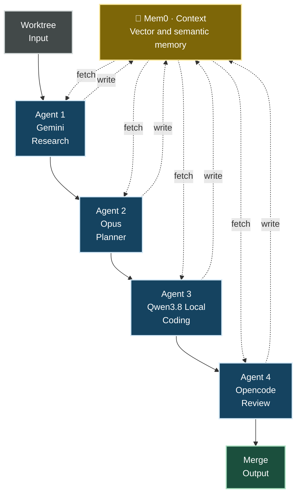

<p align="center">
  
</p>

<p align="center">
  <a href="https://www.npmjs.com/package/vibe-kanban-alternative"></a>
  <a href="https://github.com/flashlan/vibe-kanban-alternative/actions"></a>
  <a href="https://deepwiki.com/BloopAI/vibe-kanban"></a>
  <a href="https://opensource.org/licenses/Apache-2.0"></a>
  <a href="https://github.com/flashlan/vibe-kanban-alternative/issues"></a>
</p>


<h1 align="center"><strong>vibe-kanban-alternative</strong></h1>

<h1 align="center"><strongMulti-agent development with Kanban board with semantic and vector memory context managment between stages. </strong></h1>

<p align="center">
  <strong>The resilient, 100% self-hosted cockpit for single-developer AI orchestration.</strong><br>
  Persistent Graph Memory (mem0) • 10+ Coding Agents (inc. Antigravity/AGY) • Gitea/Forgejo PRs • TUI Cockpit • Telegram Daemon • Usage Observability
</p>

---

## 📌 Context: Reviving & Evolving Vibe-Kanban

Following the [official cloud shutdown of Bloop's hosted servers](https://vibekanban.com/blog/shutdown), developers were left with orphaned workspaces and broken dependencies. 

`vibe-kanban-alternative` is an actively maintained, independent evolution of [BloopAI/vibe-kanban](https://github.com/BloopAI/vibe-kanban) and [dexloom/vibe-kanban-indie](https://github.com/dexloom/vibe-kanban-indie). Built specifically for a **single-developer workflow**, it requires **no cloud accounts, no team auth, and zero remote telemetry**. You run it entirely on your machine, orchestrating a fleet of coding agents via browser, terminal (TUI), or phone (Telegram).


---

## ⚡ What's Different in This Fork?

| Capability | Upstream (Bloop) | Indie Baseline | ⚡ **vibe-kanban-alternative (This Fork)** |
| :--- | :---: | :---: | :---: |
| **Server Infrastructure** | 🛑 Sunsetting / Dead | 🟢 Local / Self-hosted | 🟢 **100% Offline & Local Runtime** |
| **Cross-Session Memory** | ❌ Ephemeral (Lost per card) | ❌ None | 🧠 **Native `mem0` + Qdrant + NetworkX Graph Memory** |
| **Prompt Cache-Hit Architecture** | ❌ None | ❌ None | ⚡ **Deterministic, Cache-Friendly Memory Prefix Injection** |
| **Telemetry & Observability** | ❌ None | ⚠️ Minimal | 📊 **Full `Settings → Usage` Dashboard (Tokens, Heatmaps, Agents)** |
| **Coding Agents Matrix** | Legacy CLI subset | Standard Set | 🚀 **10+ Agents: Claude Code, Antigravity (AGY), Codex, Gemini CLI, etc.** |
| **Antigravity (AGY) Agent** | ❌ None | ⚠️ Basic text mode | 💎 **Full `stream-json` parsing, ToolUse visual cards & reasoning effort control** |
| **Chat Input & History** | ⚠️ Basic textarea | Standard WYSIWYG | ⌨️ **Terminal-style ArrowUp/Down prompt history + Enter/Ctrl+Enter modes** |
| **Self-Hosted Git Remotes** | GitHub Only | GitHub + Basic Gitea | 🐙 **Auto-routing Gitea / Forgejo REST API + GitHub (`gh`)** |
| **Remote Control & Cockpit** | Web UI only | TUI + Telegram | 📱 **Terminal TUI Cockpit + Send-Only Telegram Forum Bridge** |
| **Backup & Disaster Recovery** | ❌ None | Basic | 💾 **Full DB, Settings & mem0 Vector/Graph State Export/Import** |
| **Chat & UI Streaming** | ⚠️ Latency bugs on long diffs | Standard | ⚡ **Optimized Canvas/Chat rendering & worktree panel fixes** |

---

## 🚀 Overview

Software engineering increasingly means **directing coding agents** — planning work, spawning a model to implement it, reviewing its diff, and shipping. The bottleneck is no longer typing code; it's orchestrating, reviewing, and keeping many agent sessions coherent. `vibe-kanban-alternative` is built to make that process fast, local, and *personal*: a single developer, entirely on their own machine, no team, no cloud, no account.

At its core it's a **kanban board that plans and tracks agent work**, plus a **workspace runtime** that turns each card into a real branch, terminal, and dev-server where any of 10+ coding agents (Claude Code, OpenCode, Qwen Code, Codex, Gemini CLI, Antigravity, Copilot, Amp, Cursor, Droid, CCR) executes the plan:

- **Plan with kanban issues** — boards, columns, priorities, tags, sub-issues, pipelines; cards are the single source of truth for a piece of work.
- **Run coding agents in workspaces** — each card launches a workspace: a branch, a terminal, a dev server, and an agent following a configurable pipeline (Quick, Basic, async variants).
- **Review diffs and iterate** — inline comments, diffs, preview browser, and the **manual-review stage** that pauses the agent and raises an alarm so you approve the result before any merge or PR.
- **Switch between 10+ coding agents** — drive Claude Code, OpenCode, Qwen Code, Codex, Gemini CLI, Antigravity (`agy`), Copilot, Amp, Cursor, Droid, and CCR from one board.
- **Cross-session project memory (mem0)** — agents recall and persist verified facts about the repositories they work in, keyed per repository and shared across CLIs, with a **graph memory** that survives restarts.
- **Usage & observability** — a Settings → Usage dashboard with per-day activity, per-agent execution bars, extraction-token monitoring, and project progress.
- **Workspaces, PRs, and merge** — dispatch work to existing sessions, open PRs (GitHub or Gitea/Forgejo) with AI-generated descriptions, squash-merge to base.
- **Terminal & phone** — a [TUI cockpit](#terminal-ui-tui) and [Telegram escalation](#telegram-orchestration) keep you in control without the browser.


---

## 🧠 Project Memory (mem0)

**Cross-session memory for every coding agent.** `vibe-kanban-alternative` ships with a first-class mem0 integration so the agents that drive your workspaces share a durable, semantic memory of the repositories they work in.

### Core Capabilities:
- ⚬ **Agentic Recall, Not Auto-Injection**: Nothing is prepended to the prompt automatically. The pipeline's "Project memory" stage instructs the agent to call `memory_search` with a query scoped to the card's files/modules/area before starting — a targeted lookup, not a full dump.
- ⚬ **Shared Repository Knowledge**: Memory is keyed per repository. You can start a task on Claude Code and switch to OpenCode or Antigravity mid-project without losing context.
- ⚬ **Verified Fact Save-Back**: The memory pipeline stage instructs the agent to persist only self-contained, verified facts (architectural decisions, patterns, root causes) via `memory_save`. Ephemeral chatter is filtered out.
- ⚬ **MCP Tools Integration**: Agents have access to `memory_search` and `memory_save` as first-class Model Context Protocol (MCP) tools.
- ⚬ **Graph-Based Memory (GraphML)**: Entity and relation extraction creates an interconnected graph (mem0 + Qdrant + NetworkX), persisted on disk (`/data/graphs/*.graphml`) so knowledge structures survive container reboots.

### ⚡ Prompt Cache-Hit Design
To minimize token costs on providers with prompt caching (Anthropic, OpenRouter, DeepSeek):
1. **No Automatic Prefix Injection**: There is no memory block prepended to the prompt — the injected block used to change on every new memory, invalidating the cached prefix on every workspace start. See [ADR-028](docs/ADR/ADR-028-mem0-agentic-recall.md).
2. **Tool Calls, Not Prompt Mutations**: `memory_search` and `memory_save` execute as MCP tool calls scoped to the current card, keeping the static system/task prefix identical (and cache-hit) across workspace starts.




### mem0 Setup

The project memory layer runs on a local Docker stack (`mem0-vk`): a mem0 API server on `:8000`, a Qdrant vector store, and a Python embeddings + NetworkX graph service.

```bash
cd mem0-vk
cp .env.example .env      # then set an extraction LLM key (see below)
docker compose up -d --build
```

**Configure from the app:** Open **Settings → Memory** to manage the graph at runtime, configure extraction providers (Groq, OpenRouter, Local llama), and view token usage.

---

## 🤖 Supported Coding Agents

`vibe-kanban-alternative` integrates natively with 10+ leading coding agents:

1. **Google Antigravity (`agy`)** ⚡ *(New)*:
   - Full stream-JSON protocol support.
   - Native visual cards for file inspection (`view_file`), search (`grep_search`, `find_by_name`), bash commands (`run_command`), and file edits (`write_to_file`, `replace_file_content`).
   - Reasoning effort controls (`Low`, `Medium`, `High`) with automatic fallback for `gemini-3.7-flash`.
   - YOLO mode auto-permission bypass (`--dangerously-skip-permissions`).
2. **Anthropic Claude Code**: Headed & headless modes, full MCP tool approvals, and turn navigation.
3. **OpenCode & OpenCode Headed**: Multi-model agent runner with local & remote inference.
4. **OpenAI Codex**: Deep reasoning & plan generation.
5. **Qwen Code**: High-performance local and cloud agent workflows.
6. **Google Gemini CLI**: Native Gemini execution.
7. **GitHub Copilot CLI**, **Cursor Agent**, **Droid**, and **Amp**.

---

## ⌨️ Chat & Terminal Interaction

- **Prompt History Navigation (`ArrowUp` / `ArrowDown`)**:
  - Press `ArrowUp` at the start of the chat box to cycle backward through previously sent commands and prompts.
  - Press `ArrowDown` to cycle forward and seamlessly restore your uncommitted draft text.
  - History is persisted locally across browser sessions.
- **Customizable Send Shortcuts**:
  - **`Enter` Mode**: Press `Enter` to send instantly; use `Ctrl + Enter`, `Cmd + Enter`, or `Shift + Enter` to insert a newline.
  - **`ModifierEnter` Mode**: Press `Cmd/Ctrl + Enter` to send; `Enter` for newline.
  - Configurable under **Settings → General**.

---

## 📊 Usage & Observability Dashboard

A per-machine activity dashboard in **Settings → Usage** shows how your agent time is spent, straight from the local database — no cloud telemetry:

- **Totals** — executions, agent time, and open issues over the last 30 days.
- **GitHub-style activity squares** — a day-by-day heatmap of agent executions.
- **Executions per day by agent** — stacked bar rows for each configured agent.
- **Extraction Token Usage** — monitor tokens spent on mem0 graph extractions.
- **Project & issue progress** — open/done counts and completion bars per project.


---

## 🖥️ Terminal UI (TUI)

`vibe-tui` is a terminal cockpit for the backend — list workspaces and sessions, watch live agent transcripts, manage a kanban board for local projects, and approve/deny/answer the things agents block on, all without leaving the terminal:

```bash
cargo run -p tui
```

| Context | Keys |
|---|---|
| Global | `a` approvals inbox · `?` help · `q` quit |
| List | `↑↓`/`jk` move · `⇥` switch pane · `⏎` open · `n` new task · `b` board · `r` refresh |
| Detail | `⇥`/`←→` move focus · `↑↓`/`jk` navigate · `f` follow · `i` message agent · `s` stop · `esc` back |
| Git pane | `⇥` focus · `↑↓` select repo · `m` merge · `R` rebase · `P` create PR · `u` push |
| Approvals inbox | `↑↓` move · `y` approve · `d` deny · `⏎` answer · `esc` back |
| Board | `←→` column · `↑↓` card · `[ ]` move card · `n` new · `e` edit · `d` delete · `w` workspace |

---

## 📱 Telegram Orchestration

`vibe-telegram-bridge` is a **send-only** daemon that streams coding-agent escalations to a Telegram supergroup with topics, so a blocked agent can be unblocked remotely from your phone:

```toml
# ~/.vibe-kanban/telegram.toml
enabled = true
bot_token = "123456:ABC..."
chat_id = "-1001234567890"
per_worktree_topics = true
```

```bash
cargo run -p telegram-bridge
```

---

## 🐙 Gitea / Forgejo Support

Full REST API integration alongside GitHub:
- Automatic routing: `github.com` remotes use `gh` CLI; custom hosts use Gitea REST API.
- Secure token storage in `~/.vibe-kanban/gitea.toml` or `GITEA_TOKEN`.
- Unified comments and PR lifecycle management.

---


<p align="center">
  <a href="#quick-start">Quick Start</a> •
  <a href="#overview">Overview</a> •
  <a href="#whats-different-in-this-fork">What's Different</a> •
  <a href="#project-memory-mem0">Project Memory (mem0)</a> •
  <a href="#supported-coding-agents">Supported Agents</a> •
  <a href="#chat--terminal-interaction">Chat & Controls</a> •
  <a href="#usage--observability-dashboard">Usage Dashboard</a> •
  <a href="#terminal-ui-tui">TUI Cockpit</a> •
  <a href="#telegram-orchestration">Telegram Bridge</a> •
  <a href="#development--self-hosting">Development</a>
</p>

---

## ⚡ Quick Start (Instant Run)

Launch the entire cockpit with a single command — no install, no accounts, no cloud setup:

```bash
npx vibe-kanban-alternative
```

> 💡 **Zero Setup Required**: Downloads prebuilt binaries and launches the local web cockpit directly at **`http://localhost:3001`** (with backend on `:3002`).

---

### ⚙️ Full Setup & Environment Configuration

For development, custom ports, local mem0 vector stores, and custom agent configurations:

#### 1. Clone & Install
```bash
git clone https://github.com/flashlan/vibe-kanban-alternative.git
cd vibe-kanban-alternative
pnpm i
```

#### 2. Configure Environment Variables
Duplicate the template configuration file:
```bash
cp .env.example .env
```

Open `.env` in your editor and configure your environment:

```env
# ==========================================
# 🌐 CORE SERVER CONFIGURATION
# ==========================================
PORT=3000
HOST=localhost
NODE_ENV=development

# ==========================================
# 🧠 MEM0 LONG-TERM MEMORY SETTINGS
# ==========================================
MEM0_ENABLED=true
MEM0_API_KEY=your_mem0_api_key_here
# If running local embeddings/vector store:
# MEM0_VECTOR_STORE=qdrant
# MEM0_HOST=http://localhost:6333

# ==========================================
# 🤖 AGENT API KEYS & RUNTIMES
# ==========================================
ANTHROPIC_API_KEY=sk-ant-...
OPENAI_API_KEY=sk-...
GEMINI_API_KEY=...

# Antigravity (AGY) Specific Settings
AGY_CLI_PATH=/usr/local/bin/agy
AGY_DEFAULT_TEMPERATURE=0.2

# ==========================================
# 📊 METRICS & TELEMETRY
# ==========================================
ENABLE_METRICS_DASHBOARD=true
METRICS_STORAGE_PATH=./data/metrics.sqlite

# ==========================================
# 💾 BACKUP CONFIGURATION
# ==========================================
BACKUP_ENABLED=true
BACKUP_INTERVAL_MINUTES=30
BACKUP_STORAGE_PATH=./backups
```

#### 3. Start Development Cockpit
```bash
./restart.sh
```
 ---

## 🛠️ Quick Start & Development

### Prerequisites:
- [Node.js](https://nodejs.org/) (>=20) & [pnpm](https://pnpm.io/)
- [Rust](https://rustup.rs/) (stable toolchain)
- [Docker](https://www.docker.com/) (for mem0 graph memory stack)

### Running locally:

```bash
# 1. Install dependencies
pnpm i

# 2. Start mem0 stack (optional but recommended)
cd mem0-vk && cp .env.example .env && docker compose up -d --build && cd ..

# 3. Start development server (Frontend: 3001, Backend: 3002)
./restart.sh
```

---

## 📄 License

Apache 2.0. See [LICENSE](LICENSE) for details.
