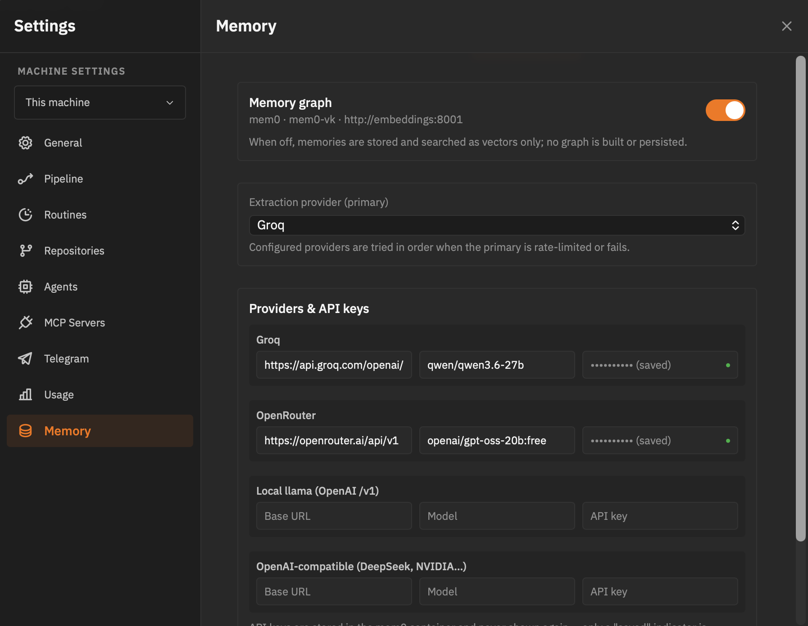

<p align="center">
  <a href="https://dexloom.mintlify.app">
    <picture>
      <source srcset="packages/public/vibe-kanban-logo-dark.svg" media="(prefers-color-scheme: dark)">
      <source srcset="packages/public/vibe-kanban-logo.svg" media="(prefers-color-scheme: light)">
      
    </picture>
  </a>
</p>

<p align="center">Get 10X more out of Claude Code, Gemini CLI, Codex, Amp and other coding agents...</p>

## What's different in this fork

This fork targets self-hosted development workflows where GitHub is not the primary host. Changes are additive — all upstream features remain intact.

- **Gitea / Forgejo PR support** — create PRs, check status, and fetch comments on any Gitea/Forgejo instance via its REST API. Routing is automatic: remotes pointing at `github.com` use the GitHub provider (`gh` CLI); remotes whose host matches the configured Gitea base URL use the Gitea provider. No manual switching needed.
- **Secure token storage** — the Gitea token lives in `~/.vibe-kanban/gitea.toml` (or the `GITEA_TOKEN` env var), never in the app config or the repository.

## Gitea / Forgejo Support

### Setup

1. Create a **personal access token** on your Gitea/Forgejo instance (scope: `Projects: read/write` or broader as needed).
2. Store the token outside the repo:

```toml
# ~/.vibe-kanban/gitea.toml
token = "your-personal-access-token"
```

   Alternatively, set the environment variable `GITEA_TOKEN` (takes precedence if both are set).

3. Open **Settings → Gitea** in the app and fill in:
   - **Base URL** — e.g. `https://gitea.example.com` (trailing slash optional)
   - **Default branch** — e.g. `main` (used when a PR's base branch is unspecified)

### How routing works

The app inspects the `git remote` URL of each project:

| Remote host | Provider used |
|---|---|
| `github.com`, `github.*` (Enterprise) | GitHub (`gh` CLI) |
| matches `gitea_base_url` host | Gitea (REST API) |
| anything else | unsupported (clear error) |

You can have a board with a mix of GitHub and Gitea projects simultaneously — each project is routed independently.

### Limitations

- Gitea PR creation uses the REST API directly (not a CLI), so no `gh`-specific features (like project-based auto-assignment) apply.
- Comments are fetched from both the issue and PR comment endpoints and merged, matching GitHub's unified comment view.
- Forgejo instances are fully compatible (they share the Gitea API surface used here).
<p align="center">
  <a href="https://www.npmjs.com/package/vibe-kanban-alternative"></a>
  <a href="https://github.com/flashlan/vibe-kanban-alternative/actions"></a>
  <a href="https://deepwiki.com/BloopAI/vibe-kanban"></a>
</p>

<h1 align="center"><strong>vibe-kanban-alternative</strong></h1>
<p align="center">
  The independent, self-hosted fork of vibe-kanban. One dev, your machine, your
  agents — drive a crew of coding agents from the terminal or your phone.
</p>
<p align="center">
  Built for a <strong>single-developer process</strong>: no team, no cloud, no
  auth. Adds a <a href="#terminal-ui-tui">TUI cockpit</a> and
  <a href="#telegram-integration">Telegram channel orchestration</a> on top of
  upstream <a href="https://github.com/BloopAI/vibe-kanban">vibe-kanban</a>.
</p>


# Welcome to vibe-kanban-alternative

## Overview

Software engineering increasingly means **directing coding agents** — planning work, spawning a model to implement it, reviewing its diff, and shipping. The bottleneck is no longer typing code; it's orchestrating, reviewing, and keeping many agent sessions coherent. `vibe-kanban-alternative` is built to make that process fast, local, and *personal*: a single developer, entirely on their own machine, no team, no cloud, no account.

At its core it's a **kanban board that plans and tracks agent work**, plus a **workspace runtime** that turns each card into a real branch, terminal, and dev-server where any of 10+ coding agents (Claude Code, OpenCode, Qwen Code, Codex, Gemini CLI, Antigravity, Copilot, Amp, Cursor, Droid, CCR) executes the plan. On top of that sits a growing **single-developer cockpit**:

- **Plan with kanban issues** — boards, columns, priorities, tags, sub-issues, pipelines; cards are the single source of truth for a piece of work.
- **Run coding agents in workspaces** — each card launches a workspace: a branch, a terminal, a dev server, and an agent following a configurable pipeline (Quick, Basic, async variants).
- **Review diffs and iterate** — inline comments, diffs, preview browser, and the **manual-review stage** that pauses the agent and raises an alarm so you approve the result before any merge or PR.
- **Switch between 10+ coding agents** — drive Claude Code, OpenCode, Qwen Code, Codex, Gemini, Antigravity, Copilot, Amp, Cursor, Droid, and CCR from one board.
- **Cross-session project memory (mem0)** — agents recall and persist verified facts about the repositories they work in, keyed per repository and shared across CLIs, with a **graph memory** that survives restarts.
- **Usage & observability** — a Settings → Usage dashboard with per-day activity, per-agent execution bars, extraction-token monitoring, and project progress.
- **Workspaces, PRs, and merge** — dispatch work to existing sessions, open PRs (GitHub or Gitea/Forgejo) with AI-generated descriptions, squash-merge to base.
- **Terminal & phone** — a [TUI cockpit](#terminal-ui-tui) and [Telegram escalation](#telegram-integration) keep you in control without the browser.

It runs entirely locally (`npx vibe-kanban-alternative`), with a **Backup** section (Settings → Backup) to export and restore everything — database, settings, and the project-memory stack — so you never lose history when reinstalling or moving machines.


## Project Memory (mem0)

**Cross-session memory for every coding agent.** `vibe-kanban-alternative` ships with a first-class mem0 integration so the agents that drive your workspaces (Claude Code, OpenCode, Qwen Code, Gemini CLI — any of the 10+ supported) share a durable, semantic memory of the repositories they work in.

- **Recall on launch** — every workspace start fetches the memories stored for the repository and prepends them to the agent's task, so decisions, conventions, and hard-won lessons carry across sessions without re-discovery.
- **Shared per repository** — memories are keyed by the repository slug, so every CLI working in the same repo reads and writes the same memory graph. Switch between OpenCode and Claude mid-project without losing context.
- **Save-back of verified facts** — the `memory` pipeline stage instructs the agent to persist only **self-contained, verified facts** (decisions, conventions, root causes) via `memory_save`. It never saves speculation or ephemeral state, so a future agent is never poisoned by a false memory.
- **MCP tools** — `memory_search`, `memory_recall`, and `memory_save` are exposed to agents as MCP tools, callable mid-session and cache-safe by construction.
- **Graph memory** — memories are stored as an entity/relation graph (mem0 + Qdrant + NetworkX), not just flat vectors, so relationships between decisions are recoverable. Graph extraction is enabled by default; it requires an extraction LLM provider key (see [mem0 setup](#mem0-setup)).

### Prompt Cache-Hit design

The memory block is engineered for **prompt-cache friendliness** on LLM providers that bill per token (Anthropic, OpenRouter, DeepSeek, NVIDIA, etc.):

- The injected memory block is placed in the **static prefix** of the task — before the dynamic user question — exactly where the API's prefix cache can be reused across calls.
- Memory rows are **deterministically sorted**, so the rendered block is byte-identical across sessions. A second terminal that pulls the same repository memory hits the cache generated by the first, saving latency and tokens.
- The block is injected **once at workspace start** and never changes mid-session, keeping the cached prefix stable.
- `memory_search` / `memory_save` are **tool calls**, not prompt edits — they don't perturb the prefix, so long-running sessions keep their cache warm.

### mem0 Setup

The project memory layer runs on a local Docker stack (`mem0-vk`): a mem0 API server on `:8000`, a Qdrant vector store, and a Python embeddings + NetworkX graph service. Set `MEM0_URL` to override the default `http://localhost:8000`.

```bash
cd mem0-vk
cp .env.example .env      # then set an extraction LLM key (see below)
docker compose up -d --build
```

**Configure from the app:** the app's **Settings → Memory** panel manages the
mem0 graph at runtime — enable/disable the memory graph, pick the extraction
provider, and set per-provider base URL / model / API key. Keys are stored in
the mem0 container and **never displayed again** (only a "saved" indicator is
returned); the config persists in the mem0 volume without a container restart.
**Settings → Usage** shows extraction tokens segmented by provider and offers
a **Re-extract graph entities** control for memories saved before an extraction
LLM was configured.



**Graph memory note:** entity/relation extraction (the memory graph) requires an
extraction LLM. Providers form a **failover chain** — `MEM0_LLM_PROVIDER` sets
the primary, and any other configured provider is tried automatically when the
primary is rate-limited (429) or returns no usable JSON:

| Provider | Config | Notes |
|----------|--------|-------|
| **Groq** (default) | `GROQ_API_KEY` + `GROQ_MODEL` | `qwen/qwen3.6-27b` works well; free tier is TPM-limited (~8k tokens/min) |
| **OpenRouter** | `MEM0_OPENROUTER_KEY` + `MEM0_OPENROUTER_MODEL` | default `openai/gpt-oss-20b:free`; free tier is rate-limited upstream |
| **Local llama** | `MEM0_LLAMA_URL` + `MEM0_LLAMA_MODEL` (OpenAI-compatible `/v1`) | no rate limits, fully private — recommended for heavy use |

Configure more than one (e.g. Groq + OpenRouter + local llama) and the stack
fails over gracefully instead of hammering a single free provider.

**Graph persistence:** per-repository memory graphs are persisted as **GraphML**
on disk (`/data/graphs/*.graphml`, Docker volume `graph_data`) and lazy-loaded
on first access, so they survive container restarts.

Extraction token usage is tracked per day and per provider and shown as
**segmented bars** in Settings → Usage (llama / openrouter / groq). The same
page has a **Re-extract graph entities** control: enter the repository slug and
it re-runs graph extraction for memories that were saved before an extraction
LLM was configured.

Without a key, memories are still stored and searchable as vectors, but
`entities`/`relations` remain empty and the graph won't populate. Verify with:

```bash
curl http://localhost:8000/api/memories/vibe-kanban-alternative
curl http://localhost:8000/api/usage/tokens        # extraction token ledger
curl http://localhost:8001/graph/stats?user_id=vibe-kanban-alternative   # graph nodes/edges
```

## Usage Dashboard

A per-machine activity dashboard in **Settings → Usage** shows how your agent time is spent, straight from the local database — no cloud telemetry:

- **Totals** — executions, agent time, and open issues over the last 30 days.
- **GitHub-style activity squares** — a day-by-day heatmap of agent executions.
- **Executions per day by agent** — stacked bar rows for each configured agent.
- **Project & issue progress** — open/done counts and completion bars per project.


## Manual Review Stage

Every pipeline includes an optional **`review-manual`** stage: the agent commits its work-in-progress, emits a `VK-REVIEW-REQUEST` marker, and **stops** — no merge, no PR. The backend detects the marker and plays the configured notification alarm so you review the result from anywhere. Only explicit operator instructions let it continue.

## Project Archive

Projects can be **archived** from the sidebar (`+` → Archive) instead of deleted: the board leaves the tree, becomes read-only, and keeps its full history. The **Archived** section at the bottom of the sidebar offers **Restore** and a permanent **Delete** (with a destructive cascade confirmation for the project's issues, statuses, and tags).

One command. Describe the work, review the diff, ship it.

```bash
npx vibe-kanban-alternative
```


## Installation

This fork is published on the public npm registry as **`vibe-kanban-alternative`**.

Prerequisites:

- [Node.js](https://nodejs.org/) (>=20) and npm
- [Docker](https://www.docker.com/) (required for the mem0 project-memory layer; the app runs without it, but memory recall/save and the Usage dashboard's agent-memory features are disabled)
- A supported coding agent installed and authenticated (the app drives it). A full list is in the [docs](https://dexloom.mintlify.app/supported-coding-agents).

Run it directly with no install:

```bash
npx vibe-kanban-alternative
```

Or install globally:

```bash
npm install -g vibe-kanban-alternative
vibe-kanban-alternative
```

The package ships the web app plus prebuilt `vibe-kanban`, `vibe-kanban-mcp` and
`vibe-kanban-review` binaries and the `npx-cli` launcher, so a Rust toolchain is
not required to run it. On first launch it opens the board at
`http://localhost:3001`.

### Install Docker

The mem0 project-memory layer runs in Docker. Install the Docker Engine and the Compose plugin:

**macOS** — install [Docker Desktop](https://www.docker.com/products/docker-desktop/), then verify:

```bash
docker --version
docker compose version
```

**Ubuntu / Debian**:

```bash
curl -fsSL https://get.docker.com | sh
sudo usermod -aG docker "$USER"   # log out and back in for the group to apply
newgrp docker
docker compose version
```

**Arch Linux**:

```bash
sudo pacman -S docker docker-compose
sudo systemctl enable --now docker
sudo usermod -aG docker "$USER"   # log out and back in
newgrp docker
```

**Windows / WSL2** — install [Docker Desktop with WSL2 backend](https://docs.docker.com/desktop/wsl/). The app detects WSL2 and routes notifications and sound through PowerShell automatically.

Once Docker is installed, bring up the mem0 stack (see [mem0 Setup](#mem0-setup)):

```bash
cd mem0-vk
docker compose up -d --build
```

### Run in Docker

You can also run the whole app (backend + frontend) itself in a container from the provided `Dockerfile`:

```bash
docker build -t vibe-kanban-alternative .
docker run -p 3000:3000 \
  -v "$(pwd)/data:/repos" \
  -e VK_ALLOWED_ORIGINS="http://localhost:3000" \
  vibe-kanban-alternative
```

Open `http://localhost:3000`. Mount a volume at `/repos` to persist workspaces and repositories across container restarts. For production deployments see the [self-hosting guide](https://dexloom.mintlify.app/self-hosting/deploy-docker).

## Terminal UI (TUI)

`vibe-tui` is a terminal cockpit for the backend — list workspaces and sessions, watch live agent transcripts, manage a kanban board for local projects, and approve/deny/answer the things agents block on, all without leaving the terminal. It's also the always-available manual override for the [Telegram automation](#telegram-integration) below.

Run it against a running backend (it discovers the backend via its port file, or set `VIBE_BACKEND_URL`):

```bash
cargo run -p tui
```

Keys (press `?` in-app for the full list):

| Context | Keys |
|---|---|
| Global | `a` approvals inbox · `?` help · `q` quit |
| List | `↑↓`/`jk` move · `⇥` switch pane · `⏎` open · `n` new task · `b` board · `r` refresh |
| Detail | `⇥`/`←→` move focus between panes (processes · git · transcript) · `↑↓`/`jk` navigate the focused pane · `n`/`p` process · `f` follow · `i` message agent · `s` stop · `esc` back |
| Git pane (in detail) | focus it with `⇥`, then `↑↓` select repo · `m` merge · `R` rebase · `P` create PR · `u` push — shows branch→target, ↑ahead/↓behind, ±diff, PR state per repo |
| Approvals inbox | `↑↓` move · `y` approve · `d` deny · `⏎` answer · `esc` back |
| Board | `←→` column · `↑↓` card · `[ ]` move card · `n` new · `e` edit · `d` delete · `w` workspace · `p` project · `⏎` detail |

## Telegram Integration

`vibe-telegram-bridge` is a **send-only** daemon that streams coding-agent escalations to a Telegram supergroup, so a blocked agent (waiting on a tool-permission prompt or a clarifying question) can be unblocked remotely — by a human replying in Telegram, or by a PM agent acting through the MCP approval tools. The bridge never reads Telegram and never polls the bot token, so it coexists with the sombrax-telegram listener without a 409 conflict.

It is configured by `~/.vibe-kanban/telegram.toml` (see `automation/telegram.toml.example`):

```toml
# ~/.vibe-kanban/telegram.toml
enabled = true
bot_token = "123456:ABC..."        # optional; falls back to $TELEGRAM_BOT_TOKEN
                                   # or ~/.claude/channels/telegram/.env
chat_id = "-1001234567890"         # your supergroup (must have Topics enabled)
general_thread_id = "1"            # optional General topic
per_worktree_topics = true         # spawn a forum topic per Claude Code worktree
# topic_executors = ["CLAUDE_CODE"]  # which executors get a topic
# topic_name_template = "vk: {name}" # {name}/{branch} substituted
```

```bash
cargo run -p telegram-bridge
```

When `enabled = false` (or no config is present), the daemon exits cleanly. With `per_worktree_topics = true`, the bridge watches the backend's `/api/events` stream and creates a dedicated forum topic for each opted-in worktree, routing that worktree's escalations into it; the `workspace_id → message_thread_id` map is persisted in `~/.vibe-kanban/telegram-topics.json` so restarts reuse existing topics.

The app surfaces a read-only **Settings → Telegram** panel (status + a "Send test message" button); it reads `telegram.toml` and the bridge's heartbeat file but does not edit the config — the TOML is hand-edited.

For the full architecture (TUI, bridge, MCP approval tools, and the PM agent), see [`automation/README.md`](automation/README.md).

## Claude Code Plugins (SombraX)

The automation layer is driven from Claude Code by three plugins published in the **`sombrax_plugins`** marketplace: **vibe-kanban-alternative** (orchestration skills, the agent crew, and the bundled `vibe-kanban` MCP server), **sombrax-telegram** (the inbound Telegram channel listener that pairs with the send-only bridge above), and **sombrax-codex** (Codex CLI helpers for independent plan and code review).

Add the marketplace once, then install the plugins you want — from inside Claude Code:

```text
# Add the marketplace (once)
/plugin marketplace add dexloom/sombrax_plugins

# Install the plugins
/plugin install vibe-kanban-alternative@sombrax-plugins
/plugin install sombrax-telegram@sombrax-plugins
/plugin install sombrax-codex@sombrax-plugins
```

The plugins are optional — Indie's web UI, board, and workspaces work without them. Install them when you want to drive the board and the agent crew from Claude Code. See [Claude Code plugins & skills](https://dexloom.mintlify.app/integrations/claude-code-plugins) for the full breakdown.

## Documentation

Head to the [documentation site](https://dexloom.mintlify.app) for the latest guides, including [What's different in Indie](https://dexloom.mintlify.app/indie/whats-different) and the [Solo Cockpit](https://dexloom.mintlify.app/cockpit/index).

## Self-Hosting

Indie runs entirely on your own machine — no cloud, no account. See the [self-hosting guide](https://dexloom.mintlify.app/self-hosting/local-development) to run it locally or [behind Docker](https://dexloom.mintlify.app/self-hosting/deploy-docker).

## Support

For feature requests and bugs, please open an issue on [`flashlan/vibe-kanban-alternative`](https://github.com/flashlan/vibe-kanban-alternative/issues).

## Contributing

`vibe-kanban-alternative` is an independent, single-developer fork. Please raise ideas and changes as issues on [`flashlan/vibe-kanban-alternative`](https://github.com/flashlan/vibe-kanban-alternative/issues) before opening a PR, so we can discuss implementation details and alignment with the roadmap.

## Development

### Prerequisites

- [Rust](https://rustup.rs/) (latest stable)
- [Node.js](https://nodejs.org/) (>=20)
- [pnpm](https://pnpm.io/) (>=8)
- [Docker](https://www.docker.com/) + Compose (for the mem0 project-memory layer — see [Install Docker](#install-docker))

Additional development tools:
```bash
cargo install cargo-watch
cargo install sqlx-cli
```

Install dependencies and bring up the mem0 memory stack:
```bash
pnpm i
cd mem0-vk && cp .env.example .env && docker compose up -d --build && cd ..
```

### Running the dev server

```bash
pnpm run dev
```

This will start the backend and web app. A blank DB will be copied from the `dev_assets_seed` folder.

### Building the web app

To build just the web app:

```bash
cd packages/local-web
pnpm run build
```

### Build from source (macOS)

1. Run `./local-build.sh`
2. Test with `cd npx-cli && node bin/cli.js`

### Environment Variables

The following environment variables can be configured at build time or runtime:

| Variable | Type | Default | Description |
|----------|------|---------|-------------|
| `PORT` | Runtime | Auto-assign | **Production**: Server port. **Dev**: Frontend port (backend uses PORT+1) |
| `BACKEND_PORT` | Runtime | `0` (auto-assign) | Backend server port (dev mode only, overrides PORT+1) |
| `FRONTEND_PORT` | Runtime | `3001` | Frontend dev server port (dev mode only, overrides PORT) |
| `HOST` | Runtime | `127.0.0.1` | Backend server host |
| `MCP_HOST` | Runtime | Value of `HOST` | MCP server connection host (use `127.0.0.1` when `HOST=0.0.0.0` on Windows) |
| `MCP_PORT` | Runtime | Value of `BACKEND_PORT` | MCP server connection port |
| `DISABLE_WORKTREE_CLEANUP` | Runtime | Not set | Disable all git worktree cleanup including orphan and expired workspace cleanup (for debugging) |
| `VK_ALLOWED_ORIGINS` | Runtime | Not set | Comma-separated list of origins that are allowed to make backend API requests (e.g., `https://my-vibekanban-frontend.com`) |

**Build-time variables** must be set when running `pnpm run build`. **Runtime variables** are read when the application starts.

#### Self-Hosting with a Reverse Proxy or Custom Domain

When running Vibe Kanban behind a reverse proxy (e.g., nginx, Caddy, Traefik) or on a custom domain, you must set the `VK_ALLOWED_ORIGINS` environment variable. Without this, the browser's Origin header won't match the backend's expected host, and API requests will be rejected with a 403 Forbidden error.

Set it to the full origin URL(s) where your frontend is accessible:

```bash
# Single origin
VK_ALLOWED_ORIGINS=https://vk.example.com

# Multiple origins (comma-separated)
VK_ALLOWED_ORIGINS=https://vk.example.com,https://vk-staging.example.com
```

### Remote Deployment

When running Vibe Kanban on a remote server (e.g., via systemctl, Docker, or cloud hosting), you can configure your editor to open projects via SSH:

1. **Access via tunnel**: Use Cloudflare Tunnel, ngrok, or similar to expose the web UI
2. **Configure remote SSH** in Settings → Editor Integration:
   - Set **Remote SSH Host** to your server hostname or IP
   - Set **Remote SSH User** to your SSH username (optional)
3. **Prerequisites**:
   - SSH access from your local machine to the remote server
   - SSH keys configured (passwordless authentication)
   - VSCode Remote-SSH extension

When configured, the "Open in VSCode" buttons will generate URLs like `vscode://vscode-remote/ssh-remote+user@host/path` that open your local editor and connect to the remote server.

See the [documentation](https://dexloom.mintlify.app/settings/general) for detailed setup instructions.
