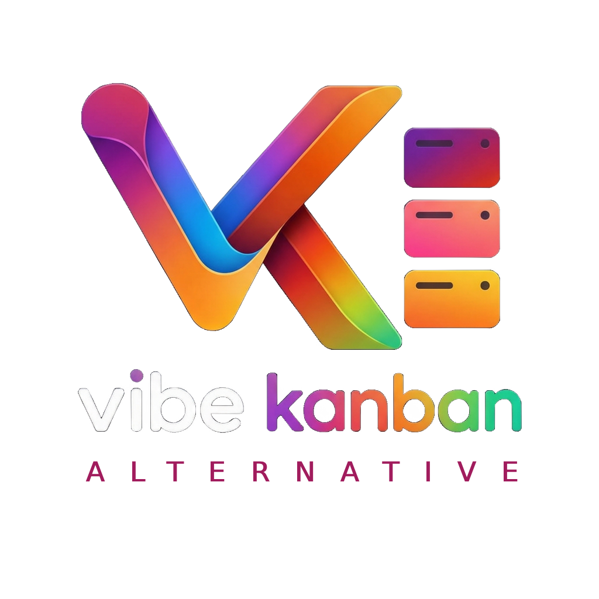
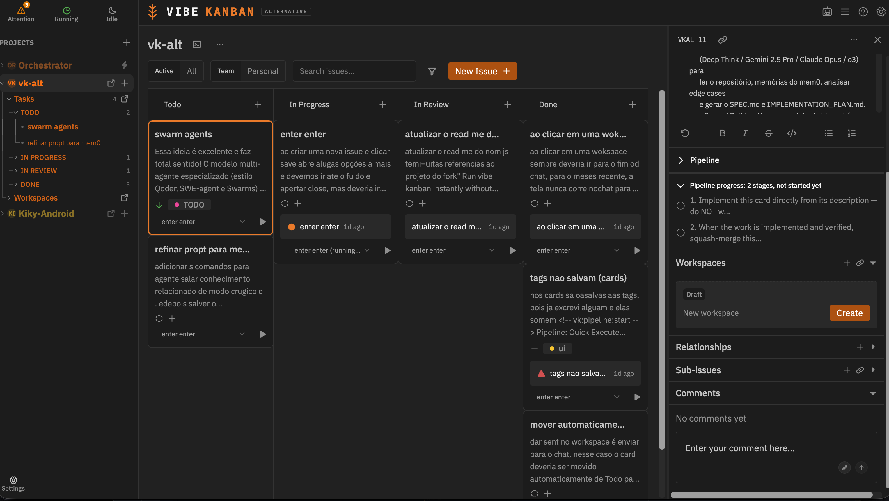
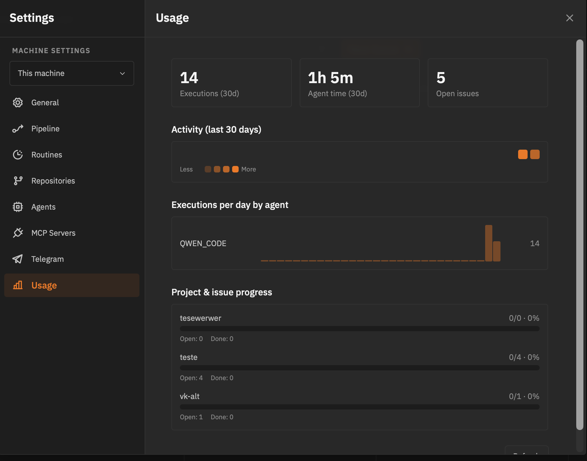

<p align="center">
  
</p>

<p align="center">
  <a href="https://www.npmjs.com/package/vibe-kanban-alternative"></a>
  <a href="https://github.com/flashlan/vibe-kanban-alternative/actions"></a>
  <a href="https://deepwiki.com/BloopAI/vibe-kanban"></a>
  <a href="https://opensource.org/licenses/Apache-2.0"></a>
  <a href="https://github.com/flashlan/vibe-kanban-alternative/issues"></a>
</p>

<h1 align="center">VIBE KANBAN ALTERNATIVE</h1>

<p align="center">
  Multi-agent development on a Kanban board, with semantic and vector memory (Qdrant memory Graph) shared across agent stages.
</p>

<p align="center">
  A self-hosted cockpit for single-developer AI orchestration — persistent graph memory (mem0), 10+ coding agents, Gitea/Forgejo PRs, a terminal cockpit, a Telegram bridge, and usage observability.
</p>

## Table of Contents

- [Background](#background)
- [What This Fork Adds](#what-this-fork-adds)
- [Overview](#overview)
- [Getting Started](#getting-started)
- [Project Memory (mem0)](#project-memory-mem0)
- [Supported Coding Agents](#supported-coding-agents)
- [Chat and Terminal Interaction](#chat-and-terminal-interaction)
- [Usage and Observability](#usage-and-observability)
- [Terminal UI (TUI)](#terminal-ui-tui)
- [Telegram Orchestration](#telegram-orchestration)
- [Gitea and Forgejo Support](#gitea-and-forgejo-support)
- [License](#license)

## Background

Following the [shutdown of Bloop's hosted servers](https://vibekanban.com/blog/shutdown), developers were left with orphaned workspaces and broken dependencies.

`vibe-kanban-alternative` is an actively maintained, independent evolution of [BloopAI/vibe-kanban](https://github.com/BloopAI/vibe-kanban) and [dexloom/vibe-kanban-indie](https://github.com/dexloom/vibe-kanban-indie). It is built for a single-developer workflow: no cloud accounts, no team auth, no remote telemetry. Everything runs on your own machine, and you orchestrate a fleet of coding agents from the browser, a terminal (TUI), or a phone (Telegram).



## What This Fork Adds

- **Server infrastructure** — upstream sunsetting, Indie runs locally → **fully offline, self-hosted runtime**
- **Cross-session memory** — ephemeral, or none → **native `mem0` with Qdrant and a NetworkX graph**
- **Prompt cache-hit architecture** — not present → **deterministic memory-prefix injection preserves cache hits**
- **Telemetry and observability** — none, or minimal → **`Settings → Usage` dashboard: tokens, activity heatmaps, per-agent breakdown**
- **Coding agent support** — legacy CLI subset → **10+ agents, including Claude Code, Antigravity, Codex, Gemini CLI**
- **Antigravity (AGY) agent** — not supported, or basic text mode → **full `stream-json` parsing, tool-use cards, reasoning-effort control**
- **Chat input and history** — basic textarea → **terminal-style prompt history, configurable send shortcuts**
- **Self-hosted git remotes** — GitHub only, or basic Gitea → **auto-routes between Gitea/Forgejo REST API and the GitHub CLI**
- **Remote control** — web UI only → **terminal TUI and a send-only Telegram bridge**
- **Backup and recovery** — none, or basic → **full export/import of the database, settings, and mem0 state**
- **Chat and UI streaming** — latency issues on long diffs → **optimized canvas/chat rendering and worktree panel fixes**

## Overview

Software engineering increasingly means directing coding agents — planning work, spawning a model to implement it, reviewing its diff, and shipping. The bottleneck is no longer typing code; it's orchestrating, reviewing, and keeping many agent sessions coherent. `vibe-kanban-alternative` is built to make that process fast, local, and personal: a single developer, entirely on their own machine, with no team, cloud, or account required.

At its core it's a kanban board that plans and tracks agent work, plus a workspace runtime that turns each card into a real branch, terminal, and dev server where any of 10+ coding agents (Claude Code, OpenCode, Qwen Code, Codex, Gemini CLI, Antigravity, Copilot, Amp, Cursor, Droid, CCR) executes the plan:

- **Kanban planning** — boards, columns, priorities, tags, sub-issues, and pipelines; cards are the source of truth for a piece of work.
- **Agent workspaces** — each card launches a workspace: a branch, a terminal, a dev server, and an agent following a configurable pipeline (Quick, Basic, or async variants).
- **Diff review** — inline comments, diffs, a preview browser, and a manual-review stage that pauses the agent and raises an alert so you approve the result before any merge or PR.
- **Cross-session project memory (mem0)** — agents recall and persist verified facts about the repositories they work in, keyed per repository and shared across CLIs, with a graph memory that survives restarts.
- **Usage and observability** — a `Settings → Usage` dashboard with per-day activity, per-agent execution bars, extraction-token monitoring, and project progress.
- **Workspaces, PRs, and merge** — dispatch work to existing sessions, open PRs (GitHub or Gitea/Forgejo) with AI-generated descriptions, and squash-merge to base.
- **Terminal and phone control** — a [TUI cockpit](#terminal-ui-tui) and [Telegram escalation](#telegram-orchestration) keep you in control without the browser.


## Getting Started

### Quick Start

Launch the full cockpit with a single command — no install, no account, no cloud setup:

```bash
npx vibe-kanban-alternative
```

This downloads prebuilt binaries and starts the local web cockpit at `http://localhost:3001` (backend on `:3002`).

### Development Setup

For development, custom ports, a local mem0 vector store, or custom agent configuration, run the project from source.

**Prerequisites**
- [Node.js](https://nodejs.org/) (>=20) and [pnpm](https://pnpm.io/)
- [Rust](https://rustup.rs/) (stable toolchain)
- [Docker](https://www.docker.com/), for the mem0 graph memory stack (optional)

**1. Clone and install**

```bash
git clone https://github.com/flashlan/vibe-kanban-alternative.git
cd vibe-kanban-alternative
pnpm i
```

**2. Configure environment variables**

```bash
cp .env.example .env
```

Then open `.env` and set the values relevant to your setup:

```env
# ==========================================
# CORE SERVER CONFIGURATION
# ==========================================
PORT=3000
HOST=localhost
NODE_ENV=development

# ==========================================
# MEM0 LONG-TERM MEMORY SETTINGS
# ==========================================
MEM0_ENABLED=true
MEM0_API_KEY=your_mem0_api_key_here
# If running local embeddings/vector store:
# MEM0_VECTOR_STORE=qdrant
# MEM0_HOST=http://localhost:6333

# ==========================================
# AGENT API KEYS & RUNTIMES
# ==========================================
ANTHROPIC_API_KEY=sk-ant-...
OPENAI_API_KEY=sk-...
GEMINI_API_KEY=...

# Antigravity (AGY) Specific Settings
AGY_CLI_PATH=/usr/local/bin/agy
AGY_DEFAULT_TEMPERATURE=0.2

# ==========================================
# METRICS & TELEMETRY
# ==========================================
ENABLE_METRICS_DASHBOARD=true
METRICS_STORAGE_PATH=./data/metrics.sqlite

# ==========================================
# BACKUP CONFIGURATION
# ==========================================
BACKUP_ENABLED=true
BACKUP_INTERVAL_MINUTES=30
BACKUP_STORAGE_PATH=./backups
```

**3. Start the project memory stack (optional, recommended)**

```bash
cd mem0-vk && cp .env.example .env && docker compose up -d --build && cd ..
```

**4. Start the development cockpit**

```bash
./restart.sh
```

Frontend runs on `:3001`, backend on `:3002`.

## Project Memory (mem0)

`vibe-kanban-alternative` ships with a first-class mem0 integration, giving every coding agent driving a workspace a durable, semantic memory of the repositories it works in.

### Capabilities

- **Agentic recall, not auto-injection** — nothing is prepended to the prompt automatically. The pipeline's "Project memory" stage instructs the agent to call `memory_search` with a query scoped to the card's files, modules, or area before starting — a targeted lookup, not a full dump.
- **Shared repository knowledge** — memory is keyed per repository, so you can start a task on Claude Code and switch to OpenCode or Antigravity mid-project without losing context.
- **Verified fact save-back** — the memory pipeline stage instructs the agent to persist only self-contained, verified facts (architectural decisions, patterns, root causes) via `memory_save`; ephemeral chatter is filtered out.
- **MCP tool integration** — agents access `memory_search` and `memory_save` as first-class Model Context Protocol (MCP) tools.
- **Graph-based memory (GraphML)** — entity and relation extraction builds an interconnected graph (mem0 + Qdrant + NetworkX), persisted on disk (`/data/graphs/*.graphml`) so knowledge structures survive container reboots.

### Prompt Cache-Hit Design

To minimize token costs on providers with prompt caching (Anthropic, OpenRouter, DeepSeek):

1. **No automatic prefix injection** — there is no memory block prepended to the prompt. The injected block used to change on every new memory, invalidating the cached prefix on every workspace start. See [ADR-028](docs/ADR/ADR-028-mem0-agentic-recall.md).
2. **Tool calls, not prompt mutations** — `memory_search` and `memory_save` execute as MCP tool calls scoped to the current card, keeping the static system/task prefix identical (and cache-hit) across workspace starts.


### Setup

The project memory layer runs on a local Docker stack (`mem0-vk`): a mem0 API server on `:8000`, a Qdrant vector store, and a Python embeddings + NetworkX graph service.

```bash
cd mem0-vk
cp .env.example .env      # then set an extraction LLM key (see below)
docker compose up -d --build
```

It can also be configured from the app: open **Settings → Memory** to manage the graph at runtime, configure extraction providers (Groq, OpenRouter, local llama), and view token usage.

## Supported Coding Agents

`vibe-kanban-alternative` integrates natively with 10+ coding agents:

1. **Google Antigravity (`agy`)** (new)
   - Full stream-JSON protocol support.
   - Native visual cards for file inspection (`view_file`), search (`grep_search`, `find_by_name`), bash commands (`run_command`), and file edits (`write_to_file`, `replace_file_content`).
   - Reasoning-effort controls (`Low`, `Medium`, `High`) with automatic fallback for `gemini-3.7-flash`.
   - YOLO mode auto-permission bypass (`--dangerously-skip-permissions`).
2. **Anthropic Claude Code** — headed and headless modes, full MCP tool approvals, and turn navigation.
3. **OpenCode and OpenCode Headed** — multi-model agent runner with local and remote inference.
4. **OpenAI Codex** — deep reasoning and plan generation.
5. **Qwen Code** — high-performance local and cloud agent workflows.
6. **Google Gemini CLI** — native Gemini execution.
7. **GitHub Copilot CLI, Cursor Agent, Droid, and Amp**.

## Chat and Terminal Interaction

- **Prompt history navigation (`ArrowUp` / `ArrowDown`)**
  - Press `ArrowUp` at the start of the chat box to cycle backward through previously sent commands and prompts.
  - Press `ArrowDown` to cycle forward and restore your uncommitted draft text.
  - History persists locally across browser sessions.
- **Configurable send shortcuts**
  - `Enter` mode — press `Enter` to send instantly; use `Ctrl + Enter`, `Cmd + Enter`, or `Shift + Enter` to insert a newline.
  - `ModifierEnter` mode — press `Cmd/Ctrl + Enter` to send; `Enter` for a newline.
  - Configurable under **Settings → General**.

## Usage and Observability

A per-machine activity dashboard in **Settings → Usage** shows how your agent time is spent, straight from the local database — no cloud telemetry:

- **Totals** — executions, agent time, and open issues over the last 30 days.
- **Activity heatmap** — a GitHub-style, day-by-day view of agent executions.
- **Executions per day by agent** — stacked bar rows for each configured agent.
- **Extraction token usage** — tokens spent on mem0 graph extractions.
- **Project and issue progress** — open/done counts and completion bars per project.



## Terminal UI (TUI)

`vibe-tui` is a terminal cockpit for the backend — list workspaces and sessions, watch live agent transcripts, manage a kanban board for local projects, and approve, deny, or answer the things agents block on, all without leaving the terminal:

```bash
cargo run -p tui
```

- **Global** — `a` approvals inbox · `?` help · `q` quit
- **List** — `↑↓`/`jk` move · `⇥` switch pane · `⏎` open · `n` new task · `b` board · `r` refresh
- **Detail** — `⇥`/`←→` move focus · `↑↓`/`jk` navigate · `f` follow · `i` message agent · `s` stop · `esc` back
- **Git pane** — `⇥` focus · `↑↓` select repo · `m` merge · `R` rebase · `P` create PR · `u` push
- **Approvals inbox** — `↑↓` move · `y` approve · `d` deny · `⏎` answer · `esc` back
- **Board** — `←→` column · `↑↓` card · `[ ]` move card · `n` new · `e` edit · `d` delete · `w` workspace

## Telegram Orchestration

`vibe-telegram-bridge` is a send-only daemon that streams coding-agent escalations to a Telegram supergroup with topics, so a blocked agent can be unblocked remotely from your phone:

```toml
# ~/.vibe-kanban/telegram.toml
enabled = true
bot_token = "123456:ABC..."
chat_id = "-1001234567890"
per_worktree_topics = true
```

```bash
cargo run -p telegram-bridge
```

## Gitea and Forgejo Support

Full REST API integration alongside GitHub:

- Automatic routing: `github.com` remotes use the `gh` CLI; custom hosts use the Gitea REST API.
- Secure token storage in `~/.vibe-kanban/gitea.toml` or `GITEA_TOKEN`.
- Unified comments and PR lifecycle management.

## License

Apache 2.0. See [LICENSE](LICENSE) for details.
