# Manual Moderno de Vibe Coding

### Uso pratico do Vibe Kanban Alternative — do `npx` ao SaaS em producao

**Subtitulo:** *Manual pratico da interface do Vibe Kanban Alternative, com um projeto-guia SaaS (AssinaFacil).*

> Manuscrito gerado a partir de `docs/livro/*.md` (branch `vk/1f98-livre-vibo-kanba`).
> Regras externas (precos KDP) verificadas em ago/2026 — revalide antes de publicar.

---

# Manual Moderno de Vibe Coding — Índice

**Subtítulo:** *Manual prático da interface do Vibe Kanban Alternative — do `npx` ao SaaS em produção, com um projeto-guia.*

Este livro foi escrito dentro do próprio repositório que ele ensina a usar. Todo caminho de arquivo citado existe no código; quando uma regra externa muda (ex.: preços do KDP), o capítulo marca a data de verificação.

## Como usar este livro

- **Parte I (caps. 1–9):** manual de uso — primeiro o vocabulário do vibe coding (cap. 2), depois instale, navegue, mexa com cards, pipelines e git, e feche com o projeto prático **Criando um SaaS com Vibe Kanban** e a publicação na Amazon.
- **Parte II (caps. 10–15):** bastidores para quem quer customizar — arquitetura, tipos gerados, loop de engenharia, orquestração e ancoragem de imagens.
- **Apêndice:** referência rápida de comandos.
- O checklist de publicação na Amazon vive em `../livro-vibe-kanban-amazon-checklist.md`.

## Parte I — Manual de Uso + Projeto Prático

| # | Capítulo | Arquivo | Estado |
| --- | --- | --- | --- |
| 1 | Introdução: o que este manual resolve | `01-introducao.md` | Escrito |
| 2 | Noções de vibe coding: Engineering Loop, Spec Development, multi-agente e jargões | `02-nocoes-vibe-coding.md` | Escrito |
| 3 | Instalação e configuração | `03-instalacao-configuracao.md` | Escrito |
| 4 | Tour da interface | `04-tour-interface.md` | Escrito |
| 5 | Cards e Kanban — ciclo de vida na prática | `05-cards-kanban.md` | Escrito |
| 6 | Pipelines na prática | `06-pipelines.md` | Escrito |
| 7 | Git, workspaces e worktrees | `07-git-workspaces.md` | Escrito |
| 8 | Projeto prático: Criando um SaaS com Vibe Kanban | `08-projeto-saas.md` | Escrito |
| 9 | Da escrita à Amazon KDP | `09-publicacao-kdp.md` | Escrito |

## Parte II — Bastidores (para quem customiza o app)

| # | Capítulo | Arquivo | Estado |
| --- | --- | --- | --- |
| 10 | The Vibe Coding Setup (arquivos de contexto) | `10-vibe-coding-setup.md` | Escrito |
| 11 | Arquitetura spec-driven: fronteiras Node × Rust | `11-arquitetura-spec-driven.md` | Escrito |
| 12 | O contrato de tipos: ts-rs na prática | `12-contrato-de-tipos.md` | Escrito |
| 13 | The Engineering Loop: CLI e autocorreção | `13-engineering-loop.md` | Escrito |
| 14 | Orquestração de agentes: MCP, pipelines e o alarme | `14-orquestracao.md` | Escrito |
| 15 | Ancoragem de imagens | `15-ancoragem-imagens.md` | Escrito |
| A | Apêndice: referência de comandos | `apendice-comandos.md` | Escrito |

## Anexos

| # | Seção | Arquivo | Estado |
| --- | --- | --- | --- |
| — | Agradecimentos (linhagem: BloopAI → dexloom → Alternative) | `16-agradecimentos.md` | Escrito |

## Screenshots-âncora (caps. 3–8)

| Imagem | Arquivo | Usada em |
| --- | --- | --- |
| Board principal (Próximos passos / Em andamento / Em revisão / Concluído) | `ancora-board-principal.png` | cap. 4 |
| Workspace aberta (3 painéis) | `ancora-workspace-aberta.png` | cap. 4 |
| Settings | `ancora-settings.png` | cap. 3 |
| Criar card — topo (Title, Status, Priority, Tags) | `ancora-criar-card-topo.png` | cap. 5 §1 |
| Criar card — base (Description + Save) | `ancora-criar-card-base.png` | cap. 5 §1 |
| Criar card — seção Workspaces / Create | `ancora-criar-card-workspace.png` | cap. 5 §2 |
| Barra da workspace (Tasks, modelo, presets, permissões, anexos) | `ancora-workspace-chat-bar.png` | cap. 5 §4 |
| AssinaFácil — Landing (hero + MRR + features) | `saas-landing.png` | cap. 8 |
| AssinaFácil — Planos (3 colunas, Pro em destaque) | `saas-planos.png` | cap. 8 |
| AssinaFácil — Checkout (formulário + resumo) | `saas-checkout.png` | cap. 8 |
| AssinaFácil — Minhas assinaturas (tabela logada) | `saas-minhas-assinaturas.png` | cap. 8 |
| AssinaFácil — Landing mobile (390×780) | `saas-landing-mobile.png` | cap. 8 |

> As 7 primeiras são screenshots reais do app; as 5 do AssinaFácil são **prévias geradas em PIL** (cap. 15) — substituir por screenshots reais do Preview quando os cards do cap. 8 forem para Done.

## Convenções

- Caminhos como `crates/server/src/routes/kanban.rs` são reais no repositório desta branch (`vk/1f98-livre-vibo-kanba`).
- Screenshots sugeridas usam `docs/images/livro/` e estão descritas no cap. 15.

---

# Capítulo 1 — Introdução: o que este manual resolve

## Para quem é este livro

Para um desenvolvedor que acabou de instalar o Vibe Kanban Alternative e quer **usar a interface para desenvolver de verdade** — não para estudar a arquitetura do app. Ao final da Parte I você vai saber:

- instalar e configurar o app no seu `projects.toml`;
- navegar na interface (board, workspaces, painéis);
- criar e mover **cards** pelas colunas do kanban;
- entender o que são **pipelines** e como eles movem o seu card sozinho;
- usar **git sem medo** dentro do Vibe Kanban (workspaces, worktrees, branches, PRs);
- construir um projeto do zero — **um SaaS completo** — usando só a interface.

A **Parte II** fica para quando você quiser customizar o próprio Vibe Kanban. O foco agora é **usar o aplicativo para desenvolver**.

> **Leia o capítulo 02 antes de instalar.** Ele apresenta o vocabulário do vibe coding atual — *Engineering Loop*, *Spec Development*, *multi-agente*, *YOLO mode*, *context engineering* — com exemplos deste repositório. Os capítulos práticos (03 em diante) assumem que você já reconhece esses termos.

## O que é o Vibe Kanban Alternative, em uma página

O Vibe Kanban Alternative é um **kanban self-hosted para um desenvolvedor solo dirigir agentes de IA**. Cada cartão do quadro é uma tarefa ("consertar login", "criar página de planos do SaaS"). Cada tarefa vira um **workspace** — uma pasta isolada com seu próprio branch git — onde um agente (Claude Code, OpenCode, Codex, Gemini, Cursor, Copilot, etc.) escreve código por você. Você acompanha o progresso no board, revisa diffs e dá merge.

Os conceitos que você vai usar todo dia:

| Conceito | O que é, numa frase |
| --- | --- |
| **Issue / Card** | Unidade de trabalho. Título + descrição + status + prioridade + tags. A descrição vira o prompt do agente. |
| **Board / Colunas** | Quadro kanban por projeto. Cada coluna é um `project_status` (ex.: Todo → In Progress → Done). Você arrasta cards entre colunas. |
| **Workspace** | Ambiente isolado de uma tarefa: um git worktree + branch `vk/xxxx-nome` + sessão do agente. |
| **Pipeline** | Receita em TOML (`assets/pipelines/*.toml`) que diz ao agente o que fazer e em que ordem — e como reportar progresso (`VK-PIPELINE-STAGE: N`). |
| **Sessão** | Conversa com um agente dentro de um workspace. Um workspace pode ter várias sessões. |
| **Setup/Cleanup/Dev scripts** | Comandos por repositório/projeto que o Vibe Kanban roda automaticamente ao criar/abrir/fechar um workspace. |

## O projeto-guia deste livro

A partir do capítulo 08 você constrói um SaaS de verdade — **AssinaFácil**, um SaaS fictício de gestão de assinaturas — inteiramente pela interface do Vibe Kanban. Cada capítulo da Parte I deixa um card pronto para o próximo, de modo que no final você tem um board com o histórico completo do produto.

## Como ler

- Siga a Parte I em ordem na primeira leitura; cada capítulo termina com um **checklist** que você pode marcar no seu próprio board.
- Caminhos como `docs/getting-started.mdx` ou `crates/server/src/main.rs` existem de verdade nesta branch (`vk/1f98-livre-vibo-kanba`) — abra e confira.
- Screenshots citadas vivem em `/images/` (docs do site) e `docs/images/livro/` (âncoras do livro, cap. 15).

---

# Capítulo 2 — Noções de vibe coding: Engineering Loop, Spec Development e multi-agente

> **Objetivo:** aprender o jargão atual do desenvolvimento com IA — com exemplos reais do SaaS AssinaFácil — para que os capítulos práticos (03 em diante) não precisem parar a cada palavra nova.

## 1. Vibe coding, em uma frase — e por que não é "pedir e torcer"

Vibe coding é **codar por intenção**: você descreve o resultado que quer em linguagem natural e um agente escreve, roda e corrige o código. O termo foi popularizado por Andrej Karpathy em fev/2025 e pegou porque descreve bem a sensação — você "vibe" a ideia, a máquina materializa.

### O que vibe coding **não** é

Para usar a ferramenta bem, vale desarmar três expectativas erradas:

- **Não é "no-code".** Você continua sendo o dono da arquitetura, da revisão e do merge. O agente é um desenvolvedor júnior que trabalha na velocidade dos tokens — rápido, mas que precisa de um sênior (você) para aprovar e direcionar.
- **Não é "pedir e torcer".** Um prompt solto no chat sem contexto gera código que *parece* certo e quebra em runtime. Vibe coding de verdade é um fluxo com **artefatos** que tornam a intenção auditável.
- **Não é mágica sem custo.** O agente tem memória finita (a *context window*) e atenção seletiva. Se você não gerir o que ele vê e o que ele lembra, ele alucina, esquece ou repete trabalho. Daí as práticas deste capítulo (e a seção 6: contexto, memória, autocompact).

### O que vibe coding **é**, no Vibe Kanban

No Vibe Kanban, vibe coding não é prompt solto no chat. É um fluxo com artefatos — **cards (spec), pipelines (receita), workspaces (worktrees isolados)** — que tornam a intenção auditável, repetível e paralelizável. Sem artefatos, o agente alucina; com artefatos, ele entrega.

```
intenção (você) → spec (card) → pipeline (receita) → workspace (worktree) → loop (agente) → review (você)
```

### Níveis de maturidade do vibe coding

| Nível | Como você trabalha | Onde este livro mora |
| --- | --- | --- |
| 1 — Chat solto | Você pede e copia o resultado | — (ponto de partida, frágil) |
| 2 — Spec-driven | Cada tarefa vira card com spec forte + critério de pronto (caps. 2–5) | Parte I |
| 3 — Orquestrado | Vários agentes em paralelo, pipelines, memória e autocompact cuidando do estado (caps. 6, 10–14) | Parte II |

Este livro te leva do nível 1 ao 3. O cap. 2 todo é o vocabulário; a seção 6 (abaixo) é o que separa um usuário que "pede" de um que "dirige".

Este capítulo apresenta os três pilares que sustentam esse fluxo e, em seguida, as boas práticas operacionais.

## 2. Spec Development — a spec vem antes do código

**Spec = o que o software deve fazer, antes de como faz.** Se a spec está fraca, o código nasce torto e todo conserto depois é remendo.

### Onde a spec vive neste repositório

- **O card é a spec.** Em `docs/issue-management.mdx:57`, a descrição do card vira o prompt que o agente recebe ao criar a workspace. A diferença entre um card fraco e um forte é a diferença entre agente perdido e agente certeiro.
- **Pipelines formalizam a spec.** `speckit` e `basic` (`assets/pipelines/*.toml`) geram `SPEC.md` / `IMPLEMENTATION_PLAN.md` antes de tocar no código — o agente só codifica depois que a spec foi revisada.
- **ADRs guardam a spec arquitetural.** O `AGENTS.md` raiz manda consultar `docs/ADR/` antes de propor alternativas.

### Exemplo concreto: "Página de planos" do AssinaFácil

**Spec fraca** (o agente vai adivinhar — e errar):

> Fazer página de planos.

**Spec forte** (o agente acerta de primeira):

> **Título:** Criar página `/planos` com 3 planos (Free, Pro R$49, Enterprise) e CTA para checkout
>
> **Descrição:**
> - Tabela comparativa com 3 colunas, badges "Mais popular" no Pro, CTA "Assinar" em cada coluna.
> - Arquivos: `packages/web-core/src/pages/plans.tsx` (novo), `packages/web-core/src/features/billing/plans.ts` (dados dos planos).
> - Validação: Preview em 1440px e 375px mostra tabela sem quebra; `pnpm run check` passa; screenshot ancorada em `docs/images/livro/saas-planos.png` coincide.
> - Restrições: usar Tailwind já configurado (`packages/local-web/AGENTS.md`); não adicionar dependência nova; seguir padrão de `packages/web-core/src/features/`.

Perceba a estrutura: **o que** (tabela de 3 planos), **onde** (arquivos), **como validar** (check + screenshot), **restrições** (sem nova lib). O agente recebe isso como prompt e já sabe quando terminou — quando o Preview coincide com a âncora.

### Jargões de spec que você vai ver

| Termo | O que quer dizer aqui |
| --- | --- |
| **Spec-Driven Architecture** | A spec dita quem faz o quê: TypeScript no Node cuida de UI; Rust cuida de estado/processos/git. A fronteira `crates/` vs `packages/` vs `shared/` é desenhada na spec, não no improviso (ver cap. 11). |
| **Spec Intake** | Transformar um briefing vago ("quero um SaaS de assinaturas") em tarefa pronta para desenvolvimento (`docs/cockpit/spec-intake.mdx`). No livro, o intake do AssinaFácil vira o épico + 5 sub-issues do cap. 08. |
| **Contrato gerado** | A spec da fronteira vive nos structs Rust com `#[derive(TS)]` e é gerada para TypeScript (`shared/types.ts` via `crates/server/src/bin/generate_types.rs` — cap. 12). O código **é** a spec. |
| **Critério de pronto** | Frase que diz quando o card está Done — sempre com validação observável ("Preview mostra X; `pnpm run check` passa"). |

> Regra prática: se você não consegue escrever a spec em 5 frases + 1 critério de pronto, o agente também não vai conseguir implementar.

## 3. Engineering Loop — o loop que deixa o agente se corrigir sozinho

O **Engineering Loop** é o ciclo que permite ao agente **se corrigir sem você**:

```
escrever → rodar checks → ler o erro no log → corrigir → repetir
```

Quando o loop é curto e legível, 90% dos erros se resolvem sozinhos. Quando é longo ou opaco, o agente para e escala — e você é interrompido.

### Os três ingredientes do loop

**a) CLI como interface do agente.** Comandos canônicos em `package.json` que o agente lê em `AGENTS.md`:

```bash
pnpm run check        # tsc (local-web, web-core, ui) + cargo check + guards
pnpm run lint         # ESLint + cargo clippy -- -D warnings (com --features qa-mode)
pnpm run format       # cargo fmt + Prettier
cargo test --workspace
pnpm run generate-types  # regenera shared/types.ts (cap. 12)
```

O agente não adivinha comandos; ele roda os mesmos que você rodaria.

**b) Erros que ensinam.** Guards falham com mensagem que aponta a correção:

- `scripts/check-migration-frozen.sh` — impede editar migration publicada e diz por quê.
- `scripts/check-legacy-frontend-paths.sh` — impede importar de caminho antigo e aponta o novo.
- `cargo clippy -- -D warnings` — transforma aviso em erro; nada passa como "só um warning".

**c) Logs como protocolo.** O agente reporta progresso escrevendo no log; o backend observa o `MsgStore`:

- `VK-PIPELINE-STAGE: N` → persiste `workspaces.current_pipeline_stage` (`crates/services/src/services/pipeline_stage.rs`, regex `(?i)VK-PIPELINE-STAGE:\s*(\d+)`).
- `VK-REVIEW-REQUEST: ...` → dispara som + notificação (`crates/services/src/services/review_request.rs`, regex `(?i)VK-REVIEW-REQUEST:\s*(.+)`).

O log é, ao mesmo tempo, saída humana e API de máquina — e funciona igual para Claude, Codex, OpenCode, Gemini… porque todos escrevem no mesmo `MsgStore` (`crates/executors/src/stdout_dup.rs`).

### Walkthrough real do loop (com erro de verdade)

Imagine o card "Página de planos" do exemplo acima. O agente escreve `plans.tsx` e roda:

```bash
pnpm run check
# → error TS2322: Type 'string' is not assignable to type 'PlanTier' in plans.ts:14
```

O agente lê o erro, abre `plans.ts:14`, vê que usou `"pro"` em vez de `"Pro"` (o tipo `PlanTier` vem de `shared/types.ts`, gerado do Rust — cap. 12), corrige, e roda de novo:

```bash
pnpm run check   # → passa
pnpm run lint    # → passa (clippy -D warnings não perdoa)
```

Só então ele escreve `VK-PIPELINE-STAGE: 2` e segue. Você não fez nada — o loop fechou sozinho porque o erro era legível e o comando era canônico.

Se o erro fosse opaco ("falhou"), o agente pararia em `Needs Attention` e você teria que adivinhar. Por isso o livro insiste: **invista no loop antes de investir no prompt**.

## 4. Multi-agente — vários agentes em paralelo sem pisar no pé do outro

Um agente sozinho já ajuda. Vários, em paralelo, mudam a escala — mas só se o repositório isolar o trabalho de cada um.

### O isolamento: workspaces = worktrees

Cada workspace é uma pasta em `.vibe-kanban-workspaces/` com seu próprio branch `vk/xxxx-nome` criado a partir do `target branch` (`docs/workspaces/creating-workspaces.mdx:12`). Seu repo original não é tocado.

```
repo original (main)
  ├─ .vibe-kanban-workspaces/
  │   ├─ vk-a1b2-landing-page/   (workspace A, branch vk/a1b2-...)
  │   └─ vk-c3d4-auth/           (workspace B, branch vk/c3d4-...)
  └─ (intocado)
```

- **Um card, um workspace — ou vários.** Você pode vincular vários workspaces ao mesmo card e rodar Claude, Codex e OpenCode em paralelo, cada um no seu worktree.
- **Pipelines multi-agente.** `swarm-multi-agent.toml` orquestra subagentes em frentes diferentes do mesmo épico. O **Orchestrator** é o agente singleton que dirige o board inteiro (`docs/cockpit/orchestrator.mdx`, `crates/services/src/services/orchestrator_compactor.rs` — com watchdog de 400k tokens / 1h / 10m cooldown).

### Exemplo prático: AssinaFácil em paralelo

Épico **AssinaFácil — MVP** com sub-issues:

1. Landing page
2. Auth (login/cadastro)

Você despacha os dois ao mesmo tempo:

- Workspace A (`vk-a1b2-landing`) — agente 1 escreve `landing.tsx`.
- Workspace B (`vk-c3d4-auth`) — agente 2 escreve `auth.tsx`.

Cada um roda seu próprio `pnpm run check` no seu worktree, sem conflito. Quando ambos pedem `VK-REVIEW-REQUEST`, você revisa os diffs em **Changes** e o app no **Preview** de cada workspace, move os cards para Done, e o pipeline faz squash-merge no `main` — um de cada vez, sem merge hell.

### Jargões de multi-agente

| Termo | O que quer dizer aqui |
| --- | --- |
| **Swarm / crew** | Conjunto de agentes em workspaces diferentes do mesmo projeto. |
| **Orchestration** | Decidir quem faz o quê e em que ordem — via `get_pipeline` / `report_pipeline_stage` (MCP). |
| **YOLO mode** | Rodar sem pedir permissão a cada tool call (`docs/vibe-guide.mdx:52` — "Use YOLO mode" para async funcionar; sem isso você reinventou pair programming, só que mais lento). |
| **Needs Attention** | Estado da workspace na sidebar quando há approval pendente — o agente levantou a mão (`docs/workspaces/interface.mdx:70`). |

## 5. Glossário rápido — os jargões que aparecem toda hora

| Jargão | Tradução prática |
| --- | --- |
| **Context engineering** | Escolher o que o agente vê (arquivos, logs, regras). É o trabalho do `AGENTS.md` e do `get_rules`/`memory_search`. |
| **Prompt engineering** | Escrever a descrição do card de um jeito que o agente acerta (cap. 05: título com verbo + critério de pronto). |
| **Spec intake** | Pegar um pedido vago e transformar em card bem especificado antes de codar. |
| **Approval** | Pausa pedindo permissão — tool permission ("posso rodar `rm`?") ou pergunta ("qual prioridade?") — respondida via TUI, Telegram ou `respond_to_approval` (MCP). |
| **Setup / Cleanup / Dev scripts** | Comandos por projeto/repo que o Vibe Kanban roda ao criar/abrir/fechar workspace (Settings → Projects & Repositories). |
| **Worktree** | Cópia leve do repo com branch próprio — o isolamento que permite multi-agente sem conflito. |
| **Target vs Working branch** | Target = onde vai mergear (ex.: `main`, você define); Working = onde o agente trabalha (`vk/xxxx`, auto-criado). |
| **Preview proxy** | O Rust serve o dev server Node dentro do painel Preview (cap. 07). |
| **TUI / Telegram bridge** | Superfícies de controle para um dev solo: `vibe-tui` (`crates/tui`) no terminal e `vibe-telegram-bridge` (`crates/telegram-bridge`) no Telegram — ambas falam com a mesma API de approvals (`automation/README.md`). |
| **Squash-merge** | Pipeline `quick` junta os commits da workspace num só commit no target branch. |
| **ADR** | Architecture Decision Record em `docs/ADR/` — a spec arquitetural versionada. |

## 6. Boas práticas — contexto, memória e autocompact

Vibe coding de nível 3 não é escrever prompts melhores; é **gerir o estado cognitivo do agente**. Três alavancas: o que ele *vê* (contexto), o que ele *lembra* entre sessões (memória) e como ele *sobrevive* a runs longos (autocompact). Dominar as três é o que separa "pedir" de "dirigir".

### 6.1 Context engineering — o contexto é o código-fonte da IA

**Context engineering** é a disciplina de escolher o que o agente enxerga a cada turno. O agente só é tão bom quanto o que está na janela dele; tudo fora dela, para ele, não existe.

No Vibe Kanban, o contexto é montado por camadas (cap. 10):

- `AGENTS.md` raiz (identidade, mapa, comandos) + `docs/AGENTS.md` (docs) + `packages/local-web/AGENTS.md` (UI) — cada camada só carrega quando o agente toca naquela pasta, economizando tokens.
- `get_rules` (MCP) traz as regras gerais no início de cada card; `get_pipeline` traz **só o estágio atual**, não o pipeline inteiro.
- Cards carregam apenas um **ponteiro** de pipeline (`<!-- vk:pipeline:start -->`), não o prompt pesado — o conteúdo entra na janela só quando o card roda.

**Manipulação de contexto** (o que você, humano, faz):

- **Injete contexto com intenção.** Anexe uma screenshot ou um trecho de log no chat (`POST /api/attachments/upload`, cap. 05 §4) em vez de descrever "o erro" por extenso — a imagem vale como mil palavras de contexto.
- **Reduza ruído.** Use subagentes (multi-agente, §4) para que o trabalho lateral não suje a janela principal; não enfie o board inteiro no prompt.
- **Podc contexto morto.** Quando o transcript fica grande, force `VK-PIPELINE-STAGE` a avançar e deixe o **OrchestratorCompactor** (§6.3) cortar o que não importa.

> Regra de ouro: trate a *context window* como orçamento finito. Cada linha que você coloca no card é uma linha a menos para o agente raciocinar.

### 6.2 Autocompact — como o agente não "esquece" em runs longos

**Autocompact** é a compactação automática do transcript quando a janela de contexto está prestes a estourar. Sem isso, em runs de horas o agente "perde o início" — esquece a spec e começa a contradizer o que fez.

No Vibe Kanban, o watchdog é o **OrchestratorCompactor** (`crates/services/src/services/orchestrator_compactor.rs`):

- Mede os tokens do transcript **a cada 60s**.
- Se passar de **400k tokens** (ou 1h sem compactar, com pelo menos 50k), ele digita `/compact` na sessão tmux.
- Digita **pelo caminho de teclas** (`tmux send-keys`), não como texto colado — porque slash commands não funcionam como texto colado numa sessão interativa.
- **Cooldown de 10min** entre envios; **3 falhas seguidas** escalam para o Telegram (`crates/telegram-bridge`).

Para você: não precisa vigiar o tamanho do contexto — o watchdog cuida. Para o seu SaaS (cap. 08): aplique o mesmo princípio — corte contexto morto antes de estourar, não depois.

> **Compact manual vs autocompact:** `/compact` é o comando que o agente (ou o watchdog) dispara; "autocompact" é esse disparo acontecendo sozinho. Em agentes sem watchdog, você mesmo manda `/compact` quando o transcript cresce.

### 6.3 Memória de agentes — mem0 (semântica + grafo)

**Memória de agente** é o que permite que o agente *lembre entre sessões* fatos verificados, em vez de reapprender tudo a cada card. No Vibe Kanban isso é o **mem0**, exposto como tools MCP (`crates/mcp/src/task_server/tools/mem0.rs`):

| Tool | O que faz | Quando usar |
| --- | --- | --- |
| `memory_search` | Busca por **similaridade semântica** (não palavra-chave) | "Como o pipeline de stage funciona?" antes de tocar código |
| `memory_save` | Persiste um fato **verificado e durável** | Depois de confirmar uma decisão de arquitetura |
| `memory_graph_traverse` | Atravessa arestas de dependência a partir de uma entidade | "O que consome o marcador `VK-PIPELINE-STAGE`?" |
| `memory_check_staleness` | Checa se uma entidade salva ainda existe no código (diff `commit_sha` → HEAD) | Antes de confiar em uma memória antiga |

**Memória semântica** (`memory_search`): responde por *proximidade de significado*. Você pergunta "qual o fluxo do card até produção?" e ela ranqueia os trechos mais relevantes — mesmo que nenhum contenha a palavra exata "fluxo". Dica do `AGENTS.md`: se os resultados não cobrem o que você precisa, **re-pesquise com query mais afiada** em vez de pedir mais hits — iterar vence buscar amplo.

**Memória de grafo** (`memory_graph_traverse`): segue a *estrutura* real do código. De um nó inicial (`start`, ex.: `pipeline_stage.rs`), você vai `out` (o que depende dele), `in` (do que ele depende) ou `both`, até `hops` passos (máx. 3). É como maps de "quem usa isso?" — útil quando a semântica não bate mas a dependência é clara.

**O que salvar (e o que não salvar):**

- ✅ Salve factos **verificados** e duráveis (decisões de ADR, contratos, onde mora cada crate). O `memory_save` é *best-effort*: retorna `stored=false` se o mem0 estiver indisponível — não é erro, apenas persista depois.
- ❌ Não salve especulação, segredos, ou fatos efêmeros (o `target branch` de hoje pode mudar amanhã).
- ❌ Não salve o que está no `AGENTS.md` — duplicar contexto é desperdício.

**Staleness:** `memory_check_staleness` olha o `commit_sha` capturado quando a memória foi salva e diffa o repo até HEAD. Se o texto da entidade some do código removido, ela está **stale**. `checked=false` significa "não consegui verificar" — trate como *desconhecido*, nunca como "confirmado fresco".

### 6.4 Outros termos que você verá

| Termo | Tradução prática |
| --- | --- |
| **Context window** | Tamanho máximo (em tokens) do que o agente enxerga de uma vez. É o seu orçamento (§6.1). |
| **Context engineering** | Escolher o que entra nessa janela — o trabalho do `AGENTS.md`, `get_rules` e da poda. |
| **Autocompact** | Compactação automática do transcript quando a janela estoura (§6.2). |
| **Compact (manual)** | Comando `/compact` que corta o transcript mantendo o essencial. |
| **Semantic memory** | Memória por similaridade de significado (`memory_search`). |
| **Graph memory** | Memória por arestas de dependência (`memory_graph_traverse`). |
| **Embeddings** | Como o mem0 transforma texto em vetor para comparar significado (detalhe interno; você só usa a busca). |
| **Retrieval / RAG** | Recuperar memória ou docs relevantes para injetar no contexto. |
| **Staleness** | Se uma memória ainda bate com o código atual (`memory_check_staleness`). |
| **Scratch / Notes** | Rascunho efêmero por workspace (painel Notes, cap. 04) — não confunda com memória persistente. |

### 6.5 Regras de ouro das boas práticas

- Trate a *context window* como orçamento: injete o essencial, corte o ruído.
- Compacte cedo — autocompact ou `/compact` — em runs longos, antes de estourar.
- Salve na memória **só fatos verificados e duráveis**; deixe especulação e segredos de fora.
- Use **grafo** para descobrir vizinhança (quem usa o quê) e **semântica** para recordar *como* algo funciona.
- **Verifique staleness** antes de confiar em memória antiga — `checked=false` não é "fresco".
- Memória e contexto não substituem o `AGENTS.md`: a fonte canônica fica no arquivo, não na memória volátil.

## 7. Como tudo se encontra em 2 minutos

Um fluxo típico, com o vocabulário certo:

1. Você faz **spec intake**: escreve um card "Página de planos" com a spec forte do §2 e critério de pronto.
2. Cria uma **workspace** (worktree + working branch `vk/xxxx-planos`) vinculada ao card, escolhe o **pipeline** `quick` e despacha o agente.
3. O agente entra no **Engineering Loop**: escreve `plans.tsx` → `pnpm run check` → lê `TS2322` → corrige → `VK-PIPELINE-STAGE: 2`.
4. Se precisar de você, levanta `VK-REVIEW-REQUEST` ou `Needs Attention` — você responde na interface, na **TUI** (`cargo run -p tui`, tecla `a`) ou no **Telegram**.
5. Quando o critério de pronto bate (Preview 1440px + 375px ok, check passa, screenshot `saas-planos.png` coincide), o card vai para **Done** e o pipeline faz **squash-merge** no `main`. Enquanto isso, outro agente já corre em paralelo no card "Auth" — **multi-agente**.

Nos próximos capítulos você vai viver esse fluxo na prática, começando pela instalação (cap. 03).

## Checklist do capítulo

- [ ] Sei explicar vibe coding, spec e engineering loop em uma frase cada.
- [ ] Sei transformar "Fazer página de planos" em spec forte com onde/validar/restrições.
- [ ] Sei descrever o loop `escrever → check → ler erro → corrigir` com um exemplo real (`TS2322`).
- [ ] Sei por que worktrees permitem multi-agente sem conflito (e o que é target vs working branch).
- [ ] Reconheço os jargões das tabelas (spec, multi-agente, glossário e boas práticas) quando eles aparecerem nos caps. 03–08.
- [ ] Sei o que é context engineering e como o Vibe Kanban injeta/poda contexto (camadas de AGENTS.md, pipeline pointer, anexos).
- [ ] Sei o que é autocompact e qual watchdog cuida disso (OrchestratorCompactor, 400k tokens, /compact via teclas).
- [ ] Sei a diferença entre memória semântica (memory_search) e de grafo (memory_graph_traverse), e o que salvar vs não salvar.
- [ ] Sei usar memory_check_staleness antes de confiar em memória antiga.
- [ ] Consigo narrar o fluxo de 2 minutos (spec → workspace → loop → review → merge) sem consultar o livro.

---

# Capítulo 3 — Instalação e configuração

> **Objetivo:** sair do zero para um board com seu primeiro projeto — `AssinaFácil` — sem conta na nuvem, com `projects.toml` versionável.

## 1. Requisitos

| Requisito | Versão | Onde está declarado |
| --- | --- | --- |
| Node | ≥ 20 | `package.json` → `engines` |
| pnpm | ≥ 8 (recomendado 10.13.1) | `package.json` → `packageManager` |
| Rust / Cargo | edição 2024 | `Cargo.toml` → `[workspace.package] edition` |
| Git | recente (≥ 2.30 para worktrees) | — |

No macOS/Linux:

```bash
# Node + pnpm
curl -fsSL https://get.pnpm.io/install.sh | sh
# Rust
curl --proto '=https' --tlsv1.2 -sSf https://sh.rustup.rs | sh
```

No Windows, use `winget` para Node/pnpm e `rustup-init.exe` para Rust.

## 2. Duas formas de rodar

O Indie é **100% local** — sem login, sem cloud. Escolha uma:

### Opção A — npx (para usar, sem clonar)

```bash
npx vibe-kanban-alternative
# → Frontend :3001  Backend :3002  Preview proxy :3003
```

Ideal para quem só quer usar a interface. O binário baixa, cria `db.v2.sqlite` em `asset_dir()` (`crates/server/src/main.rs:44` — na primeira execução copia `db.sqlite` → `db.v2.sqlite` se precisar) e abre em `http://localhost:3001`.

### Opção B — clone (para desenvolver/customizar o próprio Vibe Kanban)

```bash
git clone <repo> vibe-kanban
cd vibe-kanban
pnpm i
pnpm run dev
# Mesmo :3001/:3002/:3003, mas com hot-reload (Vite + cargo watch)
```

As três portas são **fixas** (`AGENTS.md`, `package.json` scripts exportam `FRONTEND_PORT`/`BACKEND_PORT`/`PREVIEW_PROXY_PORT`). Se uma já estiver ocupada:

```bash
lsof -nP -i :3002 -sTCP:LISTEN
# confira o cwd do PID — pode ser outra instância do Vibe Kanban em outro diretório
# (ver cap. 02, §3 — Engineering Loop e conflito de portas)
```

## 3. Primeiras preferências

Na primeira vez o app pede (`docs/getting-started.mdx:19`):

- agente de coding preferido (Claude Code, OpenCode, Codex, Gemini, Cursor…),
- IDE (VS Code, Cursor, etc.),
- notificações — ative o **som do alarme** de `VK-REVIEW-REQUEST` (`crates/services/src/services/review_request.rs`).

O onboarding mostra screenshots em `/images/onboarding-*.png`. Altere depois em **Settings** (engrenagem no topo direito):

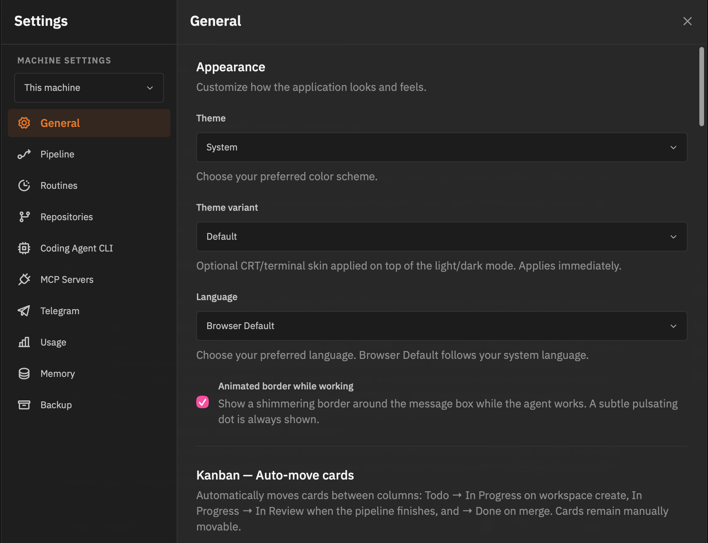

*Settings do livro: preferências de agente/IDE, som do alarme `VK-REVIEW-REQUEST` e a lista de projetos/repositórios com seus scripts (`setup_script`, `dev_server_script`). Em `~/.vibe-kanban/` ficam configs como `telegram.toml` (`automation/telegram.toml.example`) e `orchestrator.toml` — mas para este capítulo, só o básico importa.*

## 4. Declarar seu primeiro projeto: `projects.toml`

O Indie não tem "criar conta" — ele lê um arquivo **`projects.toml`** portável (`docs/cockpit/local-projects.mdx`). O SQLite é a fonte da verdade; o TOML é o export/import que você pode versionar e compartilhar.

### Formato mínimo (para o SaaS do livro)

Crie `~/.vibe-kanban/projects.toml` (ou onde `VIBE_KANBAN_PROJECTS_CONFIG` apontar):

```toml
# --- Repos ---
[[repo]]
path = "~/code/assina-facil"
display_name = "AssinaFácil"
default_target_branch = "main"
setup_script = "pnpm install"
dev_server_script = "pnpm --filter app-web dev"
# copy_files = [".env"]  # copie .env para cada worktree, se precisar

# --- Projeto ---
[[project]]
name = "AssinaFácil"
key = "AF"                       # cards viram AF-1, AF-2...
color = "#3b82f6"
repos = ["~/code/assina-facil"]
statuses = ["Todo", "In Progress", "In Review", "Done"]
```

Campos-chave (`docs/cockpit/local-projects.mdx`):

| Campo | O que faz |
| --- | --- |
| `repo.path` | Âncora única — caminho absoluto ou `~`. Usado para casar na importação. |
| `repo.setup_script` | Roda ao criar workspace (ex.: instalar deps). |
| `repo.dev_server_script` | O que o botão Play / painel Preview vai rodar. |
| `repo.copy_files` | Arquivos copiados para cada worktree (ex.: `.env`). |
| `project.key` | Prefixo dos Simple IDs (`AF-1`). Derivado do nome se omitido. |
| `project.statuses` | Colunas criadas **só na primeira importação**; depois gerencie no app. |

Importe/exporte quando quiser:

```bash
vibe-kanban import ~/.vibe-kanban/projects.toml   # não-destrutivo: atualiza por id/nome/path, nunca apaga
vibe-kanban export /tmp/backup.toml
# ou via HTTP: POST /api/config/import, GET /api/config/export
```

### Criar via UI (alternativa)

Você também pode criar projeto/repo direto na UI de criação de workspace (`docs/workspaces/creating-workspaces.mdx:62`): clique em repos recentes, **Browse repos on disk** ou **Create new repo on disk** (inicializa um git novo). Para o SaaS, crie um repo vazio com `git init ~/code/assina-facil` e aponte o projeto para ele.

## 5. Scripts que fazem o agente trabalhar sozinho

Em **Settings → Projects & Repositories** ajuste por repo:

- **Setup script** (`pnpm install`) — roda em cada worktree novo; sem ele o agente perde tempo instalando à mão.
- **Dev server script** (`pnpm --filter app-web dev`) — o que o **Preview** e o botão Play usam (`docs/browser-testing.mdx:8`).
- **Cleanup script** — roda ao arquivar workspace.

Esses três scripts são o que permitem o **Engineering Loop** do cap. 02 fechar sozinho: o agente cria o worktree, o setup roda, o dev sobe, e o loop `check → ler erro → corrigir` não depende de você.

Para o AssinaFácil, deixe o dev server subindo `app-web` na `5173` — o Preview proxy do Vibe Kanban (`:3003`) vai embuti-lo no painel **Preview** da workspace (ver cap. 04 e `docs/browser-testing.mdx:34`).

## 6. Conferir que está tudo ok

1. Abra `http://localhost:3001` — o board deve listar **AssinaFácil** com colunas Todo / In Progress / In Review / Done e botão **New Issue**.
2. Entre no projeto — board vazio é normal (cap. 05 cria os cards).
3. Crie um card de teste "Hello AssinaFácil" e uma workspace vinculada — o agente deve iniciar e o painel **Logs** deve mostrar `VK-PIPELINE-STAGE: 1`.
4. Se o board não abrir, confira `RUST_LOG=debug` (`crates/server/src/main.rs:33` filtra por `server`, `services`, `db`, `executors`) e `lsof -nP -i :3001 -sTCP:LISTEN`.

## Checklist do capítulo

- [ ] `npx vibe-kanban-alternative` (ou `pnpm run dev` no clone) abre em `http://localhost:3001` sem `AddrInUse`.
- [ ] Preferências de agente/IDE/som definidas em Settings.
- [ ] `projects.toml` com projeto `AssinaFácil` (`AF`) e repo `~/code/assina-facil` importado — board aparece com 4 colunas.
- [ ] Scripts `setup_script` e `dev_server_script` configurados; `copy_files` com `.env` se o SaaS precisar.
- [ ] Card de teste criado e workspace vinculada sobe com `VK-PIPELINE-STAGE: 1` no Logs.

---

# Capítulo 4 — Tour da interface

> **Objetivo:** saber onde cada coisa mora antes de criar o primeiro card — e reconhecer os 3 lugares onde todo o trabalho acontece.

## O app em um mapa

Tudo no Vibe Kanban acontece em dois lugares:

1. **Board do projeto** — onde você **planeja** (cards e colunas).
2. **Workspace view** — onde você **executa** (conversa com o agente + diffs + preview).

A **global sidebar** (barra lateral, presente em todas as telas) conecta os dois. Ela é descrita em `docs/workspaces/interface.mdx:54` e é o seu GPS: de qualquer tela, você volta para qualquer projeto ou workspace em 2 cliques.

```
┌─ Global sidebar ──────────────────────┐  ┌─ Área principal ──────────────────┐
│ Projetos                             │  │ Board  OU  Workspace view         │
│  └─ Meu SaaS (projeto raiz)          │  │                                   │
│     ├─ Tasks          ← cards        │  │  ← o que muda quando você navega │
│     └─ Workspaces     ← workspaces   │  │                                   │
│        ├─ Active / Running / Idle    │  │                                   │
└──────────────────────────────────────┘  └───────────────────────────────────┘
```

## A global sidebar — leia em 10 segundos

```
Projetos
 └─ Meu SaaS (projeto raiz)
    ├─ Tasks          ← cards deste projeto
    └─ Workspaces     ← todos os workspaces deste projeto (Active / Running / Idle / Archived)
```

- **Projects** no topo, com **+** para criar projeto.
- Cada projeto tem **Tasks** (os cards) e, se for raiz, **Workspaces** agregados.
- Workspaces aparecem como folhas agrupadas em **Active / Running / Idle / Needs Attention / Archived**. Um ponto azul indica dev server rodando; um badge indica PR vinculado; um ícone de mão levantada (`Needs Attention`) indica que o agente pediu aprovação — é o equivalente visual do `VK-REVIEW-REQUEST` do cap. 02 §3.
- Para uma lista plana com busca/filtros, abra o **Workspaces dashboard** (`/workspaces`).

Atalho que salva tempo: `Cmd/Ctrl + K` → digite o nome do projeto ou workspace — a command bar (`docs/workspaces/command-bar.mdx`) te leva direto, sem scroll.

## O board (kanban) — onde você planeja

Abra um projeto para cair no board (`docs/getting-started.mdx:44`). O board tem 4 zonas:

1. **App bar** (topo) — navega entre projetos, Workspaces e **Settings** (engrenagem). É de onde você importa `projects.toml` e troca agente/IDE.
2. **Colunas** — cada coluna é um `project_status` (ex.: Todo → Próximos passos / In Progress → Em andamento / In Review → Em revisão / Done → Concluído). Configuráveis por projeto via `projects.toml → statuses` (`docs/cockpit/local-projects.mdx`) ou na UI.
3. **Cards** — issues como cartões. Cada card mostra título, prioridade, tags e Simple ID (`AF-1`). O header de cada coluna tem um **+** que cria card já na coluna certa — e o botão **New Issue** na barra de filtros faz o mesmo.
4. **Painel direito** — detalhes do card selecionado (ou do rascunho em criação). É onde vivem **Workspaces**, **Sub-Issues** e **Comments** do card (ver cap. 05).

**Âncora do livro — board principal:**

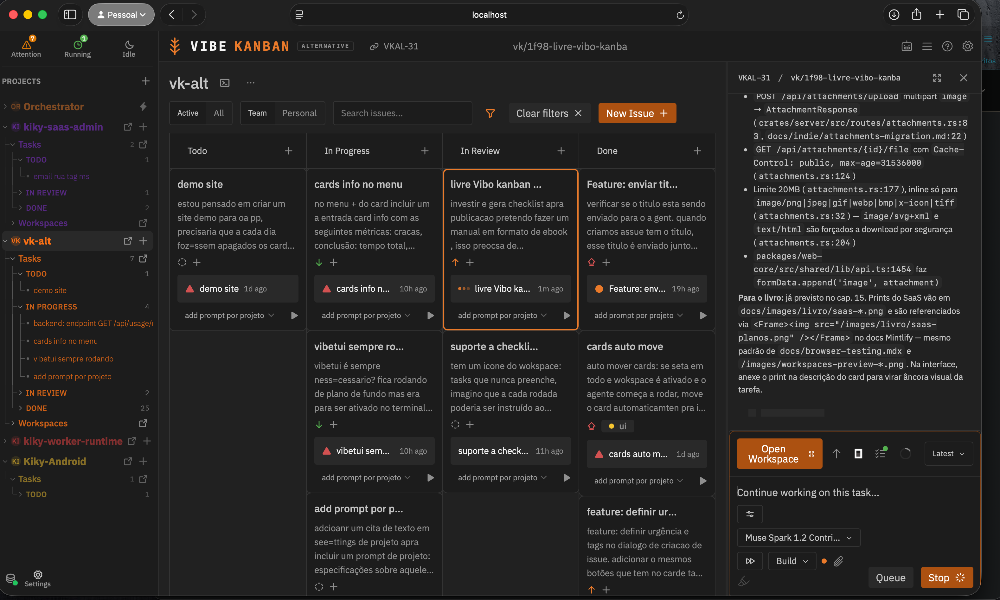

*O board do livro (projeto "Novo aplicativo SaaS"): 4 colunas em PT-BR — Próximos passos, Em andamento, Em revisão, Concluído (são `project_status` configuráveis via `projects.toml` → `statuses`, `docs/cockpit/local-projects.mdx`). Cada coluna mostra a contagem; o painel direito abre o card selecionado. Screenshots de referência do site: `/images/onboarding-projects.png`.*

> **Exercício de 30 segundos:** conte as colunas na âncora acima. São 4 — as mesmas que você declarou em `projects.toml` no cap. 03. Mude `statuses` para 3 ou 5 e recarregue — o board reflete na hora. É assim que você sente que o board é só uma view do `project_status` no SQLite (`crates/db/src/models/project_status.rs`).

**Âncora do livro — workspace aberta:**

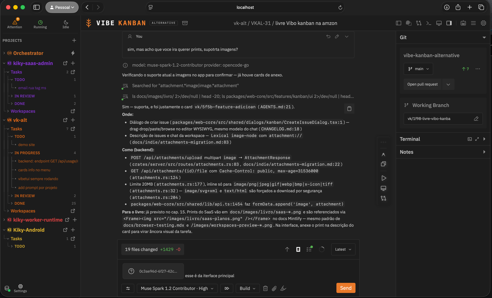

*Workspace do AssinaFácil aberta: à esquerda a Conversation com o agente; ao centro o Context alternando Changes/Logs/Preview; à direita o Details com Git/Terminal/Notes — exatamente os três painéis de `docs/workspaces/interface.mdx:10`.*

## A workspace view — os três painéis (onde você executa)

Ao abrir um workspace (`docs/workspaces/interface.mdx:10`), a tela se divide em:

| Painel | Posição | Para que serve | Quando você usa |
| --- | --- | --- | --- |
| **Conversation** | Esquerda (principal) | Chat com o agente, troca de sessões, envio de follow-ups | 80% do tempo — é onde você pede e corrige |
| **Context** | Direita (principal, alternável) | **Changes** (diffs) / **Logs** (stdout) / **Preview** (browser) | Para revisar o que o agente fez e ver o app rodando |
| **Details Sidebar** | Borda direita | Git (repo/branch, ahead/behind), Terminal (xterm.js), Notes | Para git, comandos e anotações rápidas |

Você não precisa decorar — a **navbar da workspace** (`docs/workspaces/interface.mdx:20`) tem botões para ligar/desligar cada painel:

- Esquerda: **Archive Workspace**.
- Centro-direita (controles de painel): Toggle Left Sidebar / Chat / Changes / Logs / Preview / Right Sidebar.
- Direita (utilidades): **Spawn Orchestrator**, **Command Bar** (`Cmd/Ctrl + K`), **Projects Guide**, **Settings**.

Uma dica que economiza cliques: o **Context Bar** — barra flutuante arrastável com atalhos para abrir no IDE, copiar caminho da workspace (`Copy Path`), ligar dev server e alternar Preview/Changes — descrita em `docs/workspaces/interface.mdx:239`. Arraste para onde for confortável; ela persiste por workspace.

### Conversation panel — seu canal com o agente

- Histórico completo com o agente, suporte a rich text e aprovação de planos.
- **Session dropdown** na toolbar do chat: alterna entre sessões, cria **New Session** quando o contexto fica grande (o agente avisa; ver cap. 14 sobre o watchdog de 400k tokens).
- Atalhos: `Cmd/Ctrl + Enter` envia; `Shift + Cmd/Ctrl + Enter` envia em modo alternativo; `Cmd/Ctrl + B/I/U` formata.
- **Anexos:** arraste e solte imagem direto no chat — o app faz upload para `POST /api/attachments/upload` (`crates/server/src/routes/attachments.rs:83`, 20 MB, `image/png|jpeg|gif|webp`) e o agente recebe como contexto visual. É a melhor forma de mandar mock ou screenshot do erro (ver cap. 05 §4 detalhado).

### Context panel — Changes / Logs / Preview (alterna com um clique)

- **Changes** (`/images/workspaces-changes-panel.png`): árvore de arquivos modificados + diffs com syntax highlight + **comentários inline** para dar feedback ao agente ("este diff deveria mexer em `plans.ts`, não em `landing.tsx`").
- **Logs** (`/images/workspaces-logs-panel.png`): abas por processo, busca no log, stdout/stderr em tempo real. É aqui que você vê `VK-PIPELINE-STAGE: N` sendo reportado ao vivo quando o agente avança no pipeline (cap. 06) — e `VK-REVIEW-REQUEST` quando ele precisa de você.
- **Preview** (`/images/workspaces-preview-panel.png`): browser embutido que sobe via **Preview proxy** (Rust, `crates/preview-proxy`) + seu **Dev server script** (Node, `projects.toml` ou Settings). Suporta múltiplas tabs, modos desktop/mobile e detecção automática da URL nos logs (`docs/browser-testing.mdx:34`). Para o SaaS do cap. 08, é aqui que você vê `http://localhost:5173` rodando.

> **Quando usar cada um:** Changes para revisar código, Logs para entender por que o `check` quebrou, Preview para validar visual. O agente escreve nos três — você lê nos três.

### Details sidebar — Git / Terminal / Notes (sempre à mão)

- **Git** (`/images/workspaces-git-panel.png`): repo e branch atuais (`vk/xxxx-*`), target branch, contagem de mudanças não commitadas, commits ahead/behind — e atalho para **Create PR / Merge / Rebase** (`docs/workspaces/git-operations.mdx`, ver cap. 07).
- **Terminal** (`/images/workspaces-terminal.png`): xterm.js direto no ambiente da workspace — rode `git status`, `pnpm run check`, `cargo test` ali mesmo. Persiste entre trocas de painel.
- **Notes** (`/images/workspaces-notes.png`): editor rich text por workspace (auto-save). Use para anotar decisões do card — o próximo agente que abrir a workspace lê.

## Command bar e atalhos que importam

`Cmd/Ctrl + K` abre a command bar (`docs/workspaces/command-bar.mdx`) — crie workspace, arquive, duplique, alterne painéis, execute ações de issue, tudo sem mouse. Os 3 atalhos que você vai usar todo dia:

| Atalho | Onde | Faz |
| --- | --- | --- |
| `Cmd/Ctrl + K` | Global | Command bar |
| `Cmd/Ctrl + Enter` | Chat | Enviar mensagem |
| Arrastar imagem → chat | Chat | Anexar como contexto visual |

## Checklist do capítulo

- [ ] Sei apontar no board: app bar, colunas, cards, painel direito — e criar card pelo `+` da coluna ou New Issue.
- [ ] Sei apontar na workspace: Conversation, Context (Changes/Logs/Preview) e Details (Git/Terminal/Notes).
- [ ] Sei usar a global sidebar para navegar entre projetos e workspaces por estado (Active/Running/Needs Attention).
- [ ] Sei alternar Context entre Changes/Logs/Preview e abrir o terminal embutido.
- [ ] Sei abrir a command bar (`Cmd/Ctrl + K`) e enviar mensagem no chat.

---

# Capítulo 5 — Cards e Kanban — ciclo de vida na prática

> **Objetivo:** criar cards que viram prompts bons, mover com intenção e entender como os cards mudam de coluna sozinhos.

## O que cabe num card

Em `docs/issue-management.mdx:13`, um card tem:

| Campo | O que preencher |
| --- | --- |
| **Title** | O resultado esperado, específico ("Criar página de planos do SaaS", não "Fix bug") |
| **Description** | Contexto + requisitos + instruções — vira o prompt do agente |
| **Status** | Coluna onde o card está (Todo → Próximos passos / In Progress → Em andamento / In Review → Em revisão / Done → Concluído) |
| **Priority** | Urgent / High / Medium / Low |
| **Tags** | Etiquetas do projeto (crie inline no seletor) |
| **Simple ID** | Identificador curto tipo `AF-1` (vem de `project.key` em `projects.toml`) |

No código: `crates/db/src/models/issue.rs` e `crates/db/src/models/project_status.rs`. No frontend: `packages/web-core/src/shared/dialogs/kanban/CreateIssueDialog.tsx`.

## 1. Criar um card — a janela na prática

No board, clique no **+** da coluna desejada (o card já nasce nessa coluna) ou no botão **New Issue** da barra de filtros (`docs/issue-management.mdx:22`). A janela que abre é esta — com suas três partes:

**Topo — título, status, prioridade e tags:**

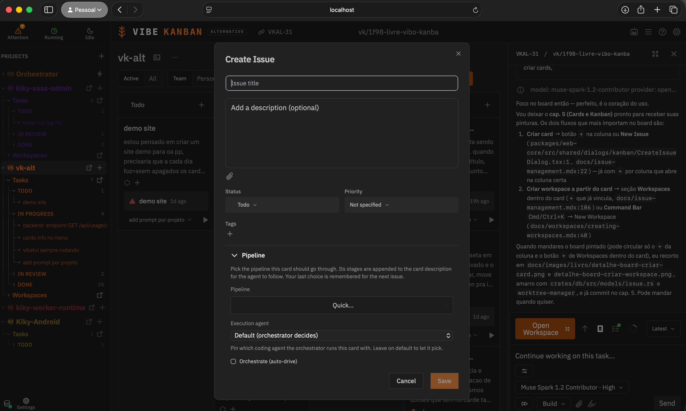

- **Title** — claro e com verbo ("Adicionar checkout com Stripe"). É o que aparece no card no board.
- **Status** — coluna inicial (ex.: `Próximos passos`). Equivale a `project_status` no DB.
- **Priority** e **Tags** — `High` + `billing`, por exemplo. Tags são criadas inline no seletor (`docs/issue-management.mdx:91`).

**Base — descrição e botão Save:**

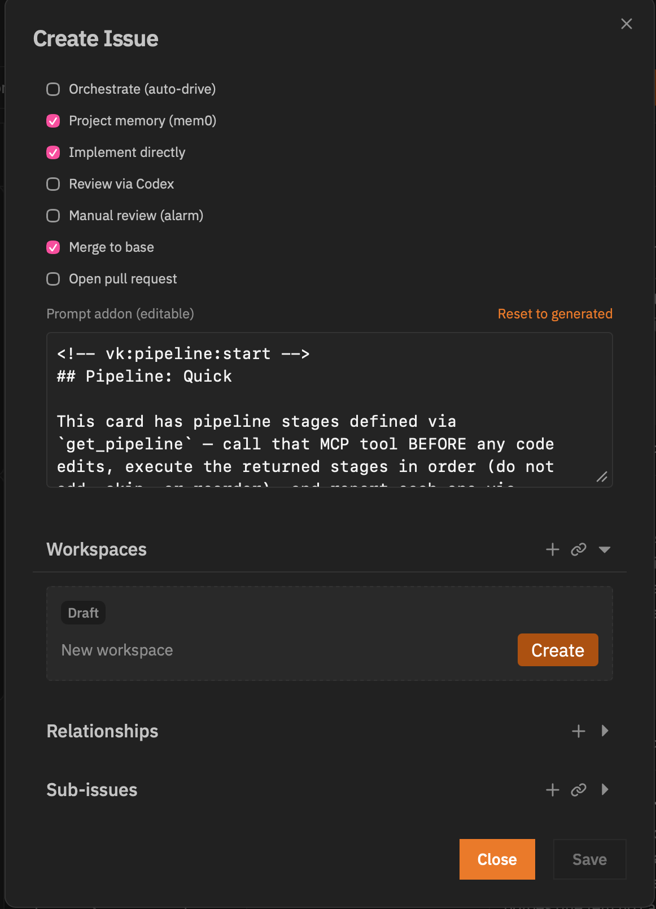

- **Description** — use o editor rico (negrito, listas, código inline, `#` para heading, `[texto](url)`). É opcional, mas decisivo: **a descrição vira o prompt que o agente recebe** ao criar a workspace. Um card sem descrição gera um agente sem direção.
- Clique em **Save** para criar. Se marcar **Create draft workspace immediately**, o app já cria a workspace vinculada (atalho útil para ir direto ao trabalho).

> **Dica do Vibe Guide (`docs/vibe-guide.mdx:22`):** cinco minutos de plano economizam dez de revisão. Um card bem escrito é o plano.

### Escrever descrições que o agente acerta

Compare (`docs/issue-management.mdx:70`):

| Fraco | Forte |
| --- | --- |
| "Tá quebrado" | "Usuários em 3G veem timeout após 5s no login. Esperado: retry com backoff exponencial. Validar com `pnpm run check`." |

Inclua: o que fazer, restrições, arquivos/áreas relevantes, e como vai validar (ex.: "rodar `pnpm run check` deve passar; screenshot do checkout em `/images/livro/saas-checkout.png` deve coincidir").

## 2. Da criação à workspace — o fluxo básico

**Na mesma janela, crie a workspace:**

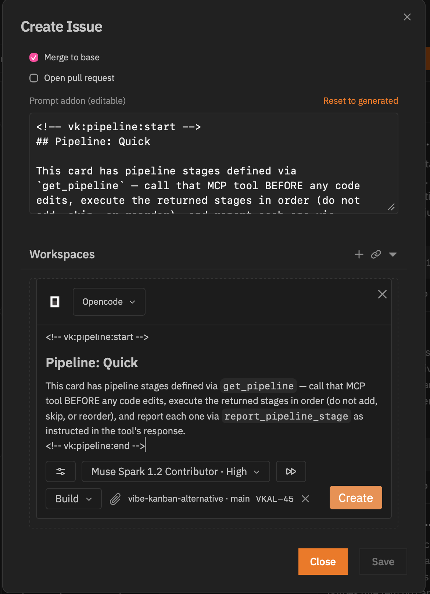

Após salvar o card, na mesma janela aparece a seção **Workspaces**. Clique em **Create** — o app cria um workspace vinculado ao card (worktree `vk/xxxx-nome` a partir do `target branch`, ver cap. 07), abre a **workspace view** principal e o agente já começa a trabalhar. A partir daí é só enviar mensagens no chat.

O workspace criado aparece na **global sidebar** à direita (ou esquerda, conforme layout) — é o mesmo que você vê no print do board principal (`ancora-board-principal.png`).

## 3. Como os cards se movem (manual e automático)

Os cards se movem de duas formas:

### Manual — você arrasta

Clique no card e arraste para outra coluna, ou troque o **Status** no painel do card. **Título e descrição salvam automaticamente** após parar de digitar; **status/prioridade/tags salvam imediatamente** (`docs/issue-management.mdx:96`). Se o sort do board não estiver em **Manual**, o drag-to-reorder é desabilitado — troque para Manual no header.

### Automático — o pipeline move por você

Quando você cria o card de um jeito que o agente consegue trabalhar (descrição clara) e envia a primeira mensagem na workspace, o agente inicia e o card vai para **In Progress** (Em andamento). Ao finalizar o trabalho, vai para **In Review** (Em revisão) — é onde você revisa diffs e Preview.

Fluxo completo:

```
Você cria o card          → Próximos passos (Todo)
Envia mensagem na workspace → Em andamento (In Progress)  ← agente trabalhando
Agente finaliza            → Em revisão (In Review)       ← você revisa
Você aprova (ou move manual) → Concluído (Done)
Precisa de ajuste? Instrui o agente → volta para Em andamento
```

Se em **Settings** o "mover cards automaticamente" estiver ligado, essas transições acontecem sozinhas; se não, você move manualmente — ambos funcionam. O livro recomenda deixar o auto-move ligado para o fluxo básico e mover manualmente quando quiser controlar o ritmo.

## 4. Barra da workspace — Tasks, conversa, presets e anexos

Dentro da workspace, a barra inferior concentra tudo que você usa enquanto o agente trabalha:

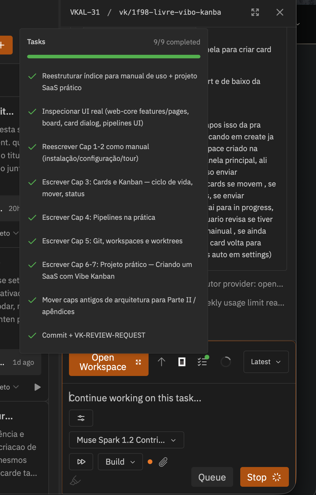

De cima para baixo, na mesma barra:

| Elemento | O que é | Código / doc |
| --- | --- | --- |
| **Detalhes de Tasks** | Tarefas cumpridas pelo modelo na barra superior | `crates/services/src/services/pipeline_stage.rs` (`VK-PIPELINE-STAGE: N`) |
| **Lista de mensagens** | Histórico da conversa com o agente | `crates/mcp` + `crates/executors` |
| **Open workspace** | Botão que abre a workspace em tela cheia | `docs/workspaces/interface.mdx:82` |
| **Ícone do modelo** | Qual agente está rodando (ex.: Claude Code) | `crates/executors/src/executors/` |
| **Contexto usado** | Tokens/contexto consumido na sessão | `crates/services/src/services/orchestrator_compactor.rs` |
| **Session** | Sessão atual (troque ou crie New Session) | `docs/workspaces/interface.mdx:119` |
| **Presets** | Atalhos de configuração do agente | `~/.vibe-kanban/projects.toml` / Settings |
| **Modelo** | Seletor de modelo (ex.: Sonnet, Opus) | `crates/executors/src/executors/` |
| **Permissões** | Nível de permissão do agente (YOLO / ask) | `crates/executors/src/approvals.rs` (`docs/vibe-guide.mdx:52`) |
| **Preset de agent** | Perfil do agente (varia por executor) | `crates/mcp/src/task_server/tools/` |
| **Anexos** | Arraste e solte imagens direto no chat — **a melhor forma de enviar referência visual** | `crates/server/src/routes/attachments.rs:83` (`POST /api/attachments/upload`, multipart `image`, 20 MB, `image/png|jpeg|gif|webp`) |
| **Preview Changes** | Alterna entre Preview e Changes | `docs/workspaces/interface.mdx:143` |
| **Quero mensagens** | Campo de envio de follow-ups | `docs/workspaces/interface.mdx:101` |

> **Dica de ouro para imagens:** arrastar e soltar a imagem direto no chat é a melhor alternativa — o app faz upload para `/api/attachments/upload`, cria `AttachmentResponse` (`attachments.rs:46`) e o agente recebe a imagem como contexto visual. Use para mandar mock, screenshot do erro ou referência de layout do SaaS (cap. 08).

## 5. Seções do card (após criado)

No painel do card já criado (`docs/issue-management.mdx:102`, `/images/issue-mgmt-link-workspace.png`):

- **Workspaces** — workspaces vinculados (onde o agente trabalha). Crie com **+** ou vincule existente; vários em paralelo são possíveis.
- **Sub-Issues** — quebre um épico em tarefas menores (`/images/issue-mgmt-sub-issues.png`). Cada sub-issue tem status próprio e pode ter sub-issues recursivamente.
- **Comments** — discussão da tarefa.

## 6. Quebrar trabalho grande (para o SaaS do cap. 08)

Crie um card pai "SaaS AssinaFácil — MVP" e sub-issues:

- "Setup do monorepo (Vite + Tailwind)"
- "Auth (login/cadastro)"
- "Página de planos e checkout"
- "Webhooks Stripe + entitlements"

Cada sub-issue vira um workspace independente — despache 3 agentes em paralelo sem conflito (cada um no seu worktree/branch `vk/xxxx-*`).

## 7. Ações, seleção múltipla e bulk

- **More (⋯)** no painel do card ou **command bar** (`Cmd/Ctrl + K` → Issue Actions): mudar status/prioridade, transformar em sub-issue, vincular workspace, duplicar, deletar.
- **Seleção múltipla**: `Cmd/Ctrl + Click` alterna, `Shift + Click` intervalo, `Cmd/Ctrl + A` todos. Com 2+ selecionados, surge a **bulk action bar** para mudar status/prioridade ou deletar em lote (bulk delete é permanente).

## Checklist do capítulo

- [ ] Criei um card pela janela (preenchi Title, Status, Priority/Tags, Description e cliquei Save).
- [ ] Criei uma workspace a partir do card (seção Workspaces → Create) e vi o agente iniciar.
- [ ] Entendi o fluxo Todo → In Progress (mensagem) → In Review (agente finaliza) → Done (eu aprovo) e quando o agente volta para In Progress.
- [ ] Sei usar a barra da workspace: anexar imagem por drag-drop, trocar modelo/preset, ver contexto e trocar sessão.
- [ ] Criei um épico com 3 sub-issues e vinculei workspaces.

---

# Capítulo 6 — Pipelines na prática

> **Objetivo:** entender o que é um pipeline, escolher o certo para cada card e acompanhar o progresso sem adivinhar.

## O que é um pipeline

Um pipeline é uma **receita em TOML** que diz ao agente o que fazer, em que ordem, e como reportar progresso. As receitas vivem em `assets/pipelines/*.toml`. Este projeto tem 9:

| Arquivo | Quando usar |
| --- | --- |
| `quick.toml` | Card trivial (1–3 arquivos, spec completa) — implementa direto, sem spec/plan |
| `basic.toml` | Feature média — spec → plan → implement → review → merge |
| `speckit.toml` | Spec-Driven Development — `/speckit.*` em `specs/<branch>/` |
| `swarm-multi-agent.toml` | Épico grande — Antigravity planeja, Claude implementa, Codex revisa |
| `wikillm.toml` | Tarefa que depende de conhecimento prévio — recall antes, enrich depois |
| `async-claude-fable.toml` / `opus` / `sonnet` | Fan-out com subagentes Fable/Opus/Sonnet (spec e plan em subagente) |
| `async-opencode-glm.toml` | Mesmo fan-out, mas para executor OpenCode/GLM (sem subagentes Claude) |

Quando você cria um card, a descrição carrega só um **ponteiro compacto** (`<!-- vk:pipeline:start --> … <!-- vk:pipeline:end -->`); o conteúdo pesado é resolvido via `get_pipeline` (MCP, `crates/mcp/src/task_server/tools/pipeline.rs`). O agente executa os `[[stage]]` em ordem, sem pular nem reordenar — e a cada estágio chama `report_pipeline_stage` + escreve `VK-PIPELINE-STAGE: N` no log.

Anatomia de um `[[stage]]`:

```toml
[[stage]]
id = "implement"
label = "Implement directly"
default_enabled = true
prompt = "Implement this card directly from its description — do NOT write SPEC.md..."
```

`default_enabled` diz se o estágio roda por padrão. Alguns existem mas vêm desabilitados — habilite quando precisa.

## O pipeline Quick por dentro

O `quick.toml` é o seu primeiro pipeline (cards `trivial`):

```toml
name = "Quick"
# "Minimal flow for trivial cards: no spec, no plan, no subagent fan-out"

[[stage]] # orchestrate  — default_enabled = false (só se ligar auto-drive)
[[stage]] # memory       — true  — get_rules (guardrails do AGENTS.md)
[[stage]] # implement    — true  — implementa direto da descrição + verifica
[[stage]] # code-review  — false — review via Codex (opcional)
[[stage]] # review-manual — false — VK-REVIEW-REQUEST + STOP (alarme)
[[stage]] # merge         — true  — squash-merge no branch base
[[stage]] # pr            — false — abrir pull request
```

| Estágio | default | O que faz de verdade |
| --- | --- | --- |
| `memory` | on | Chama `get_rules` (o `pre` são guardrails, `post` é checklist de fechamento) |
| `implement` | on | Implementa direto da descrição, roda `pnpm run check` + check manual e corrige |
| `review-manual` | **off** | Escreve `VK-REVIEW-REQUEST: <o que revisar>` e **para** — `crates/services/src/services/review_request.rs:18` toca som/notificação |
| `merge` | on | Squash-merge autorizado (não espera aprovação externa) |

A **tripwire** do `implement` é o mecanismo de segurança: se o agente descobrir que o card não era trivial (precisa mexer em >3 arquivos, há decisão de design aberta, o root cause está em outro lugar), ele commita o WIP e para com a primeira linha exatamente `VK-ESCALATE: trivial->light — <motivo>` (ou `trivial->medium`). O orquestrador re-roteia para um pipeline maior. É melhor escalar do que empurrar.

Outros pipelines acrescentam estágios visíveis no TOML: `spec`/`plan` (basic, async-*), `plan-review-codex`, `speckit-constitution`/`specify`/`clarify`, `recall-knowledge` (wikillm), e no `swarm-multi-agent` os estágios têm `executor = "antigravity"` / `"claude"` / `"codex"` — cada estágio pode rodar em um agente diferente, com memória compartilhada via `mem0` (`memory_search`/`memory_save` a cada estágio).

## Como usar na interface — o ciclo completo

1. **Crie o card** (cap. 5) com descrição específica — no Quick, ela **é** a work order. Se a descrição já contém `### Outcome`, `### Scope` e `### Testing & acceptance criteria` (cada um no início da linha), pipelines maiores reaproveitam a spec e escrevem `SPEC.md` copiando-a verbatim (com `<!-- vk:pipeline:start/end -->` removido).
2. **Crie um workspace vinculado** ao card e descreva a tarefa no chat — o agente busca `get_pipeline` e segue os estágios.
3. **Acompanhe ao vivo em Logs:** a cada estágio o agente escreve `VK-PIPELINE-STAGE: N` e chama `report_pipeline_stage`. O backend persiste em `workspaces.current_pipeline_stage` (`crates/services/src/services/pipeline_stage.rs:28`, regex `(?i)VK-PIPELINE-STAGE:\s*(\d+)` com `has_valid_boundary` para lidar com `\n` escapado em transcripts) e a UI mostra o progresso.
4. **Quando precisa de você:** `VK-REVIEW-REQUEST: <o que revisar>` (`review_request.rs:18`, regex `(?i)VK-REVIEW-REQUEST:\s*(.+)`, guard idempotente por `execution_process_id`) — a UI toca alarme e o agente para até você liberar. Você revisa em **Changes** (diffs) e **Preview** (app rodando).
5. Se o card não tem pipeline, `stages` vem vazio e o agente segue sem ele — útil para spikes exploratórios.

### Ver na prática (exercício de 5 minutos)

- Crie um card "Adicionar badge de prioridade no card" com descrição de 3 linhas (onde: `packages/web-core/src/features/kanban/ui/`, critério: `pnpm run check` passa).
- Vincule um workspace, escolha pipeline `quick`, envie a primeira mensagem.
- Abra **Logs** e observe `VK-PIPELINE-STAGE: 1` → `2` aparecendo. Quando surgir `VK-REVIEW-REQUEST`, abra **Changes** e valide.

## Escolher o pipeline certo

| Situação | Pipeline |
| --- | --- |
| Correção/tarefa de 1–3 arquivos, spec clara | `quick` |
| Feature média que merece `SPEC.md` + `IMPLEMENTATION_PLAN.md` | `basic` ou `speckit` |
| Épico com frentes paralelas | `swarm-multi-agent` |
| Pesquisa/escrita com base de conhecimento | `wikillm` ou `async-*` |

Troque o pipeline do card **antes** de despachar o workspace. Na dúvida, comece em `quick` e deixe a tripwire `VK-ESCALATE` te dizer se precisa escalar — ela existe para isso.

## Checklist do capítulo

- [ ] Sei onde vivem as receitas (`assets/pipelines/*.toml`) e o que `default_enabled` controla.
- [ ] Sei o que cada estágio do `quick` faz (memory/implement/review-manual/merge) e onde fica a tripwire.
- [ ] Criei um card Quick, vinculei workspace e vi `VK-PIPELINE-STAGE` avançando em Logs.
- [ ] Sei o que fazer em `VK-REVIEW-REQUEST` e quando escalar para `basic`/`swarm`.

---

# Capítulo 7 — Git, workspaces e worktrees

> **Objetivo:** usar git dentro do Vibe Kanban sem medo — cada workspace é um branch isolado que você pode revisar, testar e mergear com confiança.

## O que acontece quando você clica em Create

`docs/workspaces/creating-workspaces.mdx:12` resume em 4 passos o que o botão faz:

1. **Git worktree** — cria um diretório separado com seu próprio branch, isolado do repo original. Seu código original não é tocado.
2. **Working branch** — branch auto-gerado a partir do **target branch** (ex.: `main` → `vk/a1b2-criar-pagina-de-planos`). É aqui que o agente commita.
3. **Sessão do agente** — o agente escolhido é inicializado e já recebe sua tarefa (a descrição do card).
4. **Setup scripts** — se o projeto/repo tiver `setup_script` (ex.: `pnpm install`), ele roda automaticamente.

No disco: worktrees ficam em `.vibe-kanban-workspaces/` por padrão (configurável em Settings → General → Workspace Directory). Cada workspace ganha sua pasta — por isso você pode rodar 3 agentes em paralelo sem conflito (cada um no seu `vk/xxxx-*`).

No código: `crates/worktree-manager`, `crates/workspace-manager`, `crates/git` e `crates/git-host` cuidam da criação, listagem e teardown; `crates/db/src/models/workspace.rs` e `workspace_repo.rs` persistem o vínculo.

## Criar um workspace, passo a passo (na interface)

`docs/workspaces/creating-workspaces.mdx:38`, com screenshots em `/images/workspaces-*.png`:

1. **Abra o Create View** — `Cmd/Ctrl + K` → New Workspace, ou Dashboard de Workspaces, ou o **+** na seção **Workspaces** de um card (já vincula o workspace ao card — o atalho mais usado).
2. **Selecione o Project** no dropdown da direita.
3. **Adicione Repositórios** — clique nos recentes, ou **Browse repos on disk**, ou **Create new repo on disk** (inicializa um git novo). Você pode adicionar **vários repos** num mesmo workspace — cada um mantém git independente (útil para o SaaS com `app-web` + `api`).
4. **Defina o Target Branch** por repo — onde seu trabalho vai mergear (ex.: `main`). Clique no dropdown ao lado do repo para trocar.
5. **Descreva a tarefa** no chat embaixo — seja específico (cap. 5: título com verbo + critério de pronto).
6. **Escolha o Agent** e variante (modelo, permissões).
7. **Create** — o agente começa imediatamente; o card vai para **In Progress**.

> **Target vs Working branch** (`docs/workspaces/creating-workspaces.mdx:80`):
> - **Target** = onde vai mergear (ex.: `main`). Você define.
> - **Working** = onde o agente trabalha (ex.: `vk/a1b2-...`). Auto-criado a partir do target. Só afeta o target quando você cria e mergeia um PR.

## Dentro da workspace — onde o git mora

Já visto no tour (cap. 4), aqui com foco em git:

- **Details Sidebar → Git** (`/images/workspaces-git-panel.png`): repo/branch atuais, target branch, contagem de mudanças não commitadas, commits ahead/behind — e atalho para **Create PR / Merge / Rebase** (`docs/workspaces/git-operations.mdx`).
- **Terminal** (`/images/workspaces-terminal.png`): xterm.js no ambiente da workspace — rode `git status`, `git log --oneline -5`, `pnpm run check`, `cargo test` ali mesmo. O terminal persiste entre trocas de painel.
- **Context → Changes** (`/images/workspaces-changes-panel.png`): árvore de arquivos + diffs inline com syntax highlight + comentários inline para dar feedback ao agente ("este diff deveria mexer em `plans.ts`, não em `landing.tsx`").
- **Context → Preview** (`/images/workspaces-preview-panel.png`): browser embutido. Configure o **Dev server script** do projeto (ex.: `pnpm --filter app-web dev` em `projects.toml` ou Settings) e ligue com o botão **Play** na context bar. O `crates/preview-proxy` serve o dev Node dentro do painel.

### O ciclo de revisão com git

Para cada card do SaaS (cap. 8), repita:

```
Changes (diffs) → Preview (app rodando) → Terminal (pnpm run check / cargo test)
      ↓ comentário inline         ↓ clique no Preview
   agente corrige            volta para In Progress
      ↓ OK
   In Review → Done → Merge/PR
```

O painel **Logs** mostra `VK-PIPELINE-STAGE: N` avançando — é o pipeline (cap. 6) reportando estágio no `MsgStore` (`crates/services/src/services/pipeline_stage.rs:28`).

## Duplicar, arquivar e pinar

- **Duplicar:** `Cmd/Ctrl + K` → Workspace Actions → **Duplicate Workspace** (mesma config de repos/branches, conversa nova — útil para tentar outra abordagem sem perder a anterior).
- **Arquivar:** botão **Archive** na navbar ou `Cmd/Ctrl + K` → Workspace Actions → **Archive**. Arquivadas vão para **View Archive** no fim da sidebar; o `cleanup_script` do repo roda aqui. **View Archive** também é onde fica o **Delete** permanente.
- **Pinar:** **Pin** mantém workspaces ativas no topo da lista — use para o épico do SaaS enquanto as sub-tarefas correm.

## Troubleshooting rápido

| Sintoma | Causa comum | O que fazer |
| --- | --- | --- |
| Repo não aparece na lista | Pasta não é git / não está num projeto | Browse repos on disk; confirme `.git` |
| Falha ao criar workspace | Mudanças não commitadas no repo original / conflito de nome de branch | Commit/stash no repo original; troque target branch |
| Agente não inicia | Agente não instalado / API key / rede | Rode o CLI do agente no terminal da workspace; confira Settings → Agents |
| Setup script falha | Erro no script / dependência | Teste o script no terminal; veja o painel Logs |
| `AddrInUse` ao subir dev server | Porta `:5173`/`:3000`/`:3001` já ocupada | `lsof -nP -i :5173 -sTCP:LISTEN` + `cwd` do PID (cap. 03) |
| Card não sai de In Review | Pipeline em `review-manual` esperando você | Verifique `VK-REVIEW-REQUEST` em Logs; aprove ou instrua o agente |

O `docs/workspaces/creating-workspaces.mdx:201` lista esses casos em `<Accordion>` — vale marcar como favorito.

## Checklist do capítulo

- [ ] Criei um workspace vinculado a um card e identifiquei o working branch `vk/xxxx-*` em Details → Git.
- [ ] Sei a diferença entre target e working branch e onde cada um aparece na UI.
- [ ] Rodei `git status` e `pnpm run check` dentro do terminal da workspace.
- [ ] Configurei dev server script e abri o Preview com o app do SaaS rodando.
- [ ] Dupliquei e arquivei uma workspace e a encontrei em View Archive.

---

# Capítulo 8 — Projeto prático: Criando um SaaS com Vibe Kanban

> **Objetivo:** construir um SaaS do zero usando só a interface — cada seção é um card que você cria, despacha e revisa. No final, o board é a documentação do produto.

## O produto: AssinaFácil

**AssinaFácil** é um SaaS fictício de gestão de assinaturas — propositalmente simples para caber num livro, mas com as peças que todo SaaS tem: landing, auth, planos, checkout, área logada e webhooks. Você vai construí-lo card a card, exatamente como usaria o Vibe Kanban no seu produto real.

Stack sugerida (ajuste ao seu gosto — o fluxo no Vibe Kanban é o mesmo):

- `app-web` — Vite + React + Tailwind
- `api` — Node (ou Rust) em `api/` — aqui um mock em memória para focar na interface

## Preparação — o card que destrava todo o resto

**Card:** `Setup do monorepo AssinaFácil`

- **Descrição (spec forte, cap. 02):**
  > Criar monorepo pnpm com `app-web` (Vite + React + Tailwind) e `api` (Node). Configurar `pnpm run dev` (app-web na 5173, api na 3000), `pnpm run check` (tsc) e `pnpm run format` (prettier). O dev server do Vibe Kanban deve subir `app-web` no Preview.
  > Arquivos: `package.json` (workspaces), `app-web/`, `api/`, `pnpm-workspace.yaml`.
  > Critério de pronto: `pnpm run dev` sobe; Preview mostra "Hello AssinaFácil"; `pnpm run check` passa.
- **Pipeline:** `quick` (trivial e bem especificado — cap. 06).
- **Workspace:** crie a partir do card (seção **Workspaces → Create** dentro do card, cap. 05), selecione **Create new repo on disk** (`~/code/assina-facil`), target `main`, escolha o agente e clique **Create**. Acompanhe `VK-PIPELINE-STAGE` em **Logs**; quando surgir `VK-REVIEW-REQUEST`, revise diffs em **Changes** e o app em **Preview**.

Ao finalizar, configure no projeto (cap. 03):

- Setup script: `pnpm install`
- Dev server script: `pnpm --filter app-web dev`
- `copy_files = [".env"]` se o SaaS precisar de env

## Épico e sub-tarefas — quebre antes de codar

Crie o épico **AssinaFácil — MVP** (card pai) e, dentro dele, sub-issues (cap. 05 §5):

1. **Landing page + design system** — hero, features, CTA para /planos.
2. **Auth (login/cadastro)** — formulários + estado mockado.
3. **Página de planos e checkout** — tabela de 3 planos (Free, Pro R$49, Enterprise), botão Assinar, fluxo mock.
4. **Área logada — Minhas assinaturas** — lista, cancelar, recibo.
5. **Webhooks + entitlements** — `POST /webhooks` que marca assinatura como ativa.

Cada sub-issue tem status próprio, link de volta ao pai e pode ter sub-issues recursivamente (`docs/issue-management.mdx:126`). Cada uma vira um workspace independente — despache em paralelo quando não houver dependência (ex.: 1 e 2 podem rodar juntos, cada um no seu `vk/xxxx-*`).

Exemplo de descrição forte para o card 3 (reaproveita o exemplo do cap. 02):

> **Título:** Criar página `/planos` com 3 planos e CTA para checkout
> Arquivos: `app-web/src/pages/plans.tsx`, `app-web/src/features/billing/plans.ts`
> Validação: Preview em 1440px e 375px sem quebra; `pnpm run check` passa; âncora `docs/images/livro/saas-planos.png` coincide.
> Restrição: usar Tailwind já configurado; não adicionar lib nova.

## O ciclo que você vai repetir (5 vezes)

Para cada sub-issue, faça o loop completo — é o "usar o aplicativo para desenvolver":

1. **Crie o card** com título com verbo e descrição específica (cap. 05) + critério de pronto observável.
2. **Crie a workspace vinculada** (cap. 07) — worktree `vk/xxxx-nome` a partir de `main`.
3. **Board:** o card vai para **In Progress** ao enviar a primeira mensagem na workspace.
4. **Acompanhe:** Conversation (chat), **Logs** (`VK-PIPELINE-STAGE: N`), **Changes** (diffs), **Preview** (app).
5. **Revise:** quando surgir `VK-REVIEW-REQUEST`, abra Changes e Preview; comente inline ou envie follow-up no chat ("o CTA deveria ser azul, não verde").
6. **Ajuste ou aprove:** se pediu ajuste, o card volta para **In Progress** (cap. 05 §3); se OK, mova para **In Review → Done**. O estágio `merge` do `quick` faz squash-merge sozinho; ou abra PR pela aba **Git** (`docs/workspaces/git-operations.mdx`).

## Roteiro dos cards e o que validar no Preview

| Ordem | Card | O que validar |
| --- | --- | --- |
| 1 | Setup do monorepo | `pnpm run dev` sobe; Preview mostra "Hello AssinaFácil" | — |
| 2 | Landing page | Hero + CTA funcionando | `saas-landing.png` (desktop 1440×900) + `saas-landing-mobile.png` (390×780) |
| 3 | Auth — login/cadastro | Formulários com validação; estado mockado | (âncora futura `saas-auth.png`) |
| 4 | Planos e checkout | Tabela 3 planos; Assinar → /checkout mock | `saas-planos.png` + `saas-checkout.png` |
| 5 | Área logada | Lista mockada; Cancelar muda estado | `saas-minhas-assinaturas.png` |
| 6 | Webhooks | `POST /webhooks` muda entitlement; teste via Terminal da workspace | — |

As âncoras já geradas (PIL, 1440×900) vivem em `docs/images/livro/` — veja abaixo. Capture cada nova âncora quando o card for para Done (arraste a imagem no chat da workspace — `crates/server/src/routes/attachments.rs:83` — ou salve direto; ver cap. 15).

**Âncoras do AssinaFácil (prévias geradas):**

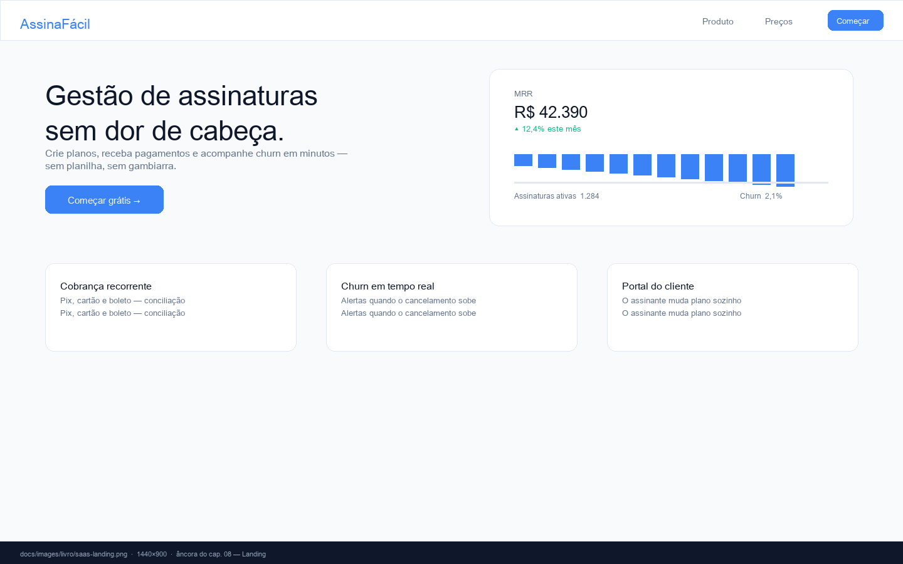

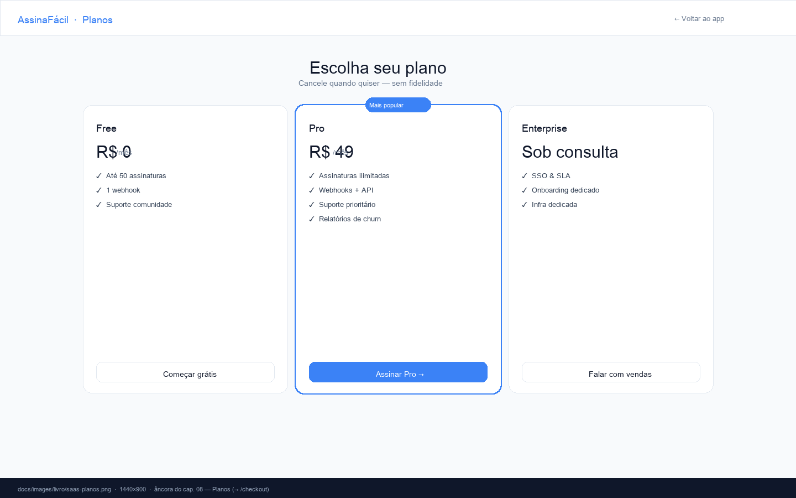

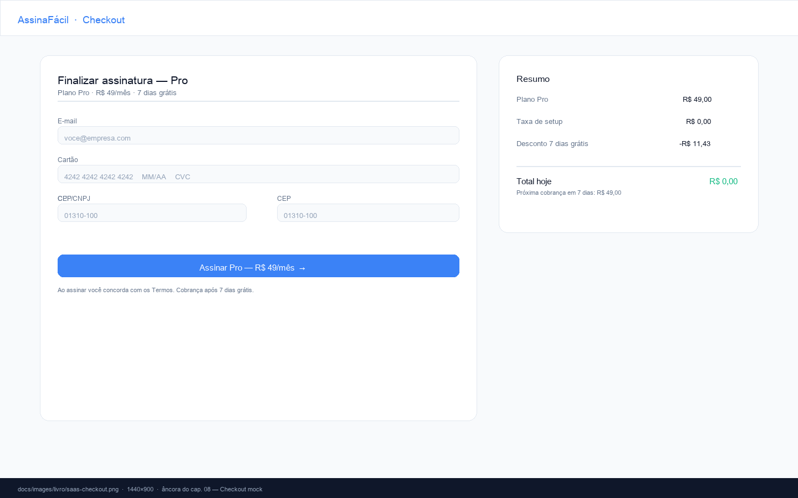

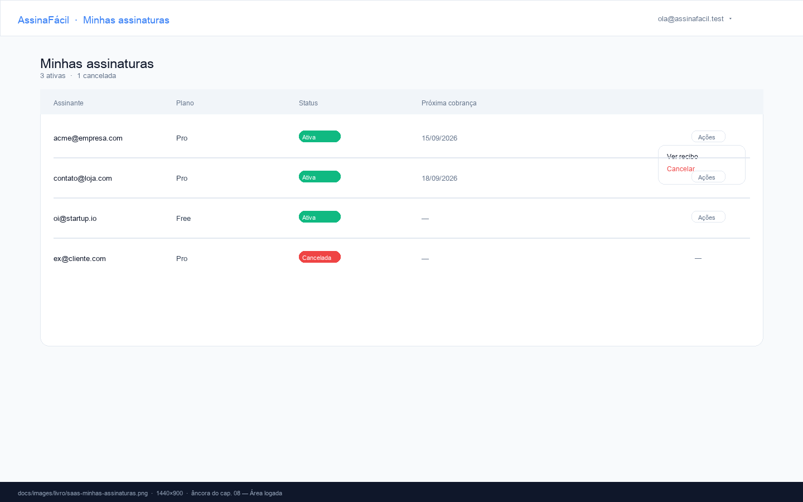

*Prévias geradas em PIL para o livro — substitua por screenshots reais quando os cards forem para Done; mantenha 1440×900 para comparação estável.*

## Quando algo dá errado (atalhos)

- **Agente travou em `Needs Attention`:** sidebar → badge de mão levantada, ou TUI `cargo run -p tui` tecla `a`, ou Telegram bridge (`automation/README.md`).
- **Card não muda de coluna:** sort do board em **Manual** (cap. 05 §3); senão troque Status no painel.
- **Porta ocupada:** `lsof -nP -i :5173 -sTCP:LISTEN` + `cwd` (cap. 03 §2).
- **Pipeline não avança:** confira `VK-PIPELINE-STAGE: N` em Logs — se parou, veja se caiu na tripwire `VK-ESCALATE: trivial->light` (card precisa de pipeline maior).

## O que você tem no final

Um board com o histórico completo — épico + 6 cards em **Done**, cada um com sua branch `vk/xxxx-*` e PR/merge. Esse board **é** a documentação do SaaS: qualquer pessoa que abrir o projeto vê como ele foi construído, card a card. É o mesmo board da âncora `ancora-board-principal.png` (cap. 04), agora com o seu produto dentro.

## Checklist do capítulo

- [ ] Monorepo criado via workspace do card de Setup, com dev server no Preview.
- [ ] Épico + 5 sub-issues criados; ao menos 2 workspaces rodaram em paralelo.
- [ ] Cada card fez Todo → In Progress → In Review → Done com Preview validado.
- [ ] Screenshots-âncora `docs/images/livro/saas-*.png` capturadas.
- [ ] Merge/PR de cada workspace concluído; board final em Done.

---

# Capítulo 9 — Da escrita à Amazon KDP

> **Princípio:** publicar é um pipeline como qualquer outro — com estágios, checklist e critério de pronto. A diferença é que o "deploy" é uma loja.

## Escrever aqui, publicar lá

Este livro nasceu como `docs/livro/*.md` dentro do próprio repositório que ele descreve — exatamente o fluxo que ele ensina nos caps. 02–08. Isso não é acidente: o manuscrito é versionado, revisado em PR, verificado por `pnpm run check` e ancorado por imagens (`docs/images/livro/`), como o código. Quando o conteúdo fica pronto, ele atravessa a fronteira para fora do repo e vira produto na Amazon. O checklist que governa essa travessia vive em `docs/livro-vibe-kanban-amazon-checklist.md` — este capítulo explica **como decidir** nos pontos onde o KDP te dá escolhas.

## O caminho do manuscrito ao produto

```
docs/livro/*.md (Markdown no repo)
  → Kindle Create / conversor → .kpf / .epub (eBook)
  → KDP (upload + metadados + preço) → Kindle Store
  → (opcional) PDF de miolo + PDF de capa → KDP Print → paperback
```

Para um livro com screenshots (como este, com 7 âncoras em `docs/images/livro/`), o tamanho do arquivo e a resolução das imagens importam — entram na decisão de preço/royalty abaixo.

## Cinco decisões que importam

### 1. eBook, paperback ou os dois?

Comece por **eBook Kindle**. Custo marginal zero (Kindle Create é gratuito), publicação em horas, royalties de até 70% e distribuição global sem logística. **Paperback** é o segundo estágio: exige miolo em PDF com margens por trim size, capa em PDF frente+lombada+contracapa (template da calculadora de capa do KDP, bleed 0,125", 300 DPI, CMYK), e prova física. O checklist separa as duas trilhas — Fase 5 (eBook) e Fase 6 (paperback) — para que você possa lançar o eBook primeiro e iterar.

Neste livro, o eBook é o MVP; o paperback entra quando as imagens estiverem em 300 DPI e o miolo validado na prova física.

### 2. Preço e royalty — simule antes de escolher

O KDP te dá duas opções por eBook (regras verificadas em ago/2026; **revalide antes de publicar** — mudam):

- **70%** entre US$ 2,99 e **US$ 12,99** (teto subiu de US$ 9,99 em jul/2026), com **taxa de entrega de US$ 0,15/MB** (tamanho do arquivo). Vendas para Brasil/Japão/México/Índia só pagam 70% se o livro estiver no **KDP Select**.
- **35%** entre US$ 0,99 e US$ 200 (mínimo sobe com o tamanho do arquivo), **sem** taxa de entrega.

Para um manual com 7 screenshots em alta + diagramas, o arquivo pode facilmente passar de 5–10 MB. Simule:

| Cenário | Arquivo | 70% (com entrega) | 35% (sem entrega) |
| --- | --- | --- | --- |
| eBook 6 MB, US$ 9,99 | 6 × 0,15 = US$ 0,90 de entrega | (9,99 − 0,90) × 70% ≈ US$ 6,36 | 9,99 × 35% = US$ 3,50 |
| Mesmo, US$ 12,99 | 6 × 0,15 = US$ 0,90 | (12,99 − 0,90) × 70% ≈ US$ 8,46 | 12,99 × 35% = US$ 4,55 |

O paperback paga **50% ou 60% menos custo de impressão**, com corte em US$ 9,99 (`kdp.amazon.com/earn`).

### 3. KDP Select: sim ou não?

KDP Select dá **90 dias de exclusividade digital** em troca de: Kindle Unlimited (pago por páginas lidas), promoções extras (Countdown, Free) e — ponto que interessa aqui — **70% no Brasil**. Se o seu público principal está no Brasil, Select paga a conta. Se você precisa vender também em Apple Books/Kobo, não entre. A decisão é reversível a cada 90 dias — trate como um estágio do pipeline que você pode reverter.

### 4. Categorias e palavras-chave — a spec da descobribilidade

Você tem **até 3 categorias** por formato (escolhidas no seletor do KDP; o esquema antigo de pedir 10 por e-mail não existe mais) e **7 campos de 50 caracteres** para palavras-chave. A lição do cap. 02 vale aqui: a "spec" da descobribilidade é textual.

- **Categorias** dizem **onde** o livro aparece (ex.: Computers / Software Development).
- **Palavras-chave** dizem **para quem** (ex.: "vibe coding", "claude code tutorial", "kanban para desenvolvedores").

Escolha categorias onde um livro novo consegue rankear (nicho > geral); use as palavras-chave para cobrir as buscas que o título não cobre. Cada eBook, paperback e hardcover tem seus próprios 3+7 slots — preencha todos.

### 5. Quando pedir a prova física

Sempre, antes de liberar o paperback. A prova custa impressão + frete e é a única forma de validar margens, lombada, cores (CMYK) e legibilidade em tamanho real — a versão digital do previewer mente sobre esses detalhes. É o `VK-REVIEW-REQUEST` do mundo físico: pare, revise, só então publique.

## O critério de pronto

O checklist termina com quatro caixas:

- eBook live na Amazon.
- Paperback live (se escolhido).
- Página de autor criada no Author Central.
- Metadados revisados na página do produto.

Tradução para linguagem de pipeline (cap. 06): `VK-PIPELINE-STAGE: done` só quando um leitor consegue comprar, abrir e recomendar. Antes disso, é rascunho — por mais que o `git log` diga "done".

## Checklist do capítulo

- [ ] Manuscrito em `docs/livro/` revisado e com imagens ancoradas (cap. 15) em 300 DPI para paperback.
- [ ] Capa do eBook em 1600×2560, legível em thumbnail (KDP Cover Creator ou designer).
- [ ] Metadados (título, descrição 4.000 chars, 3 categorias, 7×50 keywords) preenchidos.
- [ ] Preço simulado nos dois royalties (tabela acima) para o tamanho real do arquivo; decisão de KDP Select tomada.
- [ ] Prova física do paperback aprovada (se houver paperback).
- [ ] Author Central criado e `VK-REVIEW-REQUEST` interno respondido: o livro está pronto para um leitor pagar por ele.

---

# Capítulo 10 — The Vibe Coding Setup

> **Princípio:** o contexto é o código-fonte da IA. Antes de escrever uma linha de código, escreva os arquivos que dizem a uma máquina como o projeto funciona.

## O problema que este capítulo resolve

Um agente de coding chega ao seu repositório como um desenvolvedor novo no primeiro dia: sem saber onde nada mora, quais comandos rodam, o que nunca deve ser tocado. Um humano perguntaria; o agente **assume** — e assumir errado custa caro (editar `shared/types.ts` à mão, reintroduzir `crates/remote`, subir na porta errada). O Vibe Coding Setup é a documentação que transforma suposição em leitura. Neste fork, ele tem um nome e um lugar: `AGENTS.md` na raiz.

## Os arquivos de contexto — um canônico, o resto aponta

O ecossistema convergiu para arquivos de contexto na raiz, lidos automaticamente pelas ferramentas:

| Arquivo | Quem lê | Status neste repo |
| --- | --- | --- |
| `AGENTS.md` | Padrão aberto (agents.md): OpenCode, Codex, Cursor e qualquer ferramenta compatível | **Canônico** — escrito para "every agent that works here — Claude Code, OpenCode, Codex, Cursor" |
| `CLAUDE.md` | Claude Code | Ponte para `AGENTS.md` (`docs/CLAUDE.md` existe só como redirect) |
| `.clinerules` | Cline | Não usado — `AGENTS.md` cobre |
| `.cursorrules` / `.cursor/rules/` | Cursor | Não usado — `AGENTS.md` cobre |

Não precisa de todos. Precisa de **um canônico e ponteiros**. Manter dois arquivos com o mesmo conteúdo é pedir divergência; mantenha um e referencie. O `AGENTS.md` raiz deste repo tem ~120 linhas e cobre tudo que um agente precisa para o primeiro commit sem perguntar.

## Anatomia de um AGENTS.md que funciona (com linhas reais)

O `AGENTS.md` da raiz deste repositório é um bom espécime. Seção por seção, e o porquê de cada uma:

### 1. Identidade em uma frase

> "Vibe Kanban Alternative — fork independente e self-hosted do Vibe Kanban, feito para um processo de desenvolvedor único (sem equipe, sem nuvem, sem auth)."

> Nota: o `AGENTS.md` raiz ainda carrega o nome histórico do fork-base; o produto é comercializado como **Vibe Kanban Alternative** e deriva do **Vibe Kanban Indie** (dexloom), que por sua vez deriva do **Vibe Kanban** original (BloopAI) — ver Agradecimentos.

Essa linha sozinha impede que um agente "ajude" reintroduzindo auth ou cloud. Logo abaixo vem a seção explícita listando os crates deletados (`crates/remote`, `crates/relay-*`) com a ordem **"do not reintroduce"** — e o aviso que `shared/remote-types.ts` é contrato congelado, não lixo (ver cap. 12).

### 2. Estado vivo do trabalho — o Board Status

```md
## Board Status (agent-maintained checklist)

- [x] Done — Add image attachment to create issue dialog (`vk/5f5b-...`)
- [~] In Progress — Livro Vibe Kanban na Amazon (`vk/1f98-livre-vibo-kanba`)
```

Uma linha por card, com o branch (`vk/xxxx-slug`) para outro agente dar `git switch` direto. Contexto não é só estático — é o estado atual do trabalho em andamento. O agente que lê sabe o que já foi feito sem re-query no board.

### 3. Protocolos de interação — o arquivo vira contrato

Este repo vai além de documentar: define **protocolos MCP** que o agente deve executar:

- Buscar o pipeline do card (`get_pipeline`) antes de qualquer edição (o card só carrega `<!-- vk:pipeline:start -->`).
- Reportar estágio (`report_pipeline_stage` + linha `VK-PIPELINE-STAGE: N` no log).
- Buscar regras gerais (`get_rules`) no início e checar `post` antes de finalizar.

O arquivo de contexto vira contrato de comportamento — ver cap. 14 para a implementação em `crates/mcp`.

### 4. Mapa do território

"Project Structure & Module Organization": um parágrafo por diretório de primeiro nível (`crates/`, `packages/`, `shared/`, `assets/`…), incluindo o aviso **"shared/types.ts é gerado — não edite à mão"**. O agente que lê isso não perde tempo procurando nem edita o arquivo errado.

### 5. Comandos canônicos

Exatamente como rodar: `pnpm i`, `pnpm run dev`, `pnpm run check`, `cargo test --workspace`, `pnpm run generate-types`, `pnpm run format`. O cap. 13 destrincha o loop; aqui basta listar — o agente copia e cola.

### 6. Convenções e armadilhas

Estilo (rustfmt, Prettier 2 espaços/aspas simples/80 col), **portas fixas de dev (3001/3002/3003)**, "nunca commite secrets", "antes de completar: `pnpm run format`". Cada armadilha documentada é um erro que o agente não vai cometer.

### 7. Decisões arquiteturais

Aponta `docs/ADR/` como o lugar onde decisões vivem — e manda o agente consultar antes de propor alternativas. Ver cap. 11.

## Contexto em camadas: um AGENTS.md por escopo

O contexto certo no lugar certo. Este repo tem três camadas — e o AssinaFácil (cap. 08) deveria copiar:

```
AGENTS.md              ← vale para todo o repo
docs/AGENTS.md         ← só para quem edita documentação (Mintlify, frontmatter, <Frame>)
packages/local-web/AGENTS.md ← só para quem edita UI (Tailwind, design tokens)
```

Um agente editando um componente React não precisa das regras de escrita de docs; um agente editando docs não precisa das convenções de Tailwind. Contexto por diretório **evita diluir o que importa — e economiza tokens** em cada sessão (cada camada só é lida quando o agente toca naquela pasta).

> **Exercício:** crie `AGENTS.md` no seu SaaS com 4 seções — identidade (1 frase), mapa (1 linha por pasta), comandos (`dev`/`check`/`format`) e "o que é gerado / o que nunca fazer". Quando um agente criar `shared/types.ts` à mão e quebrar o CI, você saberá que faltou a linha "não edite à mão".

## Ambiente reproduzível — o que travar

Contexto também é ambiente. Os pontos que este projeto trava e que o seu deveria travar igual:

- **Versões de runtime:** `package.json` declara `engines: node >= 20, pnpm >= 8` e `packageManager: pnpm@10.13.1`; o workspace Cargo declara `edition = "2024"` e `version` compartilhada por todos os crates (`Cargo.toml` raiz). Sem isso, o agente instala com npm 9 e quebra o lockfile.
- **Portas fixas de dev:** frontend 3001, backend 3002, preview proxy 3003 — documentadas no `AGENTS.md` e exportadas por `pnpm run dev` como `FRONTEND_PORT`/`BACKEND_PORT`. Agente nenhum precisa adivinhar porta — e o erro `AddrInUse` fica previsível (cap. 13).
- **Segredos fora do repo:** `.env` para overrides locais (ignorado no `.gitignore`); config de Telegram em `~/.vibe-kanban/telegram.toml` com exemplo commitado em `automation/telegram.toml.example` — o exemplo ensina o formato sem vazar o valor. O mesmo vale para `STRIPE_SECRET_KEY` no AssinaFácil.

## Checklist do capítulo

- [ ] Existe um arquivo de contexto canônico na raiz (e ponteiros, não cópias, para ferramentas específicas).
- [ ] Ele abre com o que o projeto **é e o que ele não é** (inclui "o que foi removido e não deve voltar").
- [ ] Lista os comandos exatos de install/dev/check/test/format (copiar-colar funciona).
- [ ] Lista o que é gerado e não pode ser editado à mão (`shared/types.ts`, `routeTree.gen.ts`).
- [ ] Contexto específico de subárea vive em `AGENTS.md` do subdiretório (docs, web).
- [ ] Versões de runtime, gerenciador de pacotes e portas estão declarados.
- [ ] Segredos têm arquivo de exemplo commitado e arquivo real ignorado.
- [ ] Um agente novo consegue fazer o primeiro commit sem perguntar nada — teste com `vk/quick`.

---

# Capítulo 11 — Arquitetura spec-driven: fronteiras Node × Rust

> **Princípio:** a spec define quem faz o quê. Se a fronteira entre linguagens não está desenhada, o agente desenha errado — e você paga a conta em runtime.

## Por que separar — a regra de uma frase

Um projeto vibe-coded que mistura tudo num só runtime confunde qualquer agente: ele não sabe se deve usar `fetch` ou `reqwest`, `fs` ou `std::fs`, `npm` ou `cargo`. Separar por responsabilidade — e tornar a separação **visível na estrutura de diretórios** — é o que permite que uma IA (e um humano) escolha a ferramenta certa sem adivinhar.

A regra usada neste repositório, e que o AssinaFácil (cap. 08) copia:

- **Rust faz estado, processos e confiança.** HTTP/WebSocket (`axum` 0.8), banco (`SQLx` + SQLite), git/filesystem/worktrees, spawn de agentes, orquestração. Tudo que precisa ser durável, concorrente ou seguro por tipos.
- **TypeScript faz apresentação e interação.** Componentes React, roteamento (`TanStack Router`), estado de UI, tema, i18n. Tudo que o usuário vê e toca.

A fronteira não é gosto — é contrato. E contratos gerados (cap. 12) são melhores que convenções.

## O mapa do território (caso real — leia com `ls`)

O workspace Cargo (`Cargo.toml` raiz, `edition = "2024"`, `version = "0.2.36"` compartilhada por todos os crates) declara **19 crates**. Não decore — leia em grupos:

| Grupo | Crates | Responsabilidade em uma frase |
| --- | --- | --- |
| **Núcleo** | `server` | Binário principal (axum 0.8, rustls aws-lc-rs): monta o `Router`, serve a API e os assets do frontend; expõe o bin `generate_types` |
|  | `db` | Modelos SQLx + **93 migrations**: `projects`, `issues`, `workspaces`, `sessions`, `execution_processes`, `tags`, `merges`… |
|  | `api-types` | Tipos compartilhados de API consumidos por `server` e `db` (fonte do contrato TS) |
|  | `services` | Lógica de domínio: `local_kanban`, `review_request` (alarme), `pipeline_stage`, `pr_monitor`, `orchestrator_compactor`… |
| **Git & workspaces** | `git` / `git-host` / `worktree-manager` / `workspace-manager` | Operações git, worktrees e ciclo de vida de workspaces (cap. 07) |
| **Execução** | `executors` | Adaptadores dos **11 agentes** (`claude`, `codex`, `gemini`, `opencode`, `cursor`, `amp`, `copilot`, `droid`, `qwen`, `antigravity`, `acp`) + `qa_mock.rs` para testes sem tokens |
| **Integração** | `mcp` | Servidor MCP `vibe-kanban-mcp` e suas tools (`get_pipeline`, `get_rules`, `report_pipeline_stage`…) |
| **Supervisão** | `tui` (`vibe-tui`) / `telegram-bridge` (`vibe-telegram-bridge`) | Cockpit de terminal + daemon send-only que escala approvals para o Telegram |
| **Infra** | `utils`, `client-info`, `server-info`, `local-deployment`, `deployment`, `preview-proxy`, `review`, `tauri-app` | Utilitários, `MsgStore`, detecção de cliente, proxy de preview, review de PRs, app Tauri |

O frontend fica em `packages/`:

| Package | Papel | Onde olhar |
| --- | --- | --- |
| `local-web` | Entrypoint web local (Vite, `app/` + `routes/`, `routeTree.gen.ts` do TanStack Router) | `packages/local-web/src/` |
| `web-core` | Biblioteca compartilhada (`app/`, `features/`, `pages/`, `integrations/`, `i18n/`, `shared/`) | `packages/web-core/src/` |
| `ui` | Design system (consumido por `web-core` e `local-web`) | `packages/ui/` |

O contrato entre os dois mundos fica em `shared/` — assunto do próximo capítulo.

> **Como usar este mapa no seu SaaS:** se o seu AssinaFácil for Node-only, o equivalente é separar `apps/web` (Next), `packages/api` (rotas + DB) e `packages/shared` (tipos). A lição não é "use Rust" — é "cada pasta tem um dono de uma frase, e o dono está escrito no `AGENTS.md`".

## Como a fronteira se materializa — 3 cortes concretos

### 1. API REST + WebSocket (quem fala com quem)

O `server` expõe rotas em `crates/server/src/routes/` — `kanban.rs`, `local_kanban.rs`, `execution_processes.rs`, `workspaces/`, `sessions/`, `approvals.rs`, `events.rs` (stream de logs), `terminal.rs`, `attachments.rs` etc. O frontend em `web-core` consome por `fetch` e `WebSocket` — **nunca acessa o SQLite diretamente**. Se um agente tentar `import { db } from "db"` no frontend, o `check` quebra — e é para quebrar.

### 2. Preview do dev server (quem hospeda quem)

O crate `preview-proxy` (Rust) é o **proxy** que o `server` usa para embutir o dev server do projeto do usuário (Vite/Next em Node) dentro do painel de Preview da workspace (cap. 04). A app do usuário roda em Node; o proxy que a hospeda roda em Rust. Essa é a fronteira encarnada: dois runtimes, um `iframe`.

### 3. Geração de tipos (quem é a fonte)

Structs Rust em `db` e `api-types` com `#[derive(TS)]` viram `shared/types.ts` (cap. 12). O tipo nasce no Rust, atravessa a fronteira **gerado**, e o TypeScript o consome sem redeclaração manual. Um campo novo em `crates/db/src/models/workspace.rs` vira campo em `shared/types.ts` com `pnpm run generate-types` — sem copy-paste.

### Fluxo de um card até virar código em produção

```
UI (React, :3001) ──REST/WS──► server (axum, :3002) ──► services ─┬─► db (SQLite/SQLx, 93 migrations)
                                                                 ├─► worktree-manager (git worktree em /tmp/vibe-kanban/…)
                                                                 ├─► executors (spawn Claude/Codex/… em tmux)
                                                                 └─► MsgStore (log que volta via WS para UI + trackers)
```

O log que os agentes escrevem no `MsgStore` é lido de volta pelo frontend **e** pelos trackers de pipeline (`pipeline_stage.rs`, `review_request.rs`) — o log é, ao mesmo tempo, interface humana e interface de máquina (cap. 13).

## Onde guardar decisões — ADR e o que não deve voltar

Fronteiras geram decisões arquiteturais que precisam sobreviver ao tempo. O repositório tem `docs/ADR/` e a instrução no `AGENTS.md` raiz é explícita:

> "quando uma decisão não-trivial é tomada (novo subsistema, refactor, feature removida), registre como ADR antes ou logo depois, com Status/Date/Context/Decision/Consequences."

O livro que você está lendo é, em parte, um ADR narrado — cada cap. é uma decisão com contexto.

Também existe a seção **"Legacy cloud/remote code"** no `AGENTS.md`: os crates `remote`, `relay-*` foram deletados, e o arquivo lista o que não deve voltar — mas preserva `shared/remote-types.ts` como **contrato congelado** (ver cap. 12). Uma fronteira bem documentada explica não só o que existe, mas **o que foi removido e por quê**. Sem esse registro, alguém apagaria o arquivo achando que é lixo — ou reintroduziria um crate morto.

## Checklist do capítulo

- [ ] Cada diretório de primeiro nível tem uma responsabilidade de uma frase (legível por um agente em 10s).
- [ ] A separação de runtimes está visível na estrutura de pastas (`crates/` vs `packages/` vs `shared/`).
- [ ] Nenhum lado acessa o estado do outro por atalho (frontend não toca SQLite; backend não renderiza JSX).
- [ ] O proxy/preview (se houver) deixa claro quem hospeda quem.
- [ ] Decisões de fronteira estão registradas em ADR, não só em memória ou commit message.
- [ ] O que foi removido tem registro do porquê **e** do que preservar (contratos congelados).
- [ ] Um agente novo, ao ler `AGENTS.md` + `Cargo.toml` + `packages/`, sabe onde criar cada arquivo sem perguntar.

---

# Capítulo 12 — O contrato de tipos: ts-rs na prática

> **Princípio:** se duas linguagens precisam concordar sobre um formato, gere o formato a partir de uma fonte única. Convenção diverge; contrato gerado não — e um agente é o primeiro a introduzir a divergência.

## O problema — um campo, dois lugares, um esquecimento

Num projeto Node + Rust, os dois lados concordam o tempo todo sobre a mesma coisa: o que é um `Project`, um `Workspace`, uma `Issue`, um `ExecutionProcess`. Se cada lado declara o tipo à mão, basta um campo mudar num lado para o outro quebrar em runtime — `undefined is not an object` no frontend porque o backend renomeou `branch` para `git_branch`. Um humano percebe no review; um agente de IA, que lê Rust e escreve TypeScript no mesmo card, **é o primeiro a introduzir a divergência** sem notar.

O antídoto deste repositório é curar a fronteira como contrato: **um lado é a fonte da verdade, o outro é gerado**. O humano (e o agente) edita um, roda um comando, o outro se atualiza — sem copy-paste.

## Como funciona aqui — do `#[derive(TS)]` ao `shared/types.ts`

### Fonte: structs Rust com `ts-rs`

Em `crates/db/src/models/` e `crates/api-types/`, cada tipo que atravessa a fronteira é anotado:

```rust
#[derive(Debug, Clone, Serialize, Deserialize, TS)]
#[ts(export)]
pub struct Workspace {
    pub id: Uuid,
    pub name: String,
    pub branch: String,
    pub current_pipeline_stage: Option<i32>,
    // ...
}
```

`TS` vem do crate `ts-rs` — ele ensina o compilador Rust a emitir a declaração TypeScript equivalente.

### Gerador: `crates/server/src/bin/generate_types.rs`

O binário coleta `TS::decl()` de **dezenas de tipos** — `Repo`, `Project`, `Workspace`, `Session`, `ExecutionProcess`, `Merge`, `Scratch` etc. — e escreve um único arquivo:

```rust
// crates/server/src/bin/generate_types.rs (esqueleto)
use ts_rs::TS;
fn main() {
    let out = format!("{}\n{}",
        Workspace::decl(),
        ExecutionProcess::decl(),
        // ... mais 30 tipos
    );
    std::fs::write("shared/types.ts", out).unwrap();
}
```

O arquivo gerado abre com o aviso que todo agente precisa respeitar — mas atenção: o banner copiado do `shared/types.ts` aponta para um caminho **obsoleto**:

```ts
// This file was generated by `crates/core/src/bin/generate_types.rs`.
// Do not edit this file manually.
// If you are an AI, and you absolutely have to edit this file, please
// confirm with the user first.
```

O binário real está em `crates/server/src/bin/generate_types.rs` — o banner em `shared/types.ts` ainda diz `crates/core/...`, que não existe mais (o crate `core` foi renomeado/movido para `server`). Um agente que lê o banner e tenta abrir `crates/core/src/bin/generate_types.rs` não acha nada. **A fonte da verdade é `crates/server/src/bin/generate_types.rs`** — é de lá que o `TS::decl()` de cada tipo é coletado.

O `AGENTS.md` raiz reforça: *"Do not manually edit `shared/types.ts`, instead edit `crates/server/src/bin/generate_types.rs`."* O CI reforça com `pnpm run generate-types:check`, que **falha se o arquivo gerado estiver desatualizado** — o PR não mergeia com o contrato quebrado.

### Comandos canônicos

```bash
pnpm run generate-types          # regenera shared/types.ts
pnpm run generate-types:check    # só verifica (usado no CI) — falha se desatualizado
```

Na prática: você adiciona um campo num struct Rust em `crates/db/src/models/workspace.rs`, roda `generate-types`, e o TypeScript passa a conhecer o campo — sem redeclaração. O `cargo check` e o `tsc` quebram **juntos** se a forma divergir, o que é exatamente o que você quer: **erro cedo, na compilação, não em runtime** no Preview do usuário.

> **Exercício de 1 minuto:** abra `shared/types.ts`, procure `export interface Workspace`. Agora abra `crates/db/src/models/workspace.rs` e compare os campos. São idênticos — porque um gerou o outro. Mude um campo no Rust, rode `pnpm run generate-types:check` sem regenerar e veja o CI reclamar.

## A exceção consciente: um contrato congelado

Nem todo contrato gerado deve continuar gerado. Quando o fork removeu os crates `remote` e `relay-*` (ver `AGENTS.md` § "Legacy cloud/remote code"), o generator de `shared/remote-types.ts` foi embora junto. Mas `shared/remote-types.ts` **permaneceu** — porque ele é o contrato do data layer do kanban local (`providers/remote/*`, `integrations/electric/*`, `lib/electric/*`) consumido pelo frontend em modo fallback-REST.

O `AGENTS.md` chama isso pelo nome: *"treat it as a frozen, hand-maintained contract since its generator has been removed"*.

Lição transferível para o seu SaaS:

| Situação | O que fazer | Como documentar |
| --- | --- | --- |
| Tipo atravessa fronteira e tem fonte Rust/Node | **Gerar** — um lado é fonte, o outro é artefato | Banner "Do not edit manually" + CI `check` |
| Tipo perdeu a fonte mas ainda é usado | **Congelar** — manter o arquivo, sem gerador | Comentário no topo explicando por que existe + aviso no `AGENTS.md` |
| Tipo é só de um lado | Não gerar — declarar onde é usado | Nada de especial |

Sem o registro, alguém apagaria `remote-types.ts` achando que é lixo — ou reintroduziria um crate morto para "consertar" a geração.

## Schemas de tools de agentes — o mesmo espírito em `shared/schemas/`

O mesmo padrão aparece em `shared/schemas/`: os **schemas das tools** que os agentes usam (MCP) são compartilhados entre Rust e TypeScript. Mudar a forma de uma tool sem atualizar o schema quebra os dois lados — por isso o schema vive no meio, versionado, e ambos os lados o importam. É o cap. 11 de novo: a fronteira tem uma casa (`shared/`), e a casa tem um contrato.

## O que isso ensina sobre spec-driven

"Spec-Driven Architecture" (cap. 11) não é só escrever um documento antes de codar. É **escolher onde a spec vive**:

- A spec da fronteira de tipos vive nos **structs Rust com `#[derive(TS)]`** — o código **é** a spec, e o gerador garante que ninguém desobedeça em silêncio.
- A spec de pipeline vive em `assets/pipelines/*.toml` (cap. 06).
- A spec de como um card reporta progresso vive nos marcadores `VK-PIPELINE-STAGE` e `VK-REVIEW-REQUEST` (cap. 13/14).

Em cada caso, a ideia é a mesma: **uma fonte, uma geração, zero divergência por esquecimento**. O agente não precisa lembrar — ele roda o comando e o contrato se corrige.

## Checklist do capítulo

- [ ] Cada tipo que atravessa a fronteira tem uma única fonte (Rust com `#[derive(TS)]` ou equivalente).
- [ ] Existe um comando único que regenera o lado TypeScript (`generate-types`) — e o CI verifica.
- [ ] O arquivo gerado tem banner "Do not edit manually" e o `AGENTS.md` aponta a fonte real.
- [ ] Exceções (contratos congelados) estão documentadas com o motivo de existirem — não são lixo.
- [ ] Schemas de tools de agentes são compartilhados, não duplicados por lado.
- [ ] Adicionar um campo num lado e esquecer o outro quebra em `check`, não em produção.

---

# Capítulo 13 — The Engineering Loop: CLI e autocorreção

> **Princípio:** um agente só se autocorrige se consegue rodar, falhar, ler o erro e repetir — sem pedir permissão a cada passo. O seu trabalho é tornar esse loop curto, legível e sem surpresas.

## O loop em uma frase (e em diagrama)

```
escrever → rodar testes/checks → ler o erro no log → corrigir → repetir
   ▲                                                        │
   └────────────────────────────────────────────────────────┘
         quanto mais curta a volta, menos humano necessário
```

Quando o loop é rápido, o agente resolve sozinho 90% dos problemas. Quando é lento ou ilegível — erro sem mensagem acionável, log poluído, porta aleatória — ele para e pede ajuda. É exatamente o que o sistema de aprovações (`crates/executors/src/approvals.rs`) e o alarme de revisão (`review_request.rs`) tentam evitar (caps. 06 e 14). Este capítulo é sobre tornar o loop tão bom que a escalação vira exceção.

> **No AssinaFácil (cap. 08):** cada card do SaaS termina com `pnpm run check` verde + Preview validado. Se o `check` explica o erro, o agente corrige sozinho; se só diz "failed", você tem que intervir. A diferença está toda neste capítulo.

## Os comandos canônicos — a spec do loop

No `package.json` raiz, os scripts são a spec do loop. Qualquer agente (Claude, OpenCode, Codex, Gemini…) que leia `AGENTS.md` aprende a **mesma sequência** — não há "jeito do Claude" vs "jeito do Codex":

```bash
pnpm i                                    # instala (pnpm 10.13.1, node >= 20)
pnpm run dev                              # sobe web :3001 + backend :3002 + proxy :3003 (portas fixas)
pnpm run check                            # guardião: legacy-guard + check:db + tsc×3 + cargo check
pnpm run lint                             # ESLint (local-web, ui) + cargo clippy -D warnings --features qa-mode
pnpm run format                           # cargo fmt --all + Prettier (web-core, local-web) — obrigatório antes de completar
cargo test --workspace                    # testes Rust de todos os crates
pnpm run generate-types                   # regenera shared/types.ts (cap. 12)
pnpm run generate-types:check             # só verifica (CI) — falha se desatualizado
pnpm run prepare-db                       # SQLx .sqlx offline para builds sem banco
```

O `pnpm run check` é o guardião e roda 6 verificações em sequência:

| Verificação | O que faz | Mensagem quando falha |
| --- | --- | --- |
| `local-web:legacy-path-guard` | `scripts/check-legacy-frontend-paths.sh` — impede importar de caminhos legados | Aponta o novo caminho |
| `check:db` | `scripts/check-migration-frozen.sh` — impede editar migration já publicada | Explica por que está congelada |
| `local-web:check` / `web-core:check` / `ui:check` | `tsc --noEmit` em cada workspace | Erro de tipos com arquivo:linha |
| `backend:check` | `cargo check --workspace` | Erro do compilador Rust |

Cada guard tem **mensagem que ensina a correção** — não só "falhou". É o requisito número 1 de um bom loop: o erro é a spec da correção.

**Regra do `AGENTS.md`:** antes de completar qualquer task, `pnpm run format`. Não é polidez — é a garantia de que `cargo fmt --all` e Prettier não geram diff fantasma no próximo commit e no próximo `VK-PIPELINE-STAGE`.

## Três padrões que fazem o loop ensinar

### 1. Guards com mensagem acionável

`check-migration-frozen.sh` não deixa você editar uma migration já publicada **sem dizer por quê** (migrations são append-only); `check-legacy-frontend-paths.sh` impede importar de `packages/web-core/src/old/*` e aponta o novo `shared/`. O agente que lê esse erro sabe exatamente o que corrigir — sem precisar perguntar ao humano.

### 2. Warnings como erros (qa-mode)

`backend:lint` roda:

```bash
cargo clippy --workspace --all-targets --features qa-mode -- -D warnings
```

Em `qa-mode`, nada passa como aviso — tudo que o Clippy reclama quebra o CI. O agente não deixa dívida técnica "para depois" porque o `check` não deixa. Para o seu SaaS, copie: `eslint --max-warnings 0` tem o mesmo efeito no Node.

### 3. Logs por crate — filtráveis

Em `crates/server/src/main.rs:33`, o `EnvFilter` é montado por crate (`server`, `services`, `db`, `executors`, `deployment`…) a partir de `RUST_LOG`:

```bash
DISABLE_WORKTREE_CLEANUP=1 RUST_LOG=debug cargo watch -w crates -x 'run --bin server'
# só o que interessa:
RUST_LOG=services=debug,executors=info cargo run -p server
```

Com `backend:dev:watch` (`cargo watch -w crates -x 'run --bin server'`), o agente lê o log filtrado e sabe se o erro veio do banco, do executor ou do roteamento — sem grep manual em 10k linhas.

## Os logs como interface de máquina (ponte com o cap. 14)

O detalhe mais importante para automação: **os mesmos logs que um humano lê são a interface que os trackers de pipeline leem**. Em `crates/services/src/services/pipeline_stage.rs` e `review_request.rs`, um `Regex` varre o `MsgStore` — o log unificado de `stdout` de execuções headless e headed (`crates/utils/src/msg_store.rs`) — procurando marcadores de texto:

- `VK-PIPELINE-STAGE: N` — em que estágio do pipeline o card está (`parse_pipeline_stage_marker`, com `has_valid_boundary` para lidar com `\n` escapado em transcripts).
- `VK-REVIEW-REQUEST: <mensagem>` — o agente pede revisão humana e dispara o alarme sonoro via `NotificationService` (cap. 14).

O agente **não chama uma API** para dizer "mudei de estágio"; ele **escreve uma linha no log**. O backend observa o log. Essa escolha mantém todos os executores (Claude, Codex, OpenCode, Gemini…) iguais do ponto de vista do orquestrador — nenhum precisa de integração especial. **O log é o protocolo.** Essa ideia é tão central que o cap. 14 inteiro é sobre ela.

## Dev ports fixas e o erro previsível — `AddrInUse`

Frontend `3001`, backend `3002`, preview proxy `3003` — **fixas**, documentadas no `AGENTS.md` e exportadas por `pnpm run dev` como `FRONTEND_PORT`/`BACKEND_PORT`/`PREVIEW_PROXY_PORT`. Quando um agente tenta subir o dev server dentro de um workspace e a porta já está ocupada por outra instância, o erro é:

```
Error: Address already in use (os error 48) — crates/server/src/main.rs
```

Previsível, pesquisável e corrigível — e o diagnóstico está no cap. 02 §5:

```bash
lsof -nP -i :3002 -sTCP:LISTEN          # quem segura a porta?
ps -o pid,cwd,command -p <PID>          # de qual repo/worktree?
# se for a instância principal em ~/vibe-kanban-alternative, não mate — use outra porta ou pare o worktree
```

No livro, esse erro apareceu de verdade quando o worktree `vk/1f98` tentou `restart.sh` com a instância principal rodando em `vibe-kanban-alternative` (PIDs 50138/50146 desde 00:13 23/08). O `lsof` mostrou `cwd` diferente — diagnóstico em 10s, sem matar o processo errado.

> **Exercício:** quebre de propósito — adicione `unused_variable` num crate, rode `pnpm run check` e leia o erro do `cargo check`. Agora rode `pnpm run format` e `pnpm run check` de novo. Esse é o loop que o agente faz sozinho 20 vezes por card.

## Checklist do capítulo

- [ ] Cada comando do loop está em `package.json` com nome canônico (`check`, `lint`, `format`, `dev`) — copiar-colar funciona.
- [ ] `check` inclui guards que explicam o erro e apontam a correção (mensagem acionável, não só "failed").
- [ ] Lint trata warnings como erros (ao menos em CI/`qa-mode` / `--max-warnings 0`).
- [ ] `format` é obrigatório antes de completar — e está no `AGENTS.md` como regra.
- [ ] Logs são filtráveis por crate/componente via `RUST_LOG` / variável de ambiente.
- [ ] Mensagens que dirigem automação (estágio, revisão) são linhas de log com regex estável — não chamadas de API por executor (cap. 14).
- [ ] Portas de dev são fixas, exportadas e o erro `AddrInUse` tem diagnóstico documentado (`lsof` + `cwd`).
- [ ] Um agente consegue rodar `check` → ler erro → corrigir → repetir sem pedir ajuda.

---

# Capítulo 14 — Orquestração de agentes: MCP, pipelines e o alarme

> **Princípio:** quando o próprio agente pode dirigir o fluxo de trabalho (criar cards, reportar progresso, pedir revisão), a ferramenta de gestão deixa de ser passiva e vira parte do loop. Este capítulo mostra como este projeto faz isso com três peças: um servidor MCP, pipelines em TOML e marcadores de texto no log.

## Os executores: uma dúzia de agentes, uma interface

`crates/executors/src/executors/` tem um módulo por agente de coding suportado — `claude`, `codex`, `gemini`, `opencode`, `cursor`, `amp`, `copilot`, `droid`, `qwen`, `antigravity`, `acp` — e `qa_mock.rs`, um **executor falso** para testes. Detalhe que importa: você testa orquestração sem gastar tokens, sem API key e sem flakiness de LLM.

Ao redor deles:

| Módulo | Papel |
| --- | --- |
| `approvals.rs` | Fluxo de permissões de ferramenta (o agente pede, o humano aprova/nega) |
| `command.rs` / `env.rs` | Como processos são montados (env, args, workdir) |
| `stdout_dup.rs` | Duplica saída para log + UI ao vivo |
| `mcp_config.rs` | Injeta o MCP server no agente (para que ele enxergue o board como tools) |
| `executors/mod.rs` | Registry: qual executor usar por workspace |

A lição para o seu SaaS: se você orquestra múltiplos agentes (ou múltiplas IAs para billing/suporte), isole o adaptador. O orquestrador não deve saber se é Claude ou Codex — só que existe `spawn(prompt) → stream de log`.

## O servidor MCP: a API do quadro, falada por agentes

O binário `vibe-kanban-mcp` (`crates/mcp/`) expõe o quadro kanban como **ferramentas MCP** — o protocolo que Claude Code, OpenCode e cia. já falam nativamente. As tools vivem em `crates/mcp/src/task_server/tools/`, um arquivo por domínio:

| Arquivo | Tools | Quando o agente usa |
| --- | --- | --- |
| `issues.rs` | `create_issue`, `get_issue`, `update_issue`, `list_issues`, `list_issue_priorities` | Criar sub-cards, mover de coluna, ler descrição |
| `workspaces.rs` / `sessions.rs` | `create_workspace`, `start_workspace`, `list_workspaces`, `run_session_prompt` | Abrir worktree, mandar follow-up |
| `pipeline.rs` / `rules.rs` | `get_pipeline`, `report_pipeline_stage`, `get_rules`, `get_orchestrator_prompt` | **Protocolos do `AGENTS.md`** (cap. 10) |
| `approvals.rs` | `list_pending_approvals`, `respond_to_approval` | Um agente (ou humano via TUI) destrava outro |
| `mem0.rs` | `memory_search`, `memory_save`, `memory_graph_traverse`, `memory_check_staleness` | Memória compartilhada do projeto |
| `context.rs`, `projects.rs`, `repos.rs`, `tags.rs`… | `get_context`, `list_projects`, `list_repos`, `list_tags` | Metadados e organização |

O efeito prático: **o card que você está lendo foi executado por um agente que chamou `get_pipeline`, reportou `VK-PIPELINE-STAGE` e commitou — tudo pelas tools acima**. A ferramenta de gestão e o executor do trabalho são o mesmo sistema. Não há "integração" — há um único binário que serve UI para humanos e tools para IAs.

> **Exercício:** abra `crates/mcp/src/task_server/tools/pipeline.rs` e leia `get_pipeline`. Note como o card carrega só `<!-- vk:pipeline:start -->` e o conteúdo pesado vem do TOML — isso economiza contexto do agente (cap. 06).

## Pipelines em TOML: o processo como configuração versionada

O processo de trabalho não está hard-coded no Rust: vive em `assets/pipelines/*.toml` — `quick`, `basic`, `speckit`, `swarm-multi-agent`, `wikillm` e variantes `async-*`. Anatomia de um estágio, do `quick.toml` (o do livro):

```toml
[[stage]]
id = "review-manual"
label = "Manual review (alarm)"
default_enabled = false
prompt = "MANUAL REVIEW: stop here and hand the work to the operator. Run `git log --oneline -5`, describe what was done, emit VK-REVIEW-REQUEST and STOP — do not merge."
```

Cada estágio é um **fragmento de prompt** com `id`, `label`, `default_enabled` e `prompt`. O card carrega só um ponteiro (`pipeline = "quick"`); o conteúdo pesado vem do `get_pipeline` quando o agente inicia. Isso importa para contexto de IA: o prompt do estágio entra na janela do agente **só quando o card roda**, não em toda listagem de board.

O ciclo de um card com pipeline (cap. 06 aprofundado):

```
get_pipeline("quick") → 3 stages (implement, verify, review-manual)
  → agente executa stage 1 → escreve VK-PIPELINE-STAGE: 1 no log → report_pipeline_stage(1)
  → stage 2 → VK-PIPELINE-STAGE: 2
  → stage 3 (se enabled) → VK-REVIEW-REQUEST + STOP
```

## Marcadores de texto: a orquestração invisível (o log é o protocolo)

Dois marcadores sustentam o loop humano↔agente, ambos parseados do **stream de log (`MsgStore`)** por serviços dedicados — a ideia do cap. 13 levada ao extremo:

### `VK-PIPELINE-STAGE: N` → `pipeline_stage.rs`

Regex: `(?i)VK-PIPELINE-STAGE:\s*(\d+)`, com guarda de fronteira `has_valid_boundary` para não casar com `FOOVK-PIPELINE-STAGE` nem com o placeholder literal `<n>` da doc. O **último marcador válido da linha vence**; o estágio é persistido em `workspaces.current_pipeline_stage` — e o checklist de progresso do card se atualiza ao vivo na UI (cap. 05, painel direito). Funciona igual em modo **headless** (stdout do processo filho) e **headed** (tail do transcript).

### `VK-REVIEW-REQUEST: <msg>` → `review_request.rs`

Ao detectar, chama `NotificationService.notify("Manual Review Required", ...)` — o **alarme sonoro** que tira o operador do sofá. Idempotente por execução (`TRACKED_EXECUTIONS`) e best-effort: notificação falha nunca bloqueia trabalho.

### Por que texto no log, não API?

Nenhum executor precisa saber da existência do marcador — quem sabe é o serviço que lê o stream. O agente (Claude, Codex, OpenCode…) só escreve texto; o backend observa. Isso mantém **todos os executores iguais** do ponto de vista do orquestrador e torna o protocolo **testável com `qa_mock`**: basta o mock escrever `VK-PIPELINE-STAGE: 1` no stdout.

## Supervisão: TUI, Telegram e o cachorro de guarda do orquestrador

Para o humano (ou outro agente) supervisionar sem vigiar, três peças (`automation/README.md`):

| Peça | Comando | O que faz | Quando usar |
| --- | --- | --- | --- |
| **TUI** | `cargo run -p tui` | Cockpit de terminal — lista workspaces/sessões, transcripts ao vivo, caixa de approvals | Você está no terminal e quer ver tudo sem abrir o browser |
| **Telegram bridge** | `cargo run -p telegram-bridge` | Daemon **send-only** — approvals do backend viram mensagens no Telegram (tópico por worktree, `~/.vibe-kanban/telegram.toml`) | Você está longe do desk e precisa aprovar |
| **OrchestratorCompactor** | `crates/services/src/services/orchestrator_compactor.rs` | Watchdog que evita a sessão do orquestrador estourar contexto em runs de dias | Automático — você não chama, ele vigia |

Teclas da TUI: `a` approvals, `n` nova task, `i` mensagem ao agente, `?` ajuda.

O **OrchestratorCompactor** merece destaque: a cada 60s mede os tokens do transcript; se passar de **400k** (ou 1h sem compactar com pelo menos 50k), digita `/compact` na sessão tmux — pelo caminho de **teclas digitadas**, porque slash commands não funcionam como texto colado. Cooldown de 10min entre envios; 3 falhas seguidas escalam para o Telegram. É o "garbage collector" de contexto do orquestrador.

> **Para o AssinaFácil:** você não precisa de TUI/Telegram no dia 1. Mas precisa do padrão: supervisionar é ler o log e aprovar — não ficar olhando a tela. O Telegram bridge é só um `tail -f` com notificação.

## Checklist do capítulo

- [ ] Os agentes têm uma API de ferramentas para o sistema que os gerencia (MCP ou equivalente) — e um executor falso para testes.
- [ ] O processo (pipeline) é configuração versionada (`*.toml`), não código espalhado por `if`.
- [ ] Progresso e pedidos de humano são marcadores de texto com gramática, parser e testes (não chamadas de API por executor).
- [ ] O log é o protocolo — funciona igual em headless e headed.
- [ ] Supervisão tem caminho humano (TUI/UI) e caminho remoto (Telegram), com escalação automática.
- [ ] O watchdog de contexto evita estouro silencioso em runs longos.

---

# Capítulo 15 — Ancoragem de imagens

> **Princípio:** uma screenshot bem escolhida vale como assertion. Ela diz a um humano "parece certo" e a uma IA "compare o estado atual com este" — e no KDP, ela é literalmente o produto.

## Por que imagem ancorada — texto descreve, imagem prova

Num app com UI rica, muitas regressões são visuais — um botão que sumiu, uma coluna do kanban que quebrou, um diálogo que não abre. Um agente que só lê texto pode achar que está tudo certo quando a tela está vazia. Imagens ancoradas fecham essa lacuna: são o **"teste de snapshot" que um humano entende num relance** e que uma IA pode comparar pixel ou semanticamente.

Este repositório já trata imagem como parte da documentação, não como decoração. E este livro trata imagem como parte do **manuscrito** — cada cap. tem âncoras em `docs/images/livro/` que provam que a tela existe como descrita.

## Como a doc já faz — o padrão Mintlify

Os arquivos Mintlify em `docs/` envolvem toda imagem em `<Frame>` com `alt` descritivo:

```mdx
<Frame>
  
</Frame>
```

O caso mais completo é `docs/browser-testing.mdx`: um passo-a-passo de 3 etapas (configurar dev server → iniciar → usar o preview browser) ilustrado por **quatro screenshots** em `/images/workspaces-preview-*.png` — prompt sem script, diálogo de script, botão "Start dev server", painel de log, browser anotado com 7 controles numerados (Back/Forward, Inspect, DevTools…). O texto e a imagem se ancoram mutuamente: cada controle numerado na imagem é explicado na lista logo abaixo. O `docs/mobile-testing.md` segue o mesmo padrão para testes em dispositivo físico.

Regras que emergem (e que o `docs/AGENTS.md` reforça com frontmatter obrigatório, alt text descritivo e Frames):

- Toda imagem tem `alt` que descreve **o que deve ser visto** (não "screenshot").
- Imagens de UI têm nome que identifica o estado (`preview-no-script` vs `preview-dev-server-running`).
- O caminho é `/images/...` — relativo ao site de docs, versionado no repo; no livro, `docs/images/livro/`.
- Resolução consistente (1440×900 no livro) para comparação estável.

## O que já está ancorado neste livro — 12 imagens

O livro tem hoje **12 âncoras versionadas** em `docs/images/livro/`:

| Grupo | Arquivos | Cap. | O que prova |
| --- | --- | --- | --- |
| **App real** | `ancora-board-principal.png` (989 KB, 3156×1894) | 04 | Board com 4 colunas PT-BR |
|  | `ancora-workspace-aberta.png` (775 KB, 3118×1888) | 04 | 3 painéis (Conversation/Context/Details) |
|  | `ancora-settings.png` (254 KB) | 03 | Projects Guide / IDE / agente |
|  | `ancora-criar-card-*.png` (3 arquivos) | 05 | Diálogo criar card (topo/base) + Workspaces→Create |
|  | `ancora-workspace-chat-bar.png` (353 KB) | 05 | Barra do chat destrinchada |
| **AssinaFácil (prévias)** | `saas-landing.png` (53 KB, 1440×900) | 08 | Hero + MRR + features |
|  | `saas-planos.png` (44 KB, 1440×900) | 08 | 3 planos, Pro em destaque |
|  | `saas-checkout.png` (41 KB, 1440×900) | 08 | Formulário + resumo |
|  | `saas-minhas-assinaturas.png` (37 KB, 1440×900) | 08 | Tabela logada com ações |
|  | `saas-landing-mobile.png` (23 KB, 390×780) | 08 | Landing responsiva |

As 7 primeiras são **screenshots reais** do app rodando (capturadas via `Cmd+Shift+4` no macOS, salvas direto em `docs/images/livro/`). As 5 do AssinaFácil são **prévias geradas em PIL** (`python3` + `Pillow`, sem browser) — placeholder até os cards do cap. 08 irem para Done e serem substituídas por screenshots reais do Preview (1440×900). O gerador vive no histórico do commit `5371b672` e é reproduzível.

> **Por que PIL e não screenshot real ainda?** Porque o SaaS ainda não existe como código — as prévias permitem escrever o cap. 08 antes de codar, e dão ao agente um **alvo visual** ("parecido com isto") quando o card rodar. É spec por imagem (ver abaixo).

## O plano de ancoragem completo — o que falta capturar

O capítulo original propunha 12 nomes; com as 12 já feitas, o que falta é **substituir as prévias por reais** e cobrir os estados que ainda não têm âncora:

### Quadro kanban (falta 1)

| Nome | Rota/estado | Valida | Status |
| --- | --- | --- | --- |
| `livro/board-empty.png` | Board vazio (projeto novo) | Colunas, botão criar card, empty state | A fazer |
| `livro/board-with-cards.png` | Board com 6–8 cards em 3 colunas | Drag-and-drop, badges, coluna arquivada | Coberto por `ancora-board-principal.png` |
| `livro/card-detail.png` | Card aberto (pipeline checklist ao vivo) | `VK-PIPELINE-STAGE` refletido na UI | Coberto por `ancora-criar-card-*.png` |

### Workspace (falta 3)

| Nome | Rota/estado | Valida | Status |
| --- | --- | --- | --- |
| `livro/workspace-diff.png` | Aba Changes (diff inline) | Arquivos alterados + comentário inline | A fazer |
| `livro/workspace-terminal.png` | Aba Terminal (xterm.js) | `pnpm run check` rodando | A fazer |
| `livro/workspace-preview.png` | Aba Preview (dev server rodando, toolbar 1–7) | Preview browser + controles numerados | Parcial (`saas-*.png` são prévias) |
| `livro/workspace-conversation.png` | Aba Conversation (transcript) | Histórico + session dropdown | Coberto por `ancora-workspace-aberta.png` |

### Aprovações e criação (falta 2)

| Nome | Estado | Valida | Status |
| --- | --- | --- | --- |
| `livro/approvals-inbox.png` | TUI ou painel com 1 tool-permission + 1 pergunta | Inbox, Approve/Deny/Answer | A fazer |
| `livro/review-request.png` | Card em `review-manual` com banner `VK-REVIEW-REQUEST` | Banner + descrição da entrega | A fazer |

Capturar em **resolução consistente (1440×900)**, com dados de seed iguais (mesmo projeto `Novo aplicativo SaaS`, mesmo branch `vk/1f98-…`) para comparação estável. Para KDP paperback, exportar em **300 DPI** (cap. 09).

## Como capturar — 3 caminhos, do mais fiel ao mais rápido

### 1. Screenshot real do Preview (mais fiel — use para substituir `saas-*.png`)

1. Rode `pnpm run dev` → abra workspace do AssinaFácil → aba **Preview** (`http://localhost:5173`).
2. No macOS: `Cmd+Shift+4` → arraste → arquivo em `~/Desktop` → mova para `docs/images/livro/saas-landing.png`.
3. Valide: abra a imagem e o cap. 08 lado a lado — o hero, o MRR e os 3 features batem?

### 2. Upload via chat da workspace (vira `Attachment`, visível para o agente)

Arraste a imagem direto no **chat da workspace** — o app faz `POST /api/attachments/upload` (`crates/server/src/routes/attachments.rs:83`, 20 MB, `image/png|jpeg|gif|webp|bmp`) e o agente recebe como contexto visual. É a melhor forma de mandar mock ou screenshot de erro para o agente comparar (cap. 05 §4). O arquivo vai para `GET /api/attachments/{id}/file` com `Cache-Control: immutable, 1y`.

### 3. Geração PIL (mais rápido — use para prévias antes do código existir)

```python
from PIL import Image, ImageDraw, ImageFont
im = Image.new("RGB", (1440, 900), "#f8fafc")
# ... desenhe hero, cards, tabela (ver commit 5371b672 para o script completo)
im.save("docs/images/livro/saas-landing.png")
```

Reproduzível, sem browser, sem `pnpm run dev`. Ideal para escrever o cap. antes de codar.

## Como a IA usa a âncora — dois usos práticos

### 1. Validação visual pós-mudança

Após alterar um componente em `packages/web-core/src/`, o agente roda o dev server, navega até a rota e **compara a screenshot atual com a âncora**. Diferença inesperada (botão sumiu, coluna quebrou) → corrige antes de commitar. É o `pnpm run check` do visual.

### 2. Especificação por imagem

Ao criar uma feature visual, o card pode **anexar a imagem-âncora desejada** (ex.: mock do diálogo de criar card, `saas-planos.png` com Pro em destaque). O agente tem, além da spec em texto, a imagem-alvo — e sabe quando terminou porque **a tela coincide**. O `AGENTS.md` do design system (`packages/local-web/AGENTS.md`) já orienta styling; as imagens são o complemento visual desse texto.

> **Exercício:** abra `saas-planos.png` e `saas-checkout.png` lado a lado. Note como o CTA "Assinar Pro →" no card Pro leva ao checkout com "Plano Pro · R$ 49/mês" no header — a âncora valida o fluxo, não só a tela isolada.

## Checklist do capítulo

- [ ] Cada feature visual nova tem screenshot ancorada em `docs/images/livro/` com nome previsível (`saas-*.png`, `ancora-*.png`).
- [ ] Toda imagem tem `alt` descritivo e, na doc Mintlify, está em `<Frame>`.
- [ ] O plano de ancoragem cobre: board, workspace (5 abas), approvals, diálogos — e está versionado.
- [ ] Screenshots são capturadas em resolução/dados consistentes (1440×900, seed fixo) para comparação estável.
- [ ] Prévias PIL são substituídas por screenshots reais quando o card vai para Done (cap. 08).
- [ ] Para KDP paperback, imagens exportadas em 300 DPI, CMYK, com bleed 0,125" (cap. 09).
- [ ] O card de feature visual referencia a imagem-âncora na descrição — texto + imagem, não só texto.

---

# Apêndice — Referência de comandos

Comandos canônicos deste repositório (`package.json` raiz, `AGENTS.md`). Copie e cole; se um falhar, o erro ensina a correção (cap. 5).

## Setup

```bash
pnpm i
cp .env.example .env  # se existir; nunca commite .env
```

## Desenvolvimento

```bash
pnpm run dev
# Frontend :3001 + Backend :3002 + Preview proxy :3003
# As portas são fixas e exportadas como FRONTEND_PORT/BACKEND_PORT/PREVIEW_PROXY_PORT

pnpm run backend:dev:watch
# Só o backend, com cargo watch (RUST_LOG=debug por padrão)

pnpm run local-web:dev
# Só o frontend (Vite)
```

## Verificação (o loop)

```bash
pnpm run check
# local-web:legacy-path-guard + check:db + tsc (local-web, web-core, ui) + cargo check

pnpm run lint
# ESLint (local-web, ui) + cargo clippy -- -D warnings (com --features qa-mode)

pnpm run format
# cargo fmt --all + Prettier (web-core, local-web)
# O AGENTS.md manda rodar antes de completar qualquer task.

cargo test --workspace
# Testes Rust de todos os crates
```

## Tipos e banco

```bash
pnpm run generate-types
# Regenera shared/types.ts a partir dos structs Rust (ts-rs)

pnpm run generate-types:check
# Só verifica se shared/types.ts está atualizado (usado no CI)

pnpm run prepare-db
# Gera .sqlx offline para builds sem banco
```

## Automação (cap. 6)

```bash
cargo run -p tui                    # cockpit de terminal
cargo run -p telegram-bridge        # daemon Telegram (lê ~/.vibe-kanban/telegram.toml)
cargo run -p mcp -- --mode global   # servidor MCP global (para o PM agent)
```

## Pipelines e memória (MCP tools)

As tools MCP relevantes para o fluxo de um card: `get_rules`, `get_pipeline`, `report_pipeline_stage`, `get_issue`, `update_issue`, `memory_search`, `memory_save`, `respond_to_approval`, `get_orchestrator_prompt`.

As pipelines TOML vivem em `assets/pipelines/`; `quick.toml` é a de cards triviais.

## Publicação do livro

O checklist de KDP vive em `docs/livro-vibe-kanban-amazon-checklist.md`. Verificação de regras do KDP: revalide em `kdp.amazon.com` antes de publicar — preços e limites de categoria mudam.

---

# Agradecimentos

Este livro documenta o **Vibe Kanban Alternative** — um kanban self-hosted para um desenvolvedor solo dirigir agentes de IA. Mas ele não nasceu do zero: apoia-se em dois projetos anteriores, e esta seção existe para creditá-los com clareza.

## A linhagem do software

```
Vibe Kanban (BloopAI)
   └─ Vibe Kanban Indie (dexloom)        ← fork-base deste repositório
        └─ Vibe Kanban Alternative       ← o projeto que este livro documenta
```

- **Vibe Kanban — BloopAI** ([github.com/BloopAI/vibe-kanban](https://github.com/BloopAI/vibe-kanban)): o projeto **original**. A ideia fundamental — um quadro kanban onde cada card sobe um *workspace* isolado com um agente escrevendo código — e boa parte do modelo de execução de agentes e da UI/UX vieram daqui. Sem o lançamento aberto da BloopAI, nada disso existiria.

- **Vibe Kanban Indie — dexloom** ([github.com/dexloom/vibe-kanban-indie](https://github.com/dexloom/vibe-kanban-indie)): o **fork independente** em que este repositório se baseia. Ele pegou o original e o reformatou para um fluxo de *desenvolvedor único, self-hosted, sem nuvem e sem auth* — o modelo de branches `vk/xxxx`, o cockpit local (TUI), a orquestração de agentes e o foco em um só dev. É exatamente esse substrato que este livro descreve.

- **Vibe Kanban Alternative** (este repositório): o fork presente. Adiciona o manual de uso da interface, o passeio prático do SaaS **AssinaFácil** e o pipeline de publicação (incluindo este próprio livro), preservando o espírito self-hosted para um dev solo.

## Outros créditos

- Às ferramentas de ecossistema de agentes que tornam o vibe coding prático: **Claude Code, OpenCode, Codex, Gemini, Cursor, Copilot** e o protocolo **MCP** — sem eles, "dirigir agentes" seria só teoria.
- Ao **Kindle Direct Publishing** e à comunidade de autores técnicos que mantêm viva a cultura de documentar ferramentas em português.
- A você, leitor, por dedicar tempo a aprender a **dirigir** agentes em vez de só pedir a eles.

> Este livro é um documento vivo. Se a linhagem acima mudar (novo fork, novo upstream), atualize esta seção — ela existe para que nenhum esforço anterior seja apagado da história.

---

